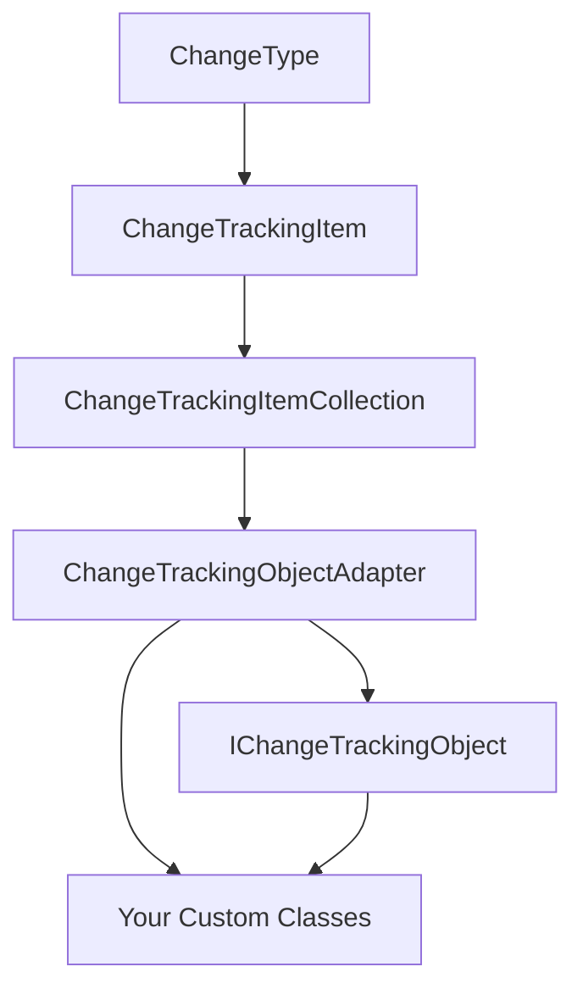

# Change Tracking Items System

The Change Tracking Items system is a comprehensive framework in the RapidStreamer BuildingBlocks library that provides robust, thread-safe change tracking capabilities for .NET applications. This system enables you to monitor, capture, and process changes to objects and collections with minimal overhead and maximum flexibility.

## Overview

The change tracking system consists of several interconnected components that work together to provide a complete solution for tracking modifications, additions, and deletions in your applications.

## System Components

### Core Components

| Component | Purpose | Documentation |
|-----------|---------|---------------|
| `ChangeType` | Enum defining types of changes (Added, Modified, Removed) | ChangeType |
| `ChangeTrackingItem<TValue>` | Immutable record of a single change operation | ChangeTrackingItem |
| `ChangeTrackingItemCollection<TKey, TValue>` | Thread-safe collection for managing change items | ChangeTrackingItemCollection |

### Implementation Components

| Component | Purpose | Documentation |
|-----------|---------|---------------|
| `IChangeTrackingObject<TKey, TValue>` | Interface contract for change tracking objects | ChangeTrackingObject |
| `ChangeTrackingObjectAdapter<TKey, TValue>` | Ready-to-use implementation helper | ChangeTrackingObjectAdapter |

## Architecture



### Component Relationships

1. **ChangeType** serves as the foundation, defining the types of changes
2. **ChangeTrackingItem** uses ChangeType to categorize individual changes
3. **ChangeTrackingItemCollection** stores and manages multiple ChangeTrackingItem instances
4. **ChangeTrackingObjectAdapter** orchestrates the collection and creates change items
5. **IChangeTrackingObject** provides the contract that custom classes can implement
6. Custom classes use the adapter to implement change tracking functionality

## Quick Start

### Basic Usage

```csharp
using RapidStreamer.BuildingBlocks.Application.ChangeTrackingItems;

// Create an adapter for your change tracking needs
var adapter = new ChangeTrackingObjectAdapter<string, object>();

// Start tracking changes
adapter.BeginTracking();

// Report various types of changes
adapter.ReportAdded("NewProperty", "New Value");
adapter.ReportModified("ExistingProperty", "Old Value", "New Value");
adapter.ReportRemoved("DeletedProperty", "Deleted Value");

// End tracking and get all changes
var changes = adapter.EndTracking();

// Process the changes
foreach (var change in changes)
{
    Console.WriteLine($"{change.Key}: {change.Value.ChangeType}");
    Console.WriteLine($"  Previous: {change.Value.PreviousValue}");
    Console.WriteLine($"  New: {change.Value.NewValue}");
}
```

### Integration with Custom Classes

```csharp
public class Person : IChangeTrackingObject<string, object>
{
    private readonly ChangeTrackingObjectAdapter<string, object> _adapter = new();
    private string _name = string.Empty;
    private int _age;
    
    public string Name
    {
        get => _name;
        set
        {
            var oldValue = _name;
            _name = value;
            _adapter.ReportModified(nameof(Name), oldValue, value);
        }
    }
    
    public int Age
    {
        get => _age;
        set
        {
            var oldValue = _age;
            _age = value;
            _adapter.ReportModified(nameof(Age), oldValue, value);
        }
    }
    
    // IChangeTrackingObject implementation
    public bool BeginTracking() => _adapter.BeginTracking();
    public IEnumerable<KeyValuePair<string, ChangeTrackingItem<object>>> EndTracking() 
        => _adapter.EndTracking();
}

// Usage
var person = new Person();
person.BeginTracking();

person.Name = "John Doe";
person.Age = 30;

var changes = person.EndTracking();
Console.WriteLine($"Person had {changes.Count()} changes");
```

## Key Features

### Thread Safety
- Built on `ConcurrentDictionary` for safe concurrent access
- All operations are thread-safe by default
- Suitable for multi-threaded applications

### Performance Optimized
- Minimal overhead when tracking is disabled
- Efficient change detection and storage
- Cached internal collections for optimal performance

### Flexible Architecture
- Generic type support for keys and values
- Extensible interface-based design
- Easy integration with existing codebases

### Rich Querying
- Filter changes by type (Added, Modified, Removed)
- Convert to standard dictionaries
- LINQ-compatible enumerable interfaces

## Common Use Cases

### 1. Entity Framework-Style Change Tracking

Track changes to entity properties for database synchronization:

```csharp
public class TrackedEntity : IChangeTrackingObject<string, object>
{
    private readonly ChangeTrackingObjectAdapter<string, object> _adapter = new();
    
    // Implementation details...
    
    public async Task SaveChangesAsync()
    {
        var changes = EndTracking();
        await SynchronizeWithDatabase(changes);
    }
}
```

### 2. Configuration Management

Monitor configuration changes for auditing and rollback:

```csharp
public class ConfigurationManager
{
    private readonly ChangeTrackingObjectAdapter<string, string> _adapter = new();
    
    public void StartChangeTracking() => _adapter.BeginTracking();
    
    public async Task SaveChangesToAuditLog()
    {
        var changes = _adapter.EndTracking();
        await WriteAuditLog(changes);
    }
}
```

### 3. Real-time Data Synchronization

Synchronize changes across distributed systems:

```csharp
public class DataSynchronizer
{
    public async Task SynchronizeChanges(IChangeTrackingObject<string, object> source)
    {
        source.BeginTracking();
        
        // ... perform operations
        
        var changes = source.EndTracking();
        await BroadcastChanges(changes);
    }
}
```

### 4. Undo/Redo Systems

Implement undo/redo functionality:

```csharp
public class UndoRedoManager
{
    private readonly Stack<IEnumerable<KeyValuePair<string, ChangeTrackingItem<object>>>> _undoStack = new();
    
    public void RecordChanges(IEnumerable<KeyValuePair<string, ChangeTrackingItem<object>>> changes)
    {
        _undoStack.Push(changes);
    }
    
    public void Undo()
    {
        if (_undoStack.TryPop(out var changes))
        {
            ApplyReverseChanges(changes);
        }
    }
}
```

## Best Practices

### 1. Session Management

Always ensure proper session lifecycle:

```csharp
public void ProcessWithTracking()
{
    adapter.BeginTracking();
    try
    {
        // ... perform operations that may cause changes
    }
    finally
    {
        var changes = adapter.EndTracking();
        ProcessChanges(changes);
    }
}
```

### 2. Performance Optimization

Check tracking status before expensive operations:

```csharp
public void SetProperty(string name, object value)
{
    if (!adapter.Enabled) return; // Early exit
    
    var oldValue = GetCurrentValue(name); // Potentially expensive
    adapter.ReportModified(name, oldValue, value);
}
```

### 3. Type Safety

Use strongly-typed generics:

```csharp
// Good: Strongly typed
var stringAdapter = new ChangeTrackingObjectAdapter<string, string>();

// Less ideal: Object-based (requires casting)
var objectAdapter = new ChangeTrackingObjectAdapter<string, object>();
```

### 4. Error Handling

Implement robust error handling:

```csharp
public void SafeChangeReporting(string key, object oldValue, object newValue)
{
    try
    {
        adapter.ReportModified(key, oldValue, newValue);
    }
    catch (Exception ex)
    {
        // Log but don't throw - change tracking shouldn't break business logic
        logger.LogWarning(ex, "Failed to report change for {Key}", key);
    }
}
```

## Advanced Scenarios

### Batch Processing

```csharp
public class BatchChangeProcessor
{
    public async Task ProcessBatch(IEnumerable<IChangeTrackingObject<string, object>> objects)
    {
        var allChanges = new List<KeyValuePair<string, ChangeTrackingItem<object>>>();
        
        foreach (var obj in objects)
        {
            obj.BeginTracking();
            
            // ... perform operations
            
            var changes = obj.EndTracking();
            allChanges.AddRange(changes);
        }
        
        await ProcessAllChanges(allChanges);
    }
}
```

### Custom Change Detection

```csharp
public class SmartChangeDetector
{
    private readonly ChangeTrackingObjectAdapter<string, object> _adapter = new();
    
    public void DetectAndReportChanges<T>(T oldObject, T newObject) where T : class
    {
        _adapter.BeginTracking();
        
        var properties = typeof(T).GetProperties();
        foreach (var property in properties)
        {
            var oldValue = property.GetValue(oldObject);
            var newValue = property.GetValue(newObject);
            
            if (!Equals(oldValue, newValue))
            {
                _adapter.ReportModified(property.Name, oldValue, newValue);
            }
        }
        
        var changes = _adapter.EndTracking();
        ProcessChanges(changes);
    }
}
```

## Testing

The system includes comprehensive unit tests for all components:

- **ChangeTrackingItemTests**: Validates change item creation and properties
- **ChangeTrackingObjectAdapterTests**: Tests adapter functionality and session management
- **Integration Tests**: Verify component interactions and real-world scenarios

## Performance Characteristics

| Operation | Complexity | Thread Safe | Notes |
|-----------|------------|-------------|-------|
| BeginTracking | O(1) | Yes | Clears internal collection |
| ReportXxx | O(1) average | Yes | Uses ConcurrentDictionary |
| EndTracking | O(1) | Yes | Returns reference to collection |
| Collection Filtering | O(n) | Yes | Where n = number of changes |

## Migration Guide

### From Manual Change Tracking

**Before:**
```csharp
private readonly List<Change> _changes = new();

public void TrackChange(string key, object oldValue, object newValue)
{
    _changes.Add(new Change { Key = key, OldValue = oldValue, NewValue = newValue });
}
```

**After:**
```csharp
private readonly ChangeTrackingObjectAdapter<string, object> _adapter = new();

public void TrackChange(string key, object oldValue, object newValue)
{
    _adapter.ReportModified(key, oldValue, newValue);
}
```

### From Custom Implementations

**Before:**
```csharp
public class MyTracker
{
    private bool _isTracking;
    private Dictionary<string, MyChange> _changes = new();
    // ... custom implementation
}
```

**After:**
```csharp
public class MyTracker : IChangeTrackingObject<string, object>
{
    private readonly ChangeTrackingObjectAdapter<string, object> _adapter = new();
    
    public bool BeginTracking() => _adapter.BeginTracking();
    public IEnumerable<KeyValuePair<string, ChangeTrackingItem<object>>> EndTracking() 
        => _adapter.EndTracking();
}
```

## Troubleshooting

### Common Issues

1. **Changes not being captured**
   - Ensure `BeginTracking()` is called before making changes
   - Verify that `adapter.Enabled` is `true`
   - Check that change reporting is happening after tracking begins

2. **Memory leaks with long-running tracking**
   - Call `EndTracking()` or `Clear()` periodically
   - Consider the memory footprint of stored values

3. **Thread safety concerns**
   - The system is thread-safe by design
   - Ensure proper session management in concurrent scenarios

4. **Performance issues**
   - Check `adapter.Enabled` before expensive change detection
   - Use appropriate generic types to avoid boxing
   - Consider batching changes for high-frequency operations

## Contributing

The change tracking system is designed to be extensible. You can:

- Implement `IChangeTrackingObject<TKey, TValue>` for custom change tracking behavior
- Extend `ChangeTrackingObjectAdapter` for specialized scenarios
- Create custom filtering and processing logic for `ChangeTrackingItemCollection`

## Related Systems

### Application Components
- **[Objects System](../Objects/README.md)**: Foundational object patterns for change tracking
  - **[Notifiable Objects](../Objects/README.md#notifiableobject)** - Property change notification infrastructure
  - **[Equatable Objects](../Objects/README.md#equatableobject)** - Value equality for change detection
  - **[Immutable Objects](../Objects/README.md#immutableobject)** - Immutability patterns for change tracking
- **[Collections System](../Collections/README.md#bindingdictionary-tkey-tvalue)**: Observable collections with change tracking
  - **[Binding Dictionary](../Collections/README.md#bindingdictionary)** - Observable dictionary with change events
  - **[Collection Performance](../Collections/README.md#performance-benchmarks)** - High-performance collection operations
- **[Serialization System](../Serializations/README.md)**: Change tracking data serialization
  - **[JSON Serialization](../Serializations/README.md#json-serialization-utilities)** - Serialize change tracking data
  - **[Performance Optimizations](../Serializations/README.md#performance-benchmarks)** - Efficient serialization

### Integration Use Cases
- **Audit Systems**: Perfect for generating audit trails and compliance tracking
- **Database ORMs**: Entity Framework-style change tracking for data access
- **Configuration Management**: Track configuration changes and rollback capabilities
- **Real-time Sync**: Synchronize changes across distributed systems
- **Version Control**: Implement versioning and history tracking for business objects

### Application Building Blocks
- **[Application Overview](../README.md)** - Complete application components
  - **[Change Tracking Module](../README.md#change-tracking)** - Change tracking overview and integration
  - **[Best Practices](../README.md#best-practices)** - Change tracking implementation guidelines

### Infrastructure Integration
- **[Infrastructure Components](../../Infrastructure/README.md)** - Infrastructure-level change tracking
  - **[Health Checks](../../Infrastructure/HealthChecks/README.md)** - Monitor change tracking system health
  - **[System Monitoring](../../Infrastructure/SystemResourceMonitor/README.md)** - Track change tracking performance

For detailed information about each component, see the individual documentation files linked in the components table above.