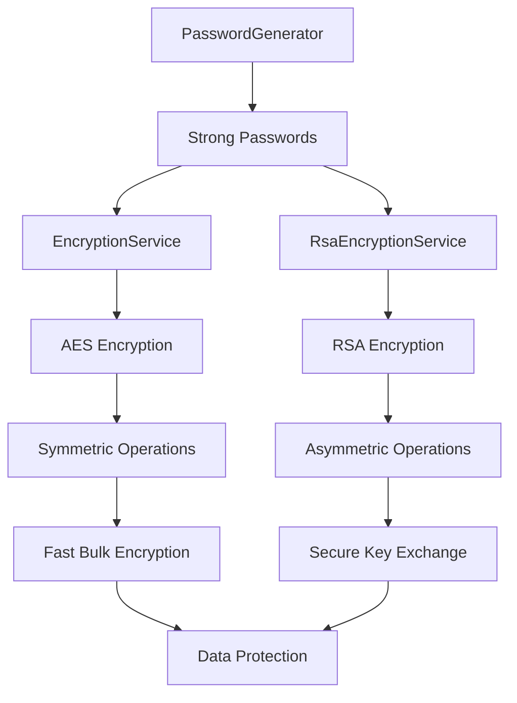

# Ciphering System

The Ciphering system in the RapidStreamer BuildingBlocks library provides a comprehensive, secure, and easy-to-use cryptographic toolkit for .NET applications. This system includes symmetric encryption (AES), asymmetric encryption (RSA), and secure password generation capabilities, all designed to work together seamlessly.

## Overview

The ciphering system consists of three main components that address different aspects of application security:

1. **Symmetric Encryption** - Fast, secure encryption for data protection
2. **Asymmetric Encryption** - Public-key cryptography for secure communication
3. **Password Generation** - Cryptographically secure password and token generation

## System Components

| Component | Purpose | Key Features | Documentation |
|-----------|---------|--------------|---------------|
| [`EncryptionService`](EncryptionService.md) | AES symmetric encryption with PBKDF2 key derivation | Fast bulk encryption, password-based keys, configurable security | [EncryptionService.md](EncryptionService.md) |
| [`RsaEncryptionService`](RsaEncryptionService.md) | RSA asymmetric encryption and key management | Public-key crypto, multiple key formats, digital signing | [RsaEncryptionService.md](RsaEncryptionService.md) |
| [`PasswordGenerator`](PasswordGenerator.md) | Cryptographically secure password generation | Customizable policies, entropy optimization, security rules | [PasswordGenerator.md](PasswordGenerator.md) |

## Architecture



### Component Relationships

1. **PasswordGenerator** creates secure passwords for encryption keys
2. **EncryptionService** uses passwords to derive AES encryption keys
3. **RsaEncryptionService** provides public-key encryption for secure communication
4. Components can be used independently or combined for hybrid encryption scenarios

## Quick Start Guide

### Basic Symmetric Encryption

```csharp
using RapidStreamer.BuildingBlocks.Application.Ciphering;

// Generate a secure password
string password = PasswordGenerator.Generate(16, settings =>
{
    settings.IncludeSymbols = false; // Easier to handle
});

// Create encryption key from password
byte[] key = EncryptionService.CreateKey(password);

// Encrypt sensitive data
string sensitiveData = "Credit Card: 1234-5678-9012-3456";
string encrypted = EncryptionService.Encrypt(sensitiveData, key);

// Decrypt when needed
string decrypted = EncryptionService.Decrypt(encrypted, key);
```

### Basic Asymmetric Encryption

```csharp
// Create RSA service with key pair
var rsaService = new RsaEncryptionService(2048);

// Encrypt data (anyone can encrypt with public key)
string publicData = "Hello, this is a secure message";
string encrypted = rsaService.Encrypt(publicData);

// Decrypt data (only private key holder can decrypt)
string decrypted = rsaService.Decrypt(encrypted);
```

### Hybrid Encryption (Best of Both Worlds)

```csharp
public class HybridEncryption
{
    public static (string EncryptedData, string EncryptedKey) Encrypt(string data, string recipientPublicKey)
    {
        // Generate random password for AES
        string aesPassword = PasswordGenerator.Generate(32);
        byte[] aesKey = EncryptionService.CreateKey(aesPassword);
        
        // Encrypt data with AES (fast)
        string encryptedData = EncryptionService.Encrypt(data, aesKey);
        
        // Encrypt AES password with RSA (secure)
        string encryptedKey = RsaEncryptionService.Encrypt(aesPassword, recipientPublicKey, 2048);
        
        return (encryptedData, encryptedKey);
    }
    
    public static string Decrypt(string encryptedData, string encryptedKey, RsaEncryptionService rsaService)
    {
        // Decrypt AES password with RSA
        string aesPassword = rsaService.Decrypt(encryptedKey);
        byte[] aesKey = EncryptionService.CreateKey(aesPassword);
        
        // Decrypt data with AES
        return EncryptionService.Decrypt(encryptedData, aesKey);
    }
}
```

## Common Use Cases

### 1. Data Protection and Storage

**Scenario**: Encrypt sensitive data before storing in databases or files.

```csharp
public class SecureDataRepository
{
    private readonly byte[] _encryptionKey;
    
    public SecureDataRepository(string masterPassword)
    {
        _encryptionKey = EncryptionService.CreateKey(masterPassword, iterations: 10000);
    }
    
    public void SaveSensitiveData(string userId, string sensitiveData)
    {
        string encrypted = EncryptionService.Encrypt(sensitiveData, _encryptionKey);
        // Save encrypted data to database
        SaveToDatabase(userId, encrypted);
    }
    
    public string LoadSensitiveData(string userId)
    {
        string encrypted = LoadFromDatabase(userId);
        return EncryptionService.Decrypt(encrypted, _encryptionKey);
    }
}
```

### 2. Secure API Communication

**Scenario**: Encrypt API requests and responses for secure communication.

```csharp
public class SecureApiClient
{
    private readonly RsaEncryptionService _clientRsa;
    private readonly string _serverPublicKey;
    
    public SecureApiClient(string serverPublicKey)
    {
        _clientRsa = new RsaEncryptionService(2048);
        _serverPublicKey = serverPublicKey;
    }
    
    public async Task<T> SecureRequest<T>(string endpoint, object data)
    {
        // Encrypt request
        string jsonData = System.Text.Json.JsonSerializer.Serialize(data);
        string encryptedRequest = RsaEncryptionService.Encrypt(jsonData, _serverPublicKey, 2048);
        
        // Send request with client public key
        var request = new
        {
            EncryptedData = encryptedRequest,
            ClientPublicKey = _clientRsa.PublicKey.ToJsonString()
        };
        
        // Receive and decrypt response
        var response = await SendHttpRequest(endpoint, request);
        string decryptedResponse = _clientRsa.Decrypt(response.EncryptedData);
        
        return System.Text.Json.JsonSerializer.Deserialize<T>(decryptedResponse);
    }
}
```

### 3. User Account Management

**Scenario**: Generate secure passwords and manage user authentication.

```csharp
public class UserAccountService
{
    public UserAccount CreateAccount(string email, string firstName, string lastName)
    {
        // Generate secure temporary password
        string temporaryPassword = PasswordGenerator.Generate(12, settings =>
        {
            settings.IncludeUpperCase = true;
            settings.IncludeLowerCase = true;
            settings.IncludeNumbers = true;
            settings.IncludeSymbols = false; // User-friendly
            settings.BeginWithLetter = true;
        });
        
        // Create account with encrypted password
        var account = new UserAccount
        {
            Email = email,
            FirstName = firstName,
            LastName = lastName,
            PasswordHash = HashPassword(temporaryPassword),
            MustChangePassword = true
        };
        
        // Send welcome email with temporary password
        SendWelcomeEmail(account, temporaryPassword);
        
        return account;
    }
    
    public string GenerateApiToken(string userId)
    {
        // Generate secure API token
        return PasswordGenerator.Generate(32, settings =>
        {
            settings.PreventDuplicateCharacters = true;
            settings.IncludeSymbols = false; // URL-safe
        });
    }
}
```

### 4. Configuration Security

**Scenario**: Encrypt configuration files and sensitive application settings.

```csharp
public class SecureConfigurationManager
{
    private readonly RsaEncryptionService _rsaService;
    private readonly Dictionary<string, string> _encryptedSettings = new();
    
    public SecureConfigurationManager()
    {
        _rsaService = LoadOrCreateKeys();
        LoadConfiguration();
    }
    
    public void SetSetting(string key, string value)
    {
        _encryptedSettings[key] = _rsaService.Encrypt(value);
        SaveConfiguration();
    }
    
    public string GetSetting(string key)
    {
        if (_encryptedSettings.TryGetValue(key, out string? encrypted))
        {
            return _rsaService.Decrypt(encrypted);
        }
        return string.Empty;
    }
    
    public void SetConnectionString(string name, string connectionString)
    {
        // Extra security for connection strings
        string password = PasswordGenerator.Generate(24);
        byte[] aesKey = EncryptionService.CreateKey(password);
        
        // Double encryption: AES + RSA
        string aesEncrypted = EncryptionService.Encrypt(connectionString, aesKey);
        string rsaEncryptedKey = _rsaService.Encrypt(password);
        
        _encryptedSettings[$"{name}_data"] = aesEncrypted;
        _encryptedSettings[$"{name}_key"] = rsaEncryptedKey;
        
        SaveConfiguration();
    }
}
```

### 5. File Encryption

**Scenario**: Encrypt files for secure storage and transmission.

```csharp
public class FileEncryptionService
{
    public void EncryptFile(string inputPath, string outputPath, string password)
    {
        // Use strong key derivation
        byte[] key = EncryptionService.CreateKey(password, iterations: 50000);
        
        // Read, encrypt, and save
        string content = File.ReadAllText(inputPath);
        string encrypted = EncryptionService.Encrypt(content, key);
        File.WriteAllText(outputPath, encrypted);
    }
    
    public void EncryptFileForRecipient(string inputPath, string outputPath, string recipientPublicKey)
    {
        // Hybrid encryption for large files
        string content = File.ReadAllText(inputPath);
        
        // Generate session key
        string sessionPassword = PasswordGenerator.Generate(32);
        byte[] sessionKey = EncryptionService.CreateKey(sessionPassword);
        
        // Encrypt file content with AES
        string encryptedContent = EncryptionService.Encrypt(content, sessionKey);
        
        // Encrypt session key with RSA
        string encryptedSessionKey = RsaEncryptionService.Encrypt(sessionPassword, recipientPublicKey, 2048);
        
        // Save both parts
        var package = new
        {
            EncryptedContent = encryptedContent,
            EncryptedKey = encryptedSessionKey
        };
        
        string packageJson = System.Text.Json.JsonSerializer.Serialize(package);
        File.WriteAllText(outputPath, packageJson);
    }
}
```

## Security Best Practices

### Encryption Key Management

```csharp
public static class SecurityBestPractices
{
    // Strong password generation for encryption keys
    public static string GenerateEncryptionPassword()
    {
        return PasswordGenerator.Generate(32, settings =>
        {
            settings.IncludeUpperCase = true;
            settings.IncludeLowerCase = true;
            settings.IncludeNumbers = true;
            settings.IncludeSymbols = true;
            settings.PreventSequentialCharacters = true;
            settings.PreventDuplicateCharacters = true;
        });
    }
    
    // Strong AES key derivation
    public static byte[] DeriveStrongKey(string password)
    {
        return EncryptionService.CreateKey(
            password, 
            keyBytes: 32,           // AES-256
            iterations: 100000,     // Strong iteration count
            algorithmName: HashAlgorithmName.SHA512
        );
    }
    
    // Secure RSA service creation
    public static RsaEncryptionService CreateSecureRsaService()
    {
        return new RsaEncryptionService(4096); // High security key size
    }
}
```

### Password Policies

```csharp
public static class PasswordPolicies
{
    public static string GenerateUserPassword(PasswordStrength strength = PasswordStrength.Medium)
    {
        return strength switch
        {
            PasswordStrength.Low => PasswordGenerator.Generate(8, settings =>
            {
                settings.IncludeSymbols = false;
                settings.PreventSequentialCharacters = false;
            }),
            
            PasswordStrength.Medium => PasswordGenerator.Generate(12, settings =>
            {
                settings.IncludeSymbols = false;
                settings.PreventSequentialCharacters = true;
            }),
            
            PasswordStrength.High => PasswordGenerator.Generate(16, settings =>
            {
                settings.IncludeSymbols = true;
                settings.PreventSequentialCharacters = true;
                settings.PreventDuplicateCharacters = true;
            }),
            
            _ => throw new ArgumentException("Unknown password strength")
        };
    }
}

public enum PasswordStrength { Low, Medium, High }
```

## Performance Guidelines

### When to Use Each Component

| Scenario | Recommended Component | Reason |
|----------|----------------------|--------|
| **Bulk Data Encryption** | `EncryptionService` | AES is fast for large data |
| **Key Exchange** | `RsaEncryptionService` | RSA is designed for small data/keys |
| **Large File Encryption** | Hybrid (AES + RSA) | Best of both worlds |
| **Password Generation** | `PasswordGenerator` | Cryptographically secure randomness |
| **Digital Signatures** | `RsaEncryptionService` | Public-key infrastructure |

### Performance Optimization

```csharp
public class OptimizedEncryptionService
{
    private static readonly ConcurrentDictionary<string, byte[]> _keyCache = new();
    private readonly RsaEncryptionService _rsaService;
    
    public OptimizedEncryptionService()
    {
        // Create RSA service once, reuse for multiple operations
        _rsaService = new RsaEncryptionService(2048);
    }
    
    public byte[] GetCachedKey(string password)
    {
        // Cache expensive key derivation
        return _keyCache.GetOrAdd(password, p => 
            EncryptionService.CreateKey(p, iterations: 10000));
    }
    
    public async Task<string> EncryptLargeDataAsync(string data, string recipientPublicKey)
    {
        return await Task.Run(() =>
        {
            // Use hybrid encryption for large data
            string sessionPassword = PasswordGenerator.Generate(32);
            byte[] sessionKey = EncryptionService.CreateKey(sessionPassword);
            
            string encryptedData = EncryptionService.Encrypt(data, sessionKey);
            string encryptedKey = RsaEncryptionService.Encrypt(sessionPassword, recipientPublicKey, 2048);
            
            return System.Text.Json.JsonSerializer.Serialize(new { encryptedData, encryptedKey });
        });
    }
}
```

## Error Handling and Validation

```csharp
public static class SecureOperations
{
    public static (bool Success, string Result, string Error) TryEncrypt(string data, string password)
    {
        try
        {
            if (string.IsNullOrWhiteSpace(data))
                return (false, string.Empty, "Data cannot be empty");
                
            if (string.IsNullOrWhiteSpace(password))
                return (false, string.Empty, "Password cannot be empty");
            
            byte[] key = EncryptionService.CreateKey(password);
            string encrypted = EncryptionService.Encrypt(data, key);
            
            return (true, encrypted, string.Empty);
        }
        catch (Exception ex)
        {
            return (false, string.Empty, $"Encryption failed: {ex.Message}");
        }
    }
    
    public static (bool Success, string Result, string Error) TryGeneratePassword(int length)
    {
        try
        {
            if (length < 4)
                return (false, string.Empty, "Password must be at least 4 characters");
                
            if (length > 128)
                return (false, string.Empty, "Password too long (max 128 characters)");
            
            string password = PasswordGenerator.Generate(length);
            return (true, password, string.Empty);
        }
        catch (Exception ex)
        {
            return (false, string.Empty, $"Password generation failed: {ex.Message}");
        }
    }
}
```

## Integration Patterns

### Dependency Injection Setup

```csharp
// In Program.cs or Startup.cs
public void ConfigureServices(IServiceCollection services)
{
    // Register encryption services
    services.AddSingleton<RsaEncryptionService>(provider =>
    {
        var config = provider.GetRequiredService<IConfiguration>();
        var keySize = config.GetValue<int>("Security:RsaKeySize", 2048);
        return new RsaEncryptionService(keySize);
    });
    
    services.AddScoped<IEncryptionService, EncryptionService>();
    services.AddScoped<IPasswordService, PasswordService>();
}

// Service implementations
public interface IEncryptionService
{
    string Encrypt(string data, string password);
    string Decrypt(string encryptedData, string password);
}

public class EncryptionService : IEncryptionService
{
    public string Encrypt(string data, string password)
    {
        byte[] key = BuildingBlocks.Application.Ciphering.EncryptionService.CreateKey(password);
        return BuildingBlocks.Application.Ciphering.EncryptionService.Encrypt(data, key);
    }
    
    public string Decrypt(string encryptedData, string password)
    {
        byte[] key = BuildingBlocks.Application.Ciphering.EncryptionService.CreateKey(password);
        return BuildingBlocks.Application.Ciphering.EncryptionService.Decrypt(encryptedData, key);
    }
}
```

### Configuration Management

```csharp
// appsettings.json
{
  "Security": {
    "RsaKeySize": 2048,
    "AesIterations": 10000,
    "PasswordPolicy": {
      "MinLength": 12,
      "RequireSymbols": false,
      "PreventSequential": true
    }
  }
}

// Configuration binding
public class SecuritySettings
{
    public int RsaKeySize { get; set; } = 2048;
    public int AesIterations { get; set; } = 10000;
    public PasswordPolicySettings PasswordPolicy { get; set; } = new();
}

public class PasswordPolicySettings
{
    public int MinLength { get; set; } = 12;
    public bool RequireSymbols { get; set; } = false;
    public bool PreventSequential { get; set; } = true;
}
```

## Testing Strategies

```csharp
[TestClass]
public class CipheringSystemTests
{
    [TestMethod]
    public void EncryptionRoundTrip_ShouldRestoreOriginalData()
    {
        // Arrange
        string originalData = "Test data for encryption";
        string password = PasswordGenerator.Generate(16);
        
        // Act
        byte[] key = EncryptionService.CreateKey(password);
        string encrypted = EncryptionService.Encrypt(originalData, key);
        string decrypted = EncryptionService.Decrypt(encrypted, key);
        
        // Assert
        Assert.AreEqual(originalData, decrypted);
    }
    
    [TestMethod]
    public void RsaEncryption_ShouldWork_WithDifferentKeySizes()
    {
        // Test different key sizes
        int[] keySizes = { 1024, 2048, 3072 };
        
        foreach (int keySize in keySizes)
        {
            var rsa = new RsaEncryptionService(keySize);
            string encrypted = rsa.Encrypt("Test message");
            string decrypted = rsa.Decrypt(encrypted);
            
            Assert.AreEqual("Test message", decrypted);
        }
    }
    
    [TestMethod]
    public void PasswordGenerator_ShouldCreateUniquePasswords()
    {
        // Generate multiple passwords and ensure uniqueness
        var passwords = new HashSet<string>();
        
        for (int i = 0; i < 1000; i++)
        {
            string password = PasswordGenerator.Generate(12);
            passwords.Add(password);
        }
        
        Assert.AreEqual(1000, passwords.Count, "All passwords should be unique");
    }
}
```

## Migration and Upgrade Paths

### Upgrading from Basic Encryption

```csharp
// Old approach (insecure)
public class OldEncryption
{
    public static string Encrypt(string data)
    {
        // Simple Base64 encoding (NOT SECURE)
        return Convert.ToBase64String(Encoding.UTF8.GetBytes(data));
    }
}

// New approach (secure)
public class NewEncryption
{
    private static readonly byte[] _key = EncryptionService.CreateKey("MigrationPassword123!");
    
    public static string Encrypt(string data)
    {
        return EncryptionService.Encrypt(data, _key);
    }
    
    public static string Decrypt(string encryptedData)
    {
        return EncryptionService.Decrypt(encryptedData, _key);
    }
}

// Migration helper
public class EncryptionMigrationService
{
    public string MigrateData(string oldData)
    {
        // Decode old format
        string decoded = Encoding.UTF8.GetString(Convert.FromBase64String(oldData));
        
        // Re-encrypt with new secure method
        return NewEncryption.Encrypt(decoded);
    }
}
```

## Troubleshooting Guide

### Common Issues and Solutions

| Issue | Cause | Solution |
|-------|-------|----------|
| **Decryption fails** | Wrong password or corrupted data | Verify password, check data integrity |
| **RSA encryption size limit** | Data too large for RSA | Use hybrid encryption for large data |
| **Key generation slow** | High iteration count | Balance security vs. performance |
| **Memory issues** | Large data encryption | Use streaming or chunked processing |

### Debugging Tips

```csharp
public static class CipheringDiagnostics
{
    public static void DiagnoseEncryption(string data, string password)
    {
        Console.WriteLine($"Data length: {data.Length}");
        Console.WriteLine($"Password strength: {CalculatePasswordStrength(password)}");
        
        try
        {
            var stopwatch = Stopwatch.StartNew();
            byte[] key = EncryptionService.CreateKey(password);
            Console.WriteLine($"Key derivation took: {stopwatch.ElapsedMilliseconds}ms");
            
            stopwatch.Restart();
            string encrypted = EncryptionService.Encrypt(data, key);
            Console.WriteLine($"Encryption took: {stopwatch.ElapsedMilliseconds}ms");
            Console.WriteLine($"Encrypted length: {encrypted.Length}");
        }
        catch (Exception ex)
        {
            Console.WriteLine($"Error: {ex.Message}");
        }
    }
    
    private static string CalculatePasswordStrength(string password)
    {
        int score = 0;
        if (password.Any(char.IsUpper)) score++;
        if (password.Any(char.IsLower)) score++;
        if (password.Any(char.IsDigit)) score++;
        if (password.Any(ch => !char.IsLetterOrDigit(ch))) score++;
        
        return score switch
        {
            4 => "Strong",
            3 => "Medium",
            2 => "Weak",
            _ => "Very Weak"
        };
    }
}
```

## Related Systems

The Ciphering system integrates well with:

- **Authentication Systems**: Generate secure passwords and tokens
- **Database Security**: Encrypt sensitive fields before storage
- **API Security**: Secure communication between services
- **File Storage**: Encrypt files for secure storage
- **Configuration Management**: Protect sensitive configuration data
- **Audit Systems**: Secure logging and audit trail protection

## Conclusion

The RapidStreamer Ciphering system provides enterprise-grade cryptographic capabilities with a focus on:

- **Security**: Industry-standard algorithms and best practices
- **Performance**: Optimized implementations for different use cases
- **Usability**: Simple APIs that promote secure usage patterns
- **Flexibility**: Multiple options for different security requirements
- **Integration**: Easy integration with existing .NET applications

For detailed information about each component, refer to the individual documentation files:
- [EncryptionService.md](EncryptionService.md) - AES symmetric encryption
- [RsaEncryptionService.md](RsaEncryptionService.md) - RSA asymmetric encryption  
- [PasswordGenerator.md](PasswordGenerator.md) - Secure password generation