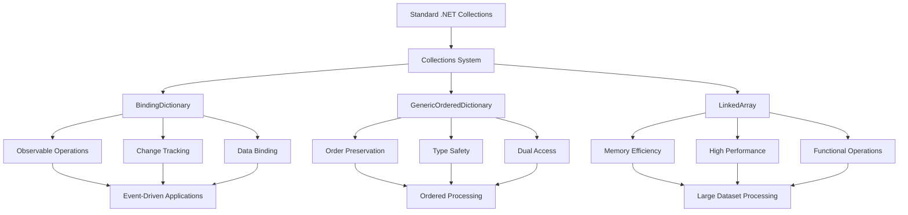

# Collections System

The Collections system in the RapidStreamer BuildingBlocks library provides advanced, high-performance collection types that extend beyond the standard .NET collections. These specialized collections are designed to address specific scenarios where standard collections fall short, offering features like observability, order preservation, memory efficiency, and performance optimization.

## Overview

The Collections system consists of three main components, each designed to solve different collection-related challenges:

1. **Observable Collections** - Collections that notify when changes occur
2. **Ordered Collections** - Collections that maintain element order with efficient access
3. **Memory-Efficient Collections** - Collections that minimize memory allocation and copying

## System Components

| Component | Purpose | Key Features | Documentation |
|-----------|---------|--------------|---------------|
| [`BindingDictionary<TKey, TValue>`](BindingDictionary.md) | Observable dictionary with change tracking | Event notifications, concurrent support, change tracking, data binding | [BindingDictionary.md](BindingDictionary.md) |
| [`GenericOrderedDictionary<TKey, TValue>`](GenericOrderedDictionary.md) | Type-safe ordered dictionary | Order preservation, dual access patterns, type safety | [GenericOrderedDictionary.md](GenericOrderedDictionary.md) |
| [`LinkedArray<T>`](LinkedArray.md) | Memory-efficient array with index linking | Zero-copy operations, high-performance enumeration, functional transformations | [LinkedArray.md](LinkedArray.md) |

## Architecture



### Component Relationships

1. **BindingDictionary** provides observable dictionary operations with change tracking integration
2. **GenericOrderedDictionary** offers type-safe ordered key-value operations  
3. **LinkedArray** enables memory-efficient array operations with functional programming support
4. **CollectionHelper** provides filtering and transformation utilities that create LinkedArrays
5. All components integrate seamlessly with LINQ and standard .NET collection interfaces

## Quick Start Guide

### Observable Dictionary Operations

```csharp
using RapidStreamer.BuildingBlocks.Application.Collections;

// Create observable dictionary with change notifications
var userSettings = new BindingDictionary<string, object>();

// Subscribe to changes
userSettings.ValueChanged += (sender, key, value, changeType) =>
    Console.WriteLine($"Setting '{key}' {changeType}: {value}");

// Make changes - events are automatically fired
userSettings["theme"] = "dark";
userSettings["language"] = "en-US";
userSettings["theme"] = "light"; // Update triggers Modified event
```

### Ordered Dictionary Operations

```csharp
// Create ordered dictionary that preserves insertion order
var processingSteps = new GenericOrderedDictionary<string, ProcessingStep>();

// Add steps in specific order
processingSteps.Add("validate", new ProcessingStep("Validate Input"));
processingSteps.Add("transform", new ProcessingStep("Transform Data")); 
processingSteps.Add("save", new ProcessingStep("Save Results"));

// Process in insertion order
foreach (var step in processingSteps)
{
    Console.WriteLine($"Executing: {step.Value.Name}");
    step.Value.Execute();
}

// Access by key or index
var firstStep = processingSteps["validate"];           // Key access
var secondStep = ((IOrderedDictionary)processingSteps)[1]; // Index access
```

### Memory-Efficient Array Operations

```csharp
// Large dataset - no copying required
var largeDataset = LoadMillionRecords();
var linkedData = new LinkedArray<DataRecord>(largeDataset);

// Efficient filtering and processing without memory copying
var processedResults = linkedData.ForEach(record => new ProcessedRecord
{
    Id = record.Id,
    ProcessedValue = CalculateValue(record),
    Timestamp = DateTime.UtcNow
});

// Filter creates LinkedArray pointing to matching elements
LinkedArray<DataRecord> filteredData = largeDataset.Filter(record => record.IsActive);
Console.WriteLine($"Filtered {filteredData.Count} active records from {largeDataset.Length}");
```

## Common Use Cases

### 1. Real-Time Data Monitoring Dashboard

**Scenario**: Build a dashboard that monitors various metrics and updates the UI when data changes.

```csharp
public class MonitoringDashboard
{
    private readonly BindingDictionary<string, MetricData> _metrics = new(concurrentSupport: true);
    private readonly GenericOrderedDictionary<string, Widget> _widgets = new();

    public MonitoringDashboard()
    {
        // Subscribe to metric changes for real-time updates
        _metrics.ValueChanged += OnMetricChanged;
        
        // Add widgets in display order
        _widgets.Add("cpu", new CpuWidget());
        _widgets.Add("memory", new MemoryWidget());
        _widgets.Add("disk", new DiskWidget());
        _widgets.Add("network", new NetworkWidget());
    }

    public void UpdateMetric(string metricName, double value)
    {
        _metrics[metricName] = new MetricData 
        { 
            Value = value, 
            Timestamp = DateTime.UtcNow 
        };
    }

    private void OnMetricChanged(object sender, string metricName, MetricData data, NotifiableChangeType changeType)
    {
        // Update UI widgets based on metric changes
        if (_widgets.TryGetValue(GetWidgetForMetric(metricName), out var widget))
        {
            widget.UpdateDisplay(data);
        }
        
        // Log metric changes
        Console.WriteLine($"Metric {metricName} {changeType}: {data.Value} at {data.Timestamp}");
    }

    public void RenderDashboard()
    {
        Console.WriteLine("Dashboard Layout:");
        
        // Render widgets in defined order
        foreach (var widget in _widgets)
        {
            Console.WriteLine($"Rendering {widget.Key} widget");
            widget.Value.Render();
        }
    }

    private string GetWidgetForMetric(string metricName) => metricName.Split('_')[0];
}

public class MetricData
{
    public double Value { get; set; }
    public DateTime Timestamp { get; set; }
}

public abstract class Widget
{
    public abstract void UpdateDisplay(MetricData data);
    public abstract void Render();
}
```

### 2. Configuration Management System

**Scenario**: Manage application configuration with ordered processing and change tracking.

```csharp
public class ConfigurationManager
{
    private readonly GenericOrderedDictionary<string, ConfigurationStep> _initializationSteps;
    private readonly BindingDictionary<string, object> _settings;
    private readonly List<ConfigurationChange> _changeHistory = new();

    public ConfigurationManager()
    {
        _initializationSteps = new GenericOrderedDictionary<string, ConfigurationStep>();
        _settings = new BindingDictionary<string, object>();
        
        // Track all configuration changes
        _settings.ValueChanged += OnSettingChanged;
        
        // Define initialization order
        _initializationSteps.Add("database", new ConfigurationStep("Database Connection", InitializeDatabase));
        _initializationSteps.Add("cache", new ConfigurationStep("Cache Settings", InitializeCache));
        _initializationSteps.Add("logging", new ConfigurationStep("Logging Configuration", InitializeLogging));
        _initializationSteps.Add("security", new ConfigurationStep("Security Settings", InitializeSecurity));
    }

    public async Task InitializeAsync()
    {
        Console.WriteLine("Starting application initialization...\n");
        
        // Process configuration steps in order
        foreach (var step in _initializationSteps)
        {
            Console.WriteLine($"Executing: {step.Value.Name}");
            await step.Value.Action();
            Console.WriteLine($"✓ {step.Key} completed\n");
        }
    }

    public T GetSetting<T>(string key, T defaultValue = default!)
    {
        return _settings.TryGetValue(key, out var value) && value is T typedValue 
            ? typedValue 
            : defaultValue;
    }

    public void UpdateSetting<T>(string key, T value)
    {
        _settings[key] = value!;
    }

    private void OnSettingChanged(object sender, string key, object value, NotifiableChangeType changeType)
    {
        _changeHistory.Add(new ConfigurationChange
        {
            Key = key,
            Value = value,
            ChangeType = changeType,
            Timestamp = DateTime.UtcNow,
            Source = "ConfigurationManager"
        });
        
        // Notify configuration observers
        NotifyConfigurationObservers(key, value, changeType);
    }

    public IEnumerable<ConfigurationChange> GetChangeHistory(TimeSpan? since = null)
    {
        var cutoff = since.HasValue ? DateTime.UtcNow.Subtract(since.Value) : DateTime.MinValue;
        return _changeHistory.Where(c => c.Timestamp >= cutoff);
    }

    private async Task InitializeDatabase()
    {
        _settings["database_connection"] = "Server=localhost;Database=MyApp;Trusted_Connection=true;";
        _settings["database_timeout"] = 30;
        await Task.Delay(100); // Simulate initialization
    }

    private async Task InitializeCache()
    {
        _settings["cache_provider"] = "Redis";
        _settings["cache_connection"] = "localhost:6379";
        await Task.Delay(50);
    }

    private async Task InitializeLogging()
    {
        _settings["log_level"] = "Information";
        _settings["log_provider"] = "Serilog";
        await Task.Delay(25);
    }

    private async Task InitializeSecurity()
    {
        _settings["jwt_secret"] = GenerateJwtSecret();
        _settings["token_expiry"] = 3600;
        await Task.Delay(75);
    }

    private void NotifyConfigurationObservers(string key, object value, NotifiableChangeType changeType)
    {
        // Implement observer pattern for configuration changes
        Console.WriteLine($"Configuration change: {key} = {value} ({changeType})");
    }

    private string GenerateJwtSecret() => Guid.NewGuid().ToString("N");
}

public class ConfigurationStep
{
    public string Name { get; }
    public Func<Task> Action { get; }
    
    public ConfigurationStep(string name, Func<Task> action)
    {
        Name = name;
        Action = action;
    }
}

public class ConfigurationChange
{
    public string Key { get; set; } = "";
    public object Value { get; set; } = new();
    public NotifiableChangeType ChangeType { get; set; }
    public DateTime Timestamp { get; set; }
    public string Source { get; set; } = "";
}
```

### 3. High-Performance Data Processing Pipeline

**Scenario**: Process large datasets through multiple stages without unnecessary memory allocation.

```csharp
public class DataProcessingPipeline
{
    private readonly ProcessingStage[] _stages;
    private readonly ProcessingMetrics _metrics = new();

    public DataProcessingPipeline()
    {
        _stages = new ProcessingStage[]
        {
            new ProcessingStage("Data Validation", ValidateData),
            new ProcessingStage("Data Transformation", TransformData),
            new ProcessingStage("Data Enrichment", EnrichData),
            new ProcessingStage("Data Aggregation", AggregateData)
        };
    }

    public async Task<ProcessingResult> ProcessAsync<T>(T[] inputData)
    {
        Console.WriteLine($"Starting pipeline with {inputData.Length} records...\n");
        
        // Create LinkedArray for memory-efficient processing
        var linkedData = new LinkedArray<T>(inputData);
        var stageResults = new List<StageResult>();
        
        foreach (var stage in _stages)
        {
            var stageStart = DateTime.UtcNow;
            Console.WriteLine($"Executing stage: {stage.Name}");
            
            try
            {
                // Process data through current stage
                var stageOutput = await stage.Process(linkedData);
                var stageDuration = DateTime.UtcNow - stageStart;
                
                stageResults.Add(new StageResult
                {
                    StageName = stage.Name,
                    InputCount = linkedData.Count,
                    OutputCount = stageOutput?.Count ?? 0,
                    Duration = stageDuration,
                    Success = true
                });
                
                Console.WriteLine($"✓ {stage.Name} completed in {stageDuration.TotalMilliseconds:F0}ms\n");
            }
            catch (Exception ex)
            {
                var stageDuration = DateTime.UtcNow - stageStart;
                stageResults.Add(new StageResult
                {
                    StageName = stage.Name,
                    InputCount = linkedData.Count,
                    OutputCount = 0,
                    Duration = stageDuration,
                    Success = false,
                    Error = ex.Message
                });
                
                Console.WriteLine($"✗ {stage.Name} failed: {ex.Message}\n");
                throw;
            }
        }

        return new ProcessingResult
        {
            TotalRecords = inputData.Length,
            ProcessingStages = stageResults.ToArray(),
            TotalDuration = stageResults.Sum(s => s.Duration.TotalMilliseconds),
            Success = stageResults.All(s => s.Success)
        };
    }

    private async Task<object?> ValidateData<T>(LinkedArray<T> data)
    {
        // Use LinkedArray's efficient ForEach for validation
        var validationResults = data.ForEach((index, record) => new
        {
            Index = index,
            Record = record,
            IsValid = ValidateRecord(record)
        });
        
        var failedValidations = validationResults.Where(r => !r.IsValid).ToArray();
        
        if (failedValidations.Any())
        {
            Console.WriteLine($"  Validation failures: {failedValidations.Length}");
            foreach (var failure in failedValidations.Take(5))
            {
                Console.WriteLine($"    Record {failure.Index}: Validation failed");
            }
        }
        
        await Task.Delay(10); // Simulate processing time
        return validationResults;
    }

    private async Task<object?> TransformData<T>(LinkedArray<T> data)
    {
        // Memory-efficient transformation using ForEach
        var transformedData = data.ForEach(record => TransformRecord(record));
        
        Console.WriteLine($"  Transformed {transformedData.Length} records");
        await Task.Delay(25);
        return transformedData;
    }

    private async Task<object?> EnrichData<T>(LinkedArray<T> data)
    {
        // Parallel processing with LinkedArray (thread-safe for reads)
        var enrichedData = data.AsParallel()
            .Select(record => EnrichRecord(record))
            .ToArray();
        
        Console.WriteLine($"  Enriched {enrichedData.Length} records");
        await Task.Delay(50);
        return enrichedData;
    }

    private async Task<object?> AggregateData<T>(LinkedArray<T> data)
    {
        // Efficient aggregation using ForEach
        var aggregationResults = new Dictionary<string, object>();
        
        data.ForEach(record => 
        {
            // Perform aggregation logic
            var category = GetRecordCategory(record);
            if (!aggregationResults.ContainsKey(category))
                aggregationResults[category] = 0;
                
            aggregationResults[category] = (int)aggregationResults[category] + 1;
        });
        
        Console.WriteLine($"  Aggregated into {aggregationResults.Count} categories");
        await Task.Delay(15);
        return aggregationResults;
    }

    private bool ValidateRecord<T>(T record) => record != null;
    private object TransformRecord<T>(T record) => record!;
    private object EnrichRecord<T>(T record) => record!;
    private string GetRecordCategory<T>(T record) => record?.GetType().Name ?? "Unknown";
}

public class ProcessingStage
{
    public string Name { get; }
    private readonly Func<LinkedArray<object>, Task<object?>> _processor;

    public ProcessingStage(string name, Func<LinkedArray<object>, Task<object?>> processor)
    {
        Name = name;
        _processor = processor;
    }

    public async Task<object?> Process<T>(LinkedArray<T> data)
    {
        // Convert to object LinkedArray for processing
        var objectData = data.ForEach(item => (object)item!);
        var linkedObjectData = new LinkedArray<object>(objectData);
        return await _processor(linkedObjectData);
    }
}

public class StageResult
{
    public string StageName { get; set; } = "";
    public int InputCount { get; set; }
    public int OutputCount { get; set; }
    public TimeSpan Duration { get; set; }
    public bool Success { get; set; }
    public string? Error { get; set; }
}

public class ProcessingResult
{
    public int TotalRecords { get; set; }
    public StageResult[] ProcessingStages { get; set; } = Array.Empty<StageResult>();
    public double TotalDuration { get; set; }
    public bool Success { get; set; }
}

public class ProcessingMetrics
{
    public int TotalRecordsProcessed { get; set; }
    public TimeSpan TotalProcessingTime { get; set; }
    public int SuccessfulStages { get; set; }
    public int FailedStages { get; set; }
}
```

### 4. Event-Driven Cache Management

**Scenario**: Implement a smart cache that tracks access patterns and automatically manages expiration.

```csharp
public class SmartCacheManager<TKey, TValue> where TKey : notnull
{
    private readonly BindingDictionary<TKey, CacheEntry<TValue>> _cache;
    private readonly GenericOrderedDictionary<DateTime, List<TKey>> _expirationSchedule;
    private readonly Timer _cleanupTimer;
    private readonly CacheStatistics _statistics = new();

    public SmartCacheManager(bool concurrentAccess = false)
    {
        _cache = new BindingDictionary<TKey, CacheEntry<TValue>>(concurrentSupport: concurrentAccess);
        _expirationSchedule = new GenericOrderedDictionary<DateTime, List<TKey>>();
        
        // Monitor cache changes for statistics and cleanup
        _cache.KeyChanged += OnCacheKeyChanged;
        _cache.ValueChanged += OnCacheValueChanged;
        _cache.Cleared += OnCacheCleared;
        
        // Periodic cleanup of expired entries
        _cleanupTimer = new Timer(CleanupExpiredEntries, null, 
            TimeSpan.FromMinutes(1), TimeSpan.FromMinutes(1));
    }

    public TValue GetOrAdd(TKey key, Func<TKey, TValue> valueFactory, TimeSpan? expiry = null)
    {
        if (_cache.TryGetValue(key, out var existingEntry))
        {
            if (existingEntry.ExpiresAt > DateTime.UtcNow)
            {
                // Update access time and return cached value
                existingEntry.LastAccessTime = DateTime.UtcNow;
                existingEntry.AccessCount++;
                return existingEntry.Value;
            }
            else
            {
                // Entry expired, remove it
                _cache.Remove(key);
            }
        }

        // Create new entry
        var value = valueFactory(key);
        var entry = new CacheEntry<TValue>
        {
            Value = value,
            CreatedAt = DateTime.UtcNow,
            LastAccessTime = DateTime.UtcNow,
            ExpiresAt = DateTime.UtcNow.Add(expiry ?? TimeSpan.FromHours(1)),
            AccessCount = 1
        };

        _cache.Add(key, entry);
        ScheduleExpiration(key, entry.ExpiresAt);
        
        return value;
    }

    public bool TryGet(TKey key, out TValue? value)
    {
        value = default;
        
        if (!_cache.TryGetValue(key, out var entry))
            return false;
            
        if (entry.ExpiresAt <= DateTime.UtcNow)
        {
            _cache.Remove(key);
            return false;
        }

        // Update access statistics
        entry.LastAccessTime = DateTime.UtcNow;
        entry.AccessCount++;
        value = entry.Value;
        return true;
    }

    public void Set(TKey key, TValue value, TimeSpan? expiry = null)
    {
        var entry = new CacheEntry<TValue>
        {
            Value = value,
            CreatedAt = DateTime.UtcNow,
            LastAccessTime = DateTime.UtcNow,
            ExpiresAt = DateTime.UtcNow.Add(expiry ?? TimeSpan.FromHours(1)),
            AccessCount = 0
        };

        _cache[key] = entry;
        ScheduleExpiration(key, entry.ExpiresAt);
    }

    public CacheStatistics GetStatistics()
    {
        _statistics.CurrentSize = _cache.Count;
        _statistics.LastUpdated = DateTime.UtcNow;
        
        // Calculate access patterns using LinkedArray for efficiency
        if (_cache.Count > 0)
        {
            var entries = _cache.Values.ToArray();
            var linkedEntries = new LinkedArray<CacheEntry<TValue>>(entries);
            
            var accessStats = linkedEntries.ForEach(entry => new
            {
                Age = DateTime.UtcNow - entry.CreatedAt,
                AccessCount = entry.AccessCount,
                TimeSinceLastAccess = DateTime.UtcNow - entry.LastAccessTime
            });
            
            _statistics.AverageAge = TimeSpan.FromTicks((long)accessStats.Average(s => s.Age.Ticks));
            _statistics.AverageAccessCount = accessStats.Average(s => s.AccessCount);
            _statistics.MostAccessedCount = accessStats.Max(s => s.AccessCount);
        }
        
        return _statistics;
    }

    private void OnCacheKeyChanged(object sender, TKey key, NotifiableChangeType changeType)
    {
        switch (changeType)
        {
            case NotifiableChangeType.Added:
                _statistics.TotalAdditions++;
                Console.WriteLine($"Cache: Added key '{key}'");
                break;
            case NotifiableChangeType.Removed:
                _statistics.TotalRemovals++;
                Console.WriteLine($"Cache: Removed key '{key}'");
                break;
        }
    }

    private void OnCacheValueChanged(object sender, TKey key, CacheEntry<TValue> entry, NotifiableChangeType changeType)
    {
        if (changeType == NotifiableChangeType.Modified)
        {
            _statistics.TotalUpdates++;
            Console.WriteLine($"Cache: Updated key '{key}'");
        }
    }

    private void OnCacheCleared(object sender)
    {
        _statistics.TotalClears++;
        _expirationSchedule.Clear();
        Console.WriteLine("Cache: Cleared all entries");
    }

    private void ScheduleExpiration(TKey key, DateTime expiresAt)
    {
        var expirationTime = new DateTime(expiresAt.Year, expiresAt.Month, expiresAt.Day, 
                                         expiresAt.Hour, expiresAt.Minute, 0); // Round to minute
        
        if (!_expirationSchedule.TryGetValue(expirationTime, out var keyList))
        {
            keyList = new List<TKey>();
            _expirationSchedule[expirationTime] = keyList;
        }
        
        keyList.Add(key);
    }

    private void CleanupExpiredEntries(object? state)
    {
        var now = DateTime.UtcNow;
        var expiredSchedules = new List<DateTime>();
        
        // Check expiration schedule in chronological order
        foreach (var schedule in _expirationSchedule)
        {
            if (schedule.Key <= now)
            {
                // Remove expired keys
                foreach (var key in schedule.Value)
                {
                    if (_cache.TryGetValue(key, out var entry) && entry.ExpiresAt <= now)
                    {
                        _cache.Remove(key);
                    }
                }
                expiredSchedules.Add(schedule.Key);
            }
            else
            {
                break; // Remaining schedules are in the future
            }
        }
        
        // Remove processed schedules
        foreach (var expiredTime in expiredSchedules)
        {
            _expirationSchedule.Remove(expiredTime);
        }
        
        if (expiredSchedules.Count > 0)
        {
            Console.WriteLine($"Cache cleanup: Processed {expiredSchedules.Count} expiration schedules");
        }
    }

    public void Dispose()
    {
        _cleanupTimer?.Dispose();
    }
}

public class CacheEntry<T>
{
    public T Value { get; set; } = default!;
    public DateTime CreatedAt { get; set; }
    public DateTime LastAccessTime { get; set; }
    public DateTime ExpiresAt { get; set; }
    public int AccessCount { get; set; }
}

public class CacheStatistics
{
    public int CurrentSize { get; set; }
    public int TotalAdditions { get; set; }
    public int TotalRemovals { get; set; }
    public int TotalUpdates { get; set; }
    public int TotalClears { get; set; }
    public TimeSpan AverageAge { get; set; }
    public double AverageAccessCount { get; set; }
    public int MostAccessedCount { get; set; }
    public DateTime LastUpdated { get; set; }
    
    public double HitRate => TotalAdditions > 0 ? (double)TotalAdditions / (TotalAdditions + TotalRemovals) : 0;
}
```

## Performance Guidelines

### When to Use Each Component

| Scenario | Recommended Component | Reason |
|----------|----------------------|--------|
| **UI Data Binding** | `BindingDictionary<TKey, TValue>` | Event notifications for UI updates |
| **Configuration Processing** | `GenericOrderedDictionary<TKey, TValue>` | Order matters for initialization |
| **Large Dataset Processing** | `LinkedArray<T>` | Memory efficiency and performance |
| **Change Auditing** | `BindingDictionary<TKey, TValue>` | Built-in change tracking |
| **Sequential Operations** | `GenericOrderedDictionary<TKey, TValue>` | Maintains insertion/processing order |
| **Functional Transformations** | `LinkedArray<T>` | Optimized ForEach operations |

### Performance Optimization Strategies

```csharp
public class OptimizedCollectionUsage
{
    // Pre-size collections when capacity is known
    public static BindingDictionary<string, T> CreatePresizedBindingDictionary<T>(int capacity)
    {
        return new BindingDictionary<string, T>(capacity, concurrentSupport: false);
    }
    
    // Use appropriate concurrency settings
    public static BindingDictionary<string, T> CreateConcurrentDictionary<T>()
    {
        return new BindingDictionary<string, T>(concurrentSupport: true);
    }
    
    // Optimize LinkedArray usage for large datasets
    public static ProcessingResult ProcessLargeDataset<T>(T[] data, Func<T, bool> filter)
    {
        // Create LinkedArray for zero-copy filtering
        LinkedArray<T> filtered = data.Filter(filter);
        
        // Use ForEach for optimal performance
        var results = filtered.ForEach(item => ProcessItem(item));
        
        return new ProcessingResult
        {
            OriginalCount = data.Length,
            FilteredCount = filtered.Count,
            ProcessedCount = results.Length
        };
    }
    
    // Batch operations to reduce event overhead
    public static void BatchUpdate<TKey, TValue>(
        BindingDictionary<TKey, TValue> dictionary, 
        IEnumerable<KeyValuePair<TKey, TValue>> updates) where TKey : notnull
    {
        // Temporarily disable notifications for bulk operations
        using var suppressNotifications = new NotificationSuppressor(dictionary);
        
        foreach (var update in updates)
        {
            dictionary[update.Key] = update.Value;
        }
        
        // Notifications resume when suppressor is disposed
    }
    
    private static object ProcessItem<T>(T item) => item!;
}

public class ProcessingResult
{
    public int OriginalCount { get; set; }
    public int FilteredCount { get; set; }
    public int ProcessedCount { get; set; }
}

// Helper class for batching operations
public class NotificationSuppressor : IDisposable
{
    private readonly object _target;
    private bool _disposed;
    
    public NotificationSuppressor(object target)
    {
        _target = target;
        // Implementation would temporarily disable notifications
    }
    
    public void Dispose()
    {
        if (!_disposed)
        {
            // Re-enable notifications and fire batch notification
            _disposed = true;
        }
    }
}
```

## Integration Patterns

### Dependency Injection Configuration

```csharp
// In Program.cs or Startup.cs
public static class ServiceCollectionExtensions
{
    public static IServiceCollection AddCollections(this IServiceCollection services)
    {
        // Register collection factories
        services.AddSingleton<ICollectionFactory, CollectionFactory>();
        
        // Register specific collections as singletons where appropriate
        services.AddSingleton<BindingDictionary<string, ApplicationSetting>>();
        services.AddSingleton<GenericOrderedDictionary<string, StartupTask>>();
        
        // Register scoped collections for per-request scenarios
        services.AddScoped<BindingDictionary<string, UserSession>>(provider =>
            new BindingDictionary<string, UserSession>(concurrentSupport: true));
            
        return services;
    }
}

public interface ICollectionFactory
{
    BindingDictionary<TKey, TValue> CreateBindingDictionary<TKey, TValue>(bool concurrent = false) where TKey : notnull;
    GenericOrderedDictionary<TKey, TValue> CreateOrderedDictionary<TKey, TValue>() where TKey : notnull;
    LinkedArray<T> CreateLinkedArray<T>(T[] source);
}

public class CollectionFactory : ICollectionFactory
{
    public BindingDictionary<TKey, TValue> CreateBindingDictionary<TKey, TValue>(bool concurrent = false) where TKey : notnull
    {
        return new BindingDictionary<TKey, TValue>(concurrentSupport: concurrent);
    }
    
    public GenericOrderedDictionary<TKey, TValue> CreateOrderedDictionary<TKey, TValue>() where TKey : notnull
    {
        return new GenericOrderedDictionary<TKey, TValue>();
    }
    
    public LinkedArray<T> CreateLinkedArray<T>(T[] source)
    {
        return new LinkedArray<T>(source);
    }
}
```

### Event Aggregation and Messaging

```csharp
public class CollectionEventAggregator
{
    private readonly ConcurrentBag<WeakReference> _subscribers = new();
    
    public void Subscribe<TKey, TValue>(BindingDictionary<TKey, TValue> dictionary) where TKey : notnull
    {
        _subscribers.Add(new WeakReference(dictionary));
        
        dictionary.ValueChanged += OnDictionaryChanged;
        dictionary.KeyChanged += OnKeyChanged;
        dictionary.Cleared += OnDictionaryCleared;
    }
    
    private void OnDictionaryChanged<TKey, TValue>(object sender, TKey key, TValue value, NotifiableChangeType changeType)
    {
        GlobalCollectionChanged?.Invoke(new CollectionChangeEvent
        {
            Source = sender.GetType().Name,
            Key = key?.ToString() ?? "",
            ChangeType = changeType,
            Timestamp = DateTime.UtcNow
        });
    }
    
    private void OnKeyChanged<TKey>(object sender, TKey key, NotifiableChangeType changeType)
    {
        GlobalKeyChanged?.Invoke(new KeyChangeEvent
        {
            Source = sender.GetType().Name,
            Key = key?.ToString() ?? "",
            ChangeType = changeType,
            Timestamp = DateTime.UtcNow
        });
    }
    
    private void OnDictionaryCleared(object sender)
    {
        GlobalCollectionCleared?.Invoke(new CollectionClearedEvent
        {
            Source = sender.GetType().Name,
            Timestamp = DateTime.UtcNow
        });
    }
    
    public event Action<CollectionChangeEvent>? GlobalCollectionChanged;
    public event Action<KeyChangeEvent>? GlobalKeyChanged;
    public event Action<CollectionClearedEvent>? GlobalCollectionCleared;
    
    public void CleanupDeadReferences()
    {
        // Remove weak references to garbage collected objects
        var aliveReferences = _subscribers.Where(wr => wr.IsAlive).ToList();
        _subscribers.Clear();
        foreach (var reference in aliveReferences)
        {
            _subscribers.Add(reference);
        }
    }
}

public class CollectionChangeEvent
{
    public string Source { get; set; } = "";
    public string Key { get; set; } = "";
    public NotifiableChangeType ChangeType { get; set; }
    public DateTime Timestamp { get; set; }
}

public class KeyChangeEvent
{
    public string Source { get; set; } = "";
    public string Key { get; set; } = "";
    public NotifiableChangeType ChangeType { get; set; }
    public DateTime Timestamp { get; set; }
}

public class CollectionClearedEvent
{
    public string Source { get; set; } = "";
    public DateTime Timestamp { get; set; }
}
```

## Testing Strategies

```csharp
[TestClass]
public class CollectionsSystemTests
{
    [TestMethod]
    public void BindingDictionary_ShouldFireEvents_WhenItemsChange()
    {
        // Arrange
        var dictionary = new BindingDictionary<string, int>();
        var eventsFired = new List<string>();
        
        dictionary.ValueChanged += (sender, key, value, changeType) =>
            eventsFired.Add($"{key}:{changeType}");
            
        // Act
        dictionary.Add("test", 42);
        dictionary["test"] = 24;
        dictionary.Remove("test");
        
        // Assert
        Assert.AreEqual(3, eventsFired.Count);
        Assert.AreEqual("test:Added", eventsFired[0]);
        Assert.AreEqual("test:Modified", eventsFired[1]);
        Assert.AreEqual("test:Removed", eventsFired[2]);
    }
    
    [TestMethod]
    public void GenericOrderedDictionary_ShouldMaintainInsertionOrder()
    {
        // Arrange
        var dictionary = new GenericOrderedDictionary<string, int>();
        var keys = new[] { "third", "first", "second" };
        
        // Act
        foreach (var key in keys)
        {
            dictionary.Add(key, key.Length);
        }
        
        // Assert
        var actualOrder = dictionary.Keys.ToArray();
        CollectionAssert.AreEqual(keys, actualOrder);
    }
    
    [TestMethod]
    public void LinkedArray_ShouldProcessWithoutCopying()
    {
        // Arrange
        var sourceArray = new[] { 1, 2, 3, 4, 5 };
        var linkedArray = new LinkedArray<int>(sourceArray);
        
        // Act
        var doubled = linkedArray.ForEach(x => x * 2);
        sourceArray[0] = 999; // Modify source
        
        // Assert - LinkedArray reflects source changes
        Assert.AreEqual(999, linkedArray[0]);
        Assert.AreEqual(2, doubled[1]); // Processed results are independent
    }
    
    [TestMethod]
    public void CollectionsSystem_ShouldIntegrateSeamlessly()
    {
        // Arrange
        var config = new GenericOrderedDictionary<string, string>();
        var cache = new BindingDictionary<string, object>();
        var data = new[] { "A", "B", "C" };
        var linkedData = new LinkedArray<string>(data);
        
        // Act & Assert - Integration test
        config.Add("step1", "Initialize");
        config.Add("step2", "Process");
        
        foreach (var step in config)
        {
            cache[step.Key] = $"Executed: {step.Value}";
        }
        
        var results = linkedData.ForEach(item => $"Processed: {item}");
        
        Assert.AreEqual(2, config.Count);
        Assert.AreEqual(2, cache.Count);
        Assert.AreEqual(3, results.Length);
    }
}
```

## Migration and Upgrade Paths

### Upgrading from Standard Collections

```csharp
// Old approach with standard Dictionary
public class OldImplementation
{
    private readonly Dictionary<string, object> _settings = new();
    private readonly List<ISettingObserver> _observers = new();
    
    public void SetSetting(string key, object value)
    {
        _settings[key] = value;
        
        // Manual notification
        foreach (var observer in _observers)
        {
            observer.OnSettingChanged(key, value);
        }
    }
}

// New approach with BindingDictionary
public class NewImplementation
{
    private readonly BindingDictionary<string, object> _settings = new();
    
    public NewImplementation()
    {
        // Automatic event-driven notifications
        _settings.ValueChanged += (sender, key, value, changeType) =>
        {
            NotifyObservers(key, value, changeType);
        };
    }
    
    public void SetSetting(string key, object value)
    {
        _settings[key] = value; // Events fire automatically
    }
    
    private void NotifyObservers(string key, object value, NotifiableChangeType changeType)
    {
        // Centralized notification logic
    }
}
```

## Best Practices Summary

1. **Choose the Right Collection**: Match collection types to specific use cases and performance requirements.

2. **Event Management**: Always unsubscribe from events to prevent memory leaks in long-running applications.

3. **Performance Optimization**: Pre-size collections, use appropriate concurrency settings, and leverage ForEach operations.

4. **Memory Management**: Use LinkedArray for large datasets to minimize memory allocation and copying.

5. **Type Safety**: Leverage generic constraints and strong typing for compile-time error prevention.

6. **Integration Patterns**: Use factory patterns and dependency injection for flexible collection management.

## Related Systems

The Collections system integrates with:

- **[ChangeTrackingItems](../ChangeTrackingItems/README.md)**: For detailed change tracking and audit trails
- **[Helpers System](../Helpers/README.md)**: CollectionHelper provides filtering and transformation utilities
- **[Objects System](../Objects/README.md)**: NotifiableObject provides base infrastructure for change notifications
- **[Serialization System](../Serializations/README.md)**: JSON and binary serialization support for all collections

## Conclusion

The RapidStreamer Collections system provides enterprise-grade collection types that extend beyond standard .NET collections with:

- **Observability**: Event-driven change notifications for reactive applications
- **Performance**: Memory-efficient operations optimized for large datasets  
- **Type Safety**: Strong typing and compile-time error prevention
- **Integration**: Seamless interoperability with existing .NET collection interfaces and LINQ
- **Flexibility**: Multiple access patterns and customization options

These collections are designed for high-performance, observable, and maintainable applications where standard collections fall short of requirements.

For detailed information about each component, refer to the individual documentation files:
- [BindingDictionary.md](BindingDictionary.md) - Observable dictionary with change tracking
- [GenericOrderedDictionary.md](GenericOrderedDictionary.md) - Type-safe ordered dictionary
- [LinkedArray.md](LinkedArray.md) - Memory-efficient array with functional operations