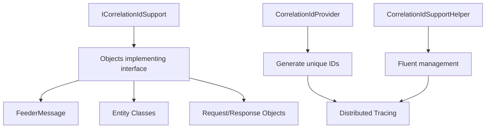

# CorrelationId System

Comprehensive solution for tracking and correlating requests, messages, and operations across distributed systems through unique identifiers.

## Components

| Component | Purpose | Key Features |
|-----------|---------|--------------|
| **ICorrelationIdSupport** | Interface for correlation ID storage | Standard contract, fluent integration, type safety |
| **CorrelationIdProvider** | Unique correlation ID generation | Time-based uniqueness, type information, deterministic hashing |
| **CorrelationIdSupportHelper** | Extension methods for fluent management | GenerateCorrelationId(), SetCorrelationId(), fluent API |

## Architecture



## Quick Start

### Basic Implementation
```csharp
using RapidStreamer.BuildingBlocks.Application.CorrelationId;

// Implement the interface
public class OrderRequest : ICorrelationIdSupport
{
    public string CorrelationId { get; set; } = string.Empty;
    public string OrderId { get; set; } = string.Empty;
    public decimal Amount { get; set; }
}

// Generate correlation ID using fluent extension
var request = new OrderRequest { OrderId = "ORD-001", Amount = 299.99m }
    .GenerateCorrelationId();

Console.WriteLine($"Processing order: {request.CorrelationId}");
```

### Web API Integration
```csharp
[ApiController]
[Route("api/[controller]")]
public class OrdersController : ControllerBase
{
    [HttpPost]
    public async Task<IActionResult> CreateOrder(CreateOrderRequest request)
    {
        // Generate correlation ID for request tracking
        request.GenerateCorrelationId();
        
        // Process with correlation context
        var result = await _orderService.ProcessAsync(request);
        
        return Ok(result);
    }
}
```

### Message Processing
```csharp
// FeederMessage already implements ICorrelationIdSupport
public class OrderCreatedMessage : FeederMessage
{
    public string OrderId { get; set; } = string.Empty;
    public decimal Amount { get; set; }
}

var message = new OrderCreatedMessage 
{ 
    OrderId = "ORD-001", 
    Amount = 299.99m 
}
.GenerateCorrelationId();

await messageProcessor.ProcessAsync(message);
```

## ICorrelationIdSupport Interface

### Purpose
Defines the contract for objects that can store and manage correlation IDs for distributed tracing.

### API Reference
```csharp
public interface ICorrelationIdSupport
{
    string CorrelationId { get; set; }
}
```

### Implementation Pattern
```csharp
public class ApiRequest : ICorrelationIdSupport
{
    public string CorrelationId { get; set; } = string.Empty;
    
    // Other request properties
    public string RequestId { get; set; } = string.Empty;
    public DateTime Timestamp { get; set; } = DateTime.UtcNow;
}
```

## CorrelationIdProvider

### Purpose
Static utility for generating unique, time-based correlation IDs with optional type information and deterministic hashing.

### Key Methods
```csharp
// Basic generation
string Generate()

// Type-specific generation
string Generate<T>()
string Generate(Type type)

// Deterministic generation (for testing)
string GenerateForType<T>(object sourceObject)
```

### Generation Patterns
```csharp
// Simple unique ID
string correlationId = CorrelationIdProvider.Generate();
// Output: "20241230143055123456789"

// Type-specific ID
string typedId = CorrelationIdProvider.Generate<OrderRequest>();
// Output: "OrderRequest_20241230143055123456789"

// Deterministic ID (same input = same output)
var request = new { OrderId = "ORD-001" };
string deterministicId = CorrelationIdProvider.GenerateForType<OrderRequest>(request);
// Output: "OrderRequest_hash_of_request_content"
```

## CorrelationIdSupportHelper

### Purpose
Extension methods providing fluent API for correlation ID management on objects implementing ICorrelationIdSupport.

### Key Methods
```csharp
// Fluent correlation ID generation
T GenerateCorrelationId<T>(this T instance) where T : ICorrelationIdSupport

// Set specific correlation ID
T SetCorrelationId<T>(this T instance, string correlationId) where T : ICorrelationIdSupport

// Conditional generation
T GenerateCorrelationIdIfEmpty<T>(this T instance) where T : ICorrelationIdSupport
```

### Usage Patterns
```csharp
// Fluent generation
var request = new OrderRequest()
    .GenerateCorrelationId()
    .SetAdditionalProperties();

// Conditional generation
var existingRequest = loadedRequest
    .GenerateCorrelationIdIfEmpty(); // Only generates if CorrelationId is empty

// Method chaining
var processedRequest = request
    .GenerateCorrelationId()
    .ValidateRequest()
    .LogRequest();
```

## Integration Patterns

### ASP.NET Core Middleware
```csharp
public class CorrelationIdMiddleware
{
    private readonly RequestDelegate _next;
    
    public CorrelationIdMiddleware(RequestDelegate next)
    {
        _next = next;
    }
    
    public async Task InvokeAsync(HttpContext context)
    {
        // Get or generate correlation ID
        var correlationId = context.Request.Headers["X-Correlation-ID"].FirstOrDefault()
                           ?? CorrelationIdProvider.Generate();
        
        // Add to response headers
        context.Response.Headers.Add("X-Correlation-ID", correlationId);
        
        // Store in context for use throughout request
        context.Items["CorrelationId"] = correlationId;
        
        await _next(context);
    }
}
```

### Message Queue Integration
```csharp
public class MessageProcessor<T> where T : ICorrelationIdSupport
{
    public async Task ProcessAsync(T message)
    {
        // Ensure correlation ID exists
        message.GenerateCorrelationIdIfEmpty();
        
        // Use correlation ID in logging
        using var scope = _logger.BeginScope(new Dictionary<string, object>
        {
            ["CorrelationId"] = message.CorrelationId
        });
        
        _logger.LogInformation("Processing message with correlation ID: {CorrelationId}", 
            message.CorrelationId);
        
        // Process message...
        await ProcessMessageAsync(message);
    }
}
```

### Database Entity Tracking
```csharp
public class AuditableEntity : ICorrelationIdSupport
{
    public int Id { get; set; }
    public string CorrelationId { get; set; } = string.Empty;
    public DateTime CreatedAt { get; set; }
    public string CreatedBy { get; set; } = string.Empty;
}

public class EntityService
{
    public async Task<TEntity> CreateAsync<TEntity>(TEntity entity) 
        where TEntity : AuditableEntity
    {
        // Ensure correlation ID for audit trail
        entity.GenerateCorrelationIdIfEmpty();
        entity.CreatedAt = DateTime.UtcNow;
        
        await _repository.AddAsync(entity);
        
        _logger.LogInformation("Created entity {EntityType} with correlation ID: {CorrelationId}",
            typeof(TEntity).Name, entity.CorrelationId);
        
        return entity;
    }
}
```

### Distributed Service Calls
```csharp
public class ServiceClient
{
    private readonly HttpClient _httpClient;
    
    public async Task<TResponse> CallServiceAsync<TRequest, TResponse>(TRequest request)
        where TRequest : ICorrelationIdSupport
        where TResponse : ICorrelationIdSupport
    {
        // Ensure request has correlation ID
        request.GenerateCorrelationIdIfEmpty();
        
        // Add correlation ID to headers
        _httpClient.DefaultRequestHeaders.Remove("X-Correlation-ID");
        _httpClient.DefaultRequestHeaders.Add("X-Correlation-ID", request.CorrelationId);
        
        // Make service call
        var json = JsonHelper.Serialize(request);
        var httpResponse = await _httpClient.PostAsync("/api/endpoint", 
            new StringContent(json, Encoding.UTF8, "application/json"));
        
        var responseJson = await httpResponse.Content.ReadAsStringAsync();
        var response = JsonHelper.Deserialize<TResponse>(responseJson);
        
        // Propagate correlation ID to response
        response.SetCorrelationId(request.CorrelationId);
        
        return response;
    }
}
```

## Performance Considerations

### ID Generation
- **Time-based**: Provides natural uniqueness and sortability
- **Memory Efficient**: Uses string concatenation with minimal allocations
- **Thread Safe**: Static methods are safe for concurrent access

### Deterministic Generation
- **Testing Support**: Same input always produces same correlation ID
- **Hash-based**: Uses object content for consistency
- **Caching**: Results can be cached for repeated operations

### Best Practices
- Generate correlation IDs as early as possible in request lifecycle
- Propagate correlation IDs across all service boundaries
- Include correlation IDs in all log messages for traceability
- Use conditional generation to avoid overwriting existing IDs
        
        // Return with same correlation ID
        return Ok(new ApiResponse 
        { 
            Data = result 
        }.SetCorrelationId(request.CorrelationId));
    }
}
```

## Component Details

### ICorrelationIdSupport Interface

The foundation interface that enables any class to participate in correlation ID tracking:

```csharp
public interface ICorrelationIdSupport
{
    string CorrelationId { get; protected internal set; }
}
```

**Key Features:**
- Simple property contract for correlation ID storage
- Protected setter ensures controlled access
- Universal application to any class type

**Read full documentation →**

### CorrelationIdProvider

Static utility class that generates unique correlation IDs with temporal and type information:

```csharp
public static class CorrelationIdProvider
{
    public static string GenerateCorrelationId<T>(this T input) where T : notnull;
}
```

**Key Features:**
- Time-stamped unique ID generation
- Type information encoding
- Special handling for FeederMessage objects
- Telemetry integration

**Read full documentation →**

### CorrelationIdSupportHelper

Extension methods providing fluent API for correlation ID management:

```csharp
public static class CorrelationIdSupportHelper
{
    public static T GenerateCorrelationId<T>(this T input) where T : class, ICorrelationIdSupport;
    public static T SetCorrelationId<T>(this T input, string correlationId) where T : class, ICorrelationIdSupport;
}
```

**Key Features:**
- Fluent method chaining
- Automatic ID generation and assignment
- Manual correlation ID setting
- Returns original object for chaining

**Read full documentation →**

## Integration Patterns

### Dependency Injection Configuration

```csharp
public static class ServiceCollectionExtensions
{
    public static IServiceCollection AddCorrelationId(this IServiceCollection services)
    {
        services.AddScoped<ICorrelationContextService, CorrelationContextService>();
        services.AddSingleton<CorrelationIdCache>();
        services.AddTransient<CorrelationIdMiddleware>();
        
        return services;
    }
}

public interface ICorrelationContextService
{
    T CreateWithCorrelationId<T>() where T : class, ICorrelationIdSupport, new();
    T EnsureCorrelationId<T>(T item) where T : class, ICorrelationIdSupport;
    string GetCurrentCorrelationId();
}
```

### Middleware Integration

```csharp
public class CorrelationIdMiddleware
{
    private readonly RequestDelegate _next;
    
    public CorrelationIdMiddleware(RequestDelegate next)
    {
        _next = next;
    }
    
    public async Task InvokeAsync(HttpContext context)
    {
        // Extract or generate correlation ID
        string correlationId = context.Request.Headers["X-Correlation-ID"]
            .FirstOrDefault() ?? context.GenerateCorrelationId();
        
        // Add to response headers
        context.Response.Headers.Add("X-Correlation-ID", correlationId);
        
        // Store in context for downstream use
        context.Items["CorrelationId"] = correlationId;
        
        await _next(context);
    }
}
```

### Entity Framework Integration

```csharp
public abstract class BaseEntity : ICorrelationIdSupport
{
    public int Id { get; set; }
    public string CorrelationId { get; set; } = string.Empty;
    public DateTime CreatedAt { get; set; } = DateTime.UtcNow;
}

public class ApplicationDbContext : DbContext
{
    public override async Task<int> SaveChangesAsync(CancellationToken cancellationToken = default)
    {
        // Auto-generate correlation IDs for new entities
        var newEntities = ChangeTracker.Entries<ICorrelationIdSupport>()
            .Where(e => e.State == EntityState.Added && string.IsNullOrEmpty(e.Entity.CorrelationId))
            .Select(e => e.Entity);
            
        foreach (var entity in newEntities)
        {
            entity.GenerateCorrelationId();
        }
        
        return await base.SaveChangesAsync(cancellationToken);
    }
}
```

### Message Queue Integration

```csharp
public class MessagePublisher<T> where T : ICorrelationIdSupport
{
    public async Task PublishAsync(T message, string? correlationId = null)
    {
        // Ensure correlation ID
        if (!string.IsNullOrEmpty(correlationId))
        {
            message.SetCorrelationId(correlationId);
        }
        else if (string.IsNullOrEmpty(message.CorrelationId))
        {
            message.GenerateCorrelationId();
        }
        
        // Create envelope with correlation tracking
        var envelope = new MessageEnvelope
        {
            MessageId = Guid.NewGuid().ToString(),
            MessageType = typeof(T).Name,
            CorrelationId = message.CorrelationId,
            Payload = message,
            Timestamp = DateTime.UtcNow
        };
        
        await PublishToQueue(envelope);
    }
}
```

## Usage Examples

### End-to-End Request Tracking

```csharp
// 1. Web API receives request
[HttpPost("orders")]
public async Task<IActionResult> CreateOrder(CreateOrderRequest request)
{
    // Generate correlation ID at entry point
    request.GenerateCorrelationId();
    
    _logger.LogInformation("Processing order creation [{CorrelationId}]", 
        request.CorrelationId);
    
    // 2. Pass to service layer
    var result = await _orderService.CreateAsync(request);
    
    return Ok(result);
}

// 3. Service processes with same correlation ID
public class OrderService
{
    public async Task<OrderResult> CreateAsync(CreateOrderRequest request)
    {
        using var activity = Activity.StartActivity("OrderService.Create");
        activity?.SetTag("correlation.id", request.CorrelationId);
        
        // 4. Create domain entity with correlation ID
        var order = new Order
        {
            OrderNumber = GenerateOrderNumber(),
            CustomerId = request.CustomerId,
            Items = request.Items
        }.SetCorrelationId(request.CorrelationId);
        
        // 5. Persist with correlation tracking
        await _repository.SaveAsync(order);
        
        // 6. Publish event with correlation ID
        var orderCreatedEvent = new OrderCreatedEvent
        {
            OrderId = order.Id,
            CustomerId = order.CustomerId,
            Amount = order.TotalAmount
        }.SetCorrelationId(request.CorrelationId);
        
        await _eventPublisher.PublishAsync(orderCreatedEvent);
        
        return new OrderResult 
        { 
            OrderId = order.Id 
        }.SetCorrelationId(request.CorrelationId);
    }
}
```

### Batch Processing

```csharp
public class BatchProcessor<T> where T : class, ICorrelationIdSupport
{
    public async Task<BatchResult> ProcessBatchAsync(IEnumerable<T> items)
    {
        // Ensure all items have correlation IDs
        var itemsList = items.ToList();
        itemsList.EnsureCorrelationIds();
        
        var results = new List<ProcessingResult>();
        
        await Parallel.ForEachAsync(itemsList, async (item, ct) =>
        {
            using var activity = Activity.StartActivity("BatchProcessor.ProcessItem");
            activity?.SetTag("correlation.id", item.CorrelationId);
            
            try
            {
                var result = await ProcessItemAsync(item);
                results.Add(new ProcessingResult 
                { 
                    Success = true, 
                    Item = item 
                }.SetCorrelationId(item.CorrelationId));
            }
            catch (Exception ex)
            {
                _logger.LogError(ex, "Failed to process item [{CorrelationId}]", 
                    item.CorrelationId);
                    
                results.Add(new ProcessingResult 
                { 
                    Success = false, 
                    Error = ex.Message, 
                    Item = item 
                }.SetCorrelationId(item.CorrelationId));
            }
        });
        
        return new BatchResult
        {
            TotalItems = itemsList.Count,
            SuccessfulItems = results.Count(r => r.Success),
            FailedItems = results.Count(r => !r.Success),
            Results = results
        };
    }
}
```

### Error Handling and Recovery

```csharp
public class ErrorHandlingService
{
    public async Task<ProcessingResult> ProcessWithRecovery<T>(T item) 
        where T : class, ICorrelationIdSupport
    {
        const int maxRetries = 3;
        var correlationId = item.CorrelationId;
        
        for (int attempt = 1; attempt <= maxRetries; attempt++)
        {
            try
            {
                _logger.LogInformation("Processing attempt {Attempt} [{CorrelationId}]", 
                    attempt, correlationId);
                
                var result = await ProcessItemAsync(item);
                
                _logger.LogInformation("Successfully processed on attempt {Attempt} [{CorrelationId}]", 
                    attempt, correlationId);
                
                return new ProcessingResult 
                { 
                    Success = true, 
                    Attempts = attempt 
                }.SetCorrelationId(correlationId);
            }
            catch (TransientException ex)
            {
                _logger.LogWarning(ex, "Transient error on attempt {Attempt} [{CorrelationId}]", 
                    attempt, correlationId);
                
                if (attempt == maxRetries)
                {
                    return new ProcessingResult 
                    { 
                        Success = false, 
                        Error = $"Max retries exceeded: {ex.Message}",
                        Attempts = attempt 
                    }.SetCorrelationId(correlationId);
                }
                
                await Task.Delay(TimeSpan.FromSeconds(Math.Pow(2, attempt))); // Exponential backoff
            }
            catch (Exception ex)
            {
                _logger.LogError(ex, "Permanent error on attempt {Attempt} [{CorrelationId}]", 
                    attempt, correlationId);
                
                return new ProcessingResult 
                { 
                    Success = false, 
                    Error = ex.Message,
                    Attempts = attempt 
                }.SetCorrelationId(correlationId);
            }
        }
        
        // Should never reach here
        throw new InvalidOperationException("Unexpected code path");
    }
}
```

## Performance Considerations

### Efficient ID Generation

```csharp
// Use object pooling for high-volume scenarios
public class CorrelationIdPool
{
    private readonly ConcurrentQueue<StringBuilder> _builders = new();
    
    public string GenerateOptimized<T>(T input) where T : notnull
    {
        if (!_builders.TryDequeue(out var sb))
        {
            sb = new StringBuilder(64);
        }
        
        try
        {
            // Generate using pooled StringBuilder
            return BuildCorrelationId(input, sb);
        }
        finally
        {
            sb.Clear();
            _builders.Enqueue(sb);
        }
    }
}
```

### Batch Operations

```csharp
public static class BatchCorrelationExtensions
{
    public static void EnsureCorrelationIds<T>(this IList<T> items) 
        where T : ICorrelationIdSupport
    {
        Parallel.ForEach(
            items.Where(i => string.IsNullOrEmpty(i.CorrelationId)),
            item => item.GenerateCorrelationId()
        );
    }
    
    public static Dictionary<string, T> IndexByCorrelationId<T>(this IEnumerable<T> items) 
        where T : ICorrelationIdSupport
    {
        return items.ToDictionary(i => i.CorrelationId, i => i);
    }
}
```

## Testing Strategies

### Unit Testing

```csharp
[TestClass]
public class CorrelationIdSystemTests
{
    [TestMethod]
    public void GenerateCorrelationId_CreatesUniqueIds()
    {
        var item1 = new TestItem().GenerateCorrelationId();
        var item2 = new TestItem().GenerateCorrelationId();
        
        Assert.AreNotEqual(item1.CorrelationId, item2.CorrelationId);
    }
    
    [TestMethod]
    public void SetCorrelationId_MaintainsCustomId()
    {
        const string customId = "CUSTOM-ID-123";
        var item = new TestItem().SetCorrelationId(customId);
        
        Assert.AreEqual(customId, item.CorrelationId);
    }
    
    [TestMethod]
    public void CorrelationId_PropagatesThoughPipeline()
    {
        var request = new TestRequest().GenerateCorrelationId();
        var response = ProcessRequest(request);
        
        Assert.AreEqual(request.CorrelationId, response.CorrelationId);
    }
}
```

### Integration Testing

```csharp
[TestClass]
public class CorrelationIdIntegrationTests
{
    [TestMethod]
    public async Task EndToEndProcessing_MaintainsCorrelationId()
    {
        // Arrange
        var request = new OrderRequest { Amount = 100m }.GenerateCorrelationId();
        var originalId = request.CorrelationId;
        
        // Act
        using var client = _factory.CreateClient();
        var response = await client.PostAsJsonAsync("/api/orders", request);
        
        // Assert
        Assert.IsTrue(response.IsSuccessStatusCode);
        Assert.AreEqual(originalId, response.Headers.GetValues("X-Correlation-ID").First());
    }
}
```

## Best Practices

1. **Early Generation**: Generate correlation IDs at system boundaries (API entry points, message handlers)
2. **Consistent Propagation**: Always pass correlation IDs through all layers and external calls
3. **Logging Integration**: Include correlation IDs in all log messages for end-to-end traceability
4. **Error Preservation**: Maintain correlation IDs through exception handling and error responses
5. **Performance Optimization**: Use batch operations for high-volume scenarios
6. **Testing**: Verify correlation ID generation, propagation, and persistence in tests
7. **Documentation**: Document correlation ID usage patterns and requirements

## Troubleshooting

### Common Issues

**Missing Correlation IDs**
```csharp
// Problem: Correlation ID not being set
var item = new MyItem();
// Solution: Always generate or set correlation ID
var item = new MyItem().GenerateCorrelationId();
```

**Correlation ID Loss**
```csharp
// Problem: Not propagating correlation ID
var response = ProcessRequest(request);
// Solution: Explicitly propagate correlation ID
var response = ProcessRequest(request).SetCorrelationId(request.CorrelationId);
```

**Performance Issues**
```csharp
// Problem: Generating many correlation IDs
foreach (var item in items)
{
    item.GenerateCorrelationId();
}
// Solution: Use batch operations
items.EnsureCorrelationIds();
```

## Related Documentation

### Application Components
- **[Application Building Blocks](../README.md)**: Complete application components overview
  - **[Core Components](../README.md#essential-components)** - FeederMessage and correlation ID integration
  - **[Telemetry](../README.md#telemetry)** - Activity tracking and observability integration
- **[Helper Utilities](../Helpers/README.md)**: Utility functions for correlation ID management
  - **[Object Helper](../Helpers/README.md#objecthelper)** - Object manipulation utilities
  - **[String Helper](../Helpers/README.md#stringhelper)** - String processing for correlation IDs
- **[Serialization System](../Serializations/README.md)**: Correlation ID serialization
  - **[JSON Serialization](../Serializations/README.md#json-serialization-utilities)** - Serialize correlation IDs in messages
  - **[Performance Optimizations](../Serializations/README.md#performance-benchmarks)** - Efficient correlation ID handling

### Integration Patterns
- **[Change Tracking](../ChangeTrackingItems/README.md)**: Correlate changes across operations
  - **[Change Tracking Framework](../ChangeTrackingItems/README.md#change-tracking-framework)** - Track changes with correlation IDs
  - **[Audit Trails](../ChangeTrackingItems/README.md#related-systems)** - Correlation ID-based audit systems
- **[Collections System](../Collections/README.md)**: Observable collections with correlation tracking
  - **[Observable Collections](../Collections/README.md#bindingdictionary)** - Event-driven collections with correlation support

### Infrastructure Integration
- **[Infrastructure Components](../../Infrastructure/README.md)** - Infrastructure-level correlation tracking
  - **[Health Checks](../../Infrastructure/HealthChecks/README.md)** - Health monitoring with correlation IDs
  - **[System Monitoring](../../Infrastructure/SystemResourceMonitor/README.md)** - System performance tracking with correlation support

### Use Cases and Patterns
- **Distributed Tracing**: Request correlation across microservices and APIs
- **Message Processing**: Correlate messages in event-driven architectures
- **Audit Logging**: Track operations and changes with unique identifiers
- **Error Tracking**: Associate errors with specific request flows
- **Performance Monitoring**: Correlate performance metrics across system boundaries

## Contributing

When extending the CorrelationId system:

1. Maintain backward compatibility with existing interfaces
2. Follow naming conventions for correlation ID properties
3. Include comprehensive unit and integration tests
4. Update documentation with usage examples
5. Consider performance implications for high-volume scenarios

## Version History

- **v1.0**: Initial implementation with basic correlation ID generation
- **v1.1**: Added CorrelationIdSupportHelper for fluent API
- **v1.2**: Enhanced FeederMessage integration and telemetry support
- **v1.3**: Performance optimizations and batch processing capabilities