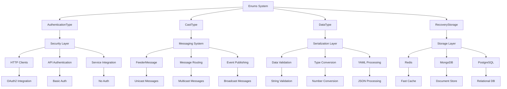

# Enums System

The Enums system provides a comprehensive collection of standardized enumerations used throughout the RapidStreamer BuildingBlocks framework. These enums establish consistent vocabularies for authentication, messaging, data types, and storage operations, ensuring type safety and improving code maintainability across the entire platform.

## System Overview

The Enums system consists of four primary enumerations that cover different aspects of the framework:

- **AuthenticationType**: Authentication mechanisms for secure communications
- **CastType**: Message distribution patterns for the messaging system
- **DataType**: Universal data type classification for serialization and validation
- **RecoveryStorage**: Storage backend options for data recovery and persistence

## Architecture



## Quick Start Guide

### Authentication Configuration

```csharp
using RapidStreamer.BuildingBlocks.Application.Enums;

// Configure API client with different authentication types
public class ApiConfiguration
{
    public string BaseUrl { get; set; } = string.Empty;
    public AuthenticationType AuthType { get; set; } = AuthenticationType.None;
    public Dictionary<string, string> AuthParameters { get; set; } = new();
}

// Basic authentication
var basicConfig = new ApiConfiguration
{
    BaseUrl = "https://api.example.com",
    AuthType = AuthenticationType.Basic,
    AuthParameters = { ["username"] = "admin", ["password"] = "secret" }
};

// OAuth2 authentication
var oauthConfig = new ApiConfiguration
{
    BaseUrl = "https://secure-api.example.com",
    AuthType = AuthenticationType.OAuth2,
    AuthParameters = { ["token"] = "bearer-token-here" }
};
```

### Message Distribution

```csharp
using RapidStreamer.BuildingBlocks.Application;
using RapidStreamer.BuildingBlocks.Application.Enums;

public class NotificationMessage : FeederMessage
{
    public string Title { get; set; } = string.Empty;
    public string Content { get; set; } = string.Empty;
    public string UserId { get; set; } = string.Empty;
}

// Unicast: Send to specific user
var personalMessage = new NotificationMessage
{
    Title = "Personal Notification",
    Content = "Your order has been shipped",
    UserId = "user123",
    CastType = CastType.Unicast
};

// Multicast: Send to subscribers (default)
var groupMessage = new NotificationMessage
{
    Title = "Group Update",
    Content = "New feature available",
    CastType = CastType.Multicast // This is the default
};

// Broadcast: Send to everyone
var systemMessage = new NotificationMessage
{
    Title = "System Maintenance",
    Content = "Scheduled maintenance in 30 minutes",
    CastType = CastType.Broadcast
};
```

### Data Type Handling

```csharp
using RapidStreamer.BuildingBlocks.Application.Enums;

public class DataProcessor
{
    public object? ProcessValue(string input, DataType expectedType)
    {
        return expectedType switch
        {
            DataType.String => input,
            DataType.Number => long.Parse(input),
            DataType.Decimal => decimal.Parse(input),
            DataType.Boolean => bool.Parse(input),
            DataType.DateTime => DateTime.Parse(input),
            DataType.Json => JsonSerializer.Deserialize<object>(input),
            _ => input
        };
    }
    
    public string FormatValue(object value, DataType dataType)
    {
        return dataType switch
        {
            DataType.Currency => ((decimal)value).ToString("C"),
            DataType.Percent => ((decimal)value / 100).ToString("P"),
            DataType.Date => ((DateTime)value).ToString("yyyy-MM-dd"),
            DataType.Time => ((TimeOnly)value).ToString("HH:mm:ss"),
            _ => value.ToString() ?? string.Empty
        };
    }
}
```

### Recovery Storage Configuration

```csharp
using RapidStreamer.BuildingBlocks.Application.Enums;

public class RecoveryConfiguration
{
    public RecoveryStorage StorageOptions { get; set; } = RecoveryStorage.None;
    public Dictionary<string, string> ConnectionStrings { get; set; } = new();
}

// Single storage backend
var redisOnly = new RecoveryConfiguration
{
    StorageOptions = RecoveryStorage.Redis,
    ConnectionStrings = { ["Redis"] = "localhost:6379" }
};

// Multiple storage backends for redundancy
var redundantStorage = new RecoveryConfiguration
{
    StorageOptions = RecoveryStorage.Redis | RecoveryStorage.MongoDb,
    ConnectionStrings = 
    {
        ["Redis"] = "localhost:6379",
        ["MongoDb"] = "mongodb://localhost:27017/recovery"
    }
};

// Check which storages are configured
if (redundantStorage.StorageOptions.HasFlag(RecoveryStorage.Redis))
{
    Console.WriteLine("Redis storage enabled");
}

if (redundantStorage.StorageOptions.HasFlag(RecoveryStorage.MongoDb))
{
    Console.WriteLine("MongoDB storage enabled");
}
```

## Component Details

### AuthenticationType

Defines authentication mechanisms for secure service communications:

| Value | Description | Use Case | Security Level |
|-------|-------------|----------|----------------|
| `None` | No authentication | Public APIs, internal services | None |
| `Basic` | HTTP Basic Auth | Simple authentication, legacy systems | Medium |
| `OAuth2` | OAuth 2.0 protocol | Modern APIs, third-party integration | High |

**Key Features:**
- Standardized authentication configuration
- HTTP client factory integration
- Middleware support for automatic authentication
- Configurable per-service authentication strategies

**Read full documentation →**

### CastType

Controls message distribution patterns in the messaging system:

| Value | Description | Delivery Pattern | Performance |
|-------|-------------|------------------|-------------|
| `Multicast` | Multiple specific recipients | Subscriber-based | Medium |
| `Broadcast` | All available recipients | System-wide | Lowest |
| `Unicast` | Single specific recipient | Point-to-point | Highest |

**Key Features:**
- Integration with FeederMessage system
- Automatic routing based on cast type
- Performance optimization per delivery pattern
- Telemetry and monitoring support

**Read full documentation →**

### DataType

Universal data type classification for cross-platform compatibility:

| Value | Description | Examples | Platform Mapping |
|-------|-------------|----------|------------------|
| `String` | Text data | `"Hello World"` | C# `string`, JS `string` |
| `Number` | Large integers | `1234567890` | C# `long`, JS `Number` |
| `Decimal` | Precise decimals | `123.45` | C# `decimal` |
| `Currency` | Monetary values | `$1,234.56` | Formatted decimal |
| `DateTime` | Date and time | `2024-01-01T12:00:00Z` | ISO 8601 format |
| `Boolean` | True/false | `true`, `false` | C# `bool`, JS `boolean` |
| `Json` | Structured data | `{"key": "value"}` | Parsed objects |

**Key Features:**
- Cross-platform data type mapping
- Automatic validation and conversion
- Formatting and display support
- YAML type converter integration

**Read full documentation →**

### RecoveryStorage

Storage backend configuration for data recovery and persistence:

| Value | Description | Characteristics | Best For |
|-------|-------------|-----------------|----------|
| `None` | No storage | No persistence | Stateless operations |
| `Redis` | In-memory cache | Fast, volatile | Session data, caching |
| `MongoDb` | Document store | Flexible schema | Complex documents |
| `Postgresql` | Relational DB | ACID compliance | Structured data |

**Key Features:**
- Flags enum for multiple storage backends
- Hierarchical storage strategies
- Health monitoring and failover
- Configurable redundancy levels

**Read full documentation →**

## Integration Patterns

### Unified Configuration System

```csharp
public class SystemConfiguration
{
    public AuthenticationType DefaultAuthType { get; set; } = AuthenticationType.None;
    public CastType DefaultCastType { get; set; } = CastType.Multicast;
    public RecoveryStorage RecoveryOptions { get; set; } = RecoveryStorage.None;
    public Dictionary<DataType, string> DataTypeFormats { get; set; } = new();
}

public class ConfigurationService
{
    public void ApplySystemDefaults(SystemConfiguration config)
    {
        // Configure authentication
        HttpClientDefaults.AuthenticationType = config.DefaultAuthType;
        
        // Configure messaging
        FeederMessage.DefaultCastType = config.DefaultCastType;
        
        // Configure storage
        RecoveryService.DefaultStorage = config.RecoveryOptions;
        
        // Configure data formatting
        DataTypeFormatter.DefaultFormats = config.DataTypeFormats;
    }
}
```

### Cross-System Usage Patterns

```csharp
public class IntegratedWorkflowService
{
    public async Task<WorkflowResult> ProcessWorkflowAsync(WorkflowRequest request)
    {
        // 1. Authenticate the request based on enum configuration
        var authResult = await AuthenticateRequest(request.AuthType);
        if (!authResult.Success)
        {
            return WorkflowResult.AuthenticationFailed();
        }
        
        // 2. Process data using DataType validation
        var processedData = new Dictionary<string, object>();
        foreach (var field in request.Data)
        {
            var convertedValue = ConvertDataType(field.Value, field.ExpectedType);
            processedData[field.Key] = convertedValue;
        }
        
        // 3. Store recovery data using configured storage
        var recoveryData = new WorkflowRecoveryData
        {
            WorkflowId = request.WorkflowId,
            ProcessedData = processedData,
            Timestamp = DateTime.UtcNow
        };
        
        await StoreRecoveryData(recoveryData, request.RecoveryStorage);
        
        // 4. Send notification using appropriate cast type
        var notification = new WorkflowCompletedMessage
        {
            WorkflowId = request.WorkflowId,
            Status = "Completed",
            CastType = request.NotificationCastType
        };
        
        await SendNotification(notification);
        
        return WorkflowResult.Success(processedData);
    }
    
    private async Task<AuthResult> AuthenticateRequest(AuthenticationType authType)
    {
        return authType switch
        {
            AuthenticationType.None => AuthResult.Success(),
            AuthenticationType.Basic => await ValidateBasicAuth(),
            AuthenticationType.OAuth2 => await ValidateOAuth2Token(),
            _ => AuthResult.Failed("Unknown authentication type")
        };
    }
    
    private object ConvertDataType(string value, DataType dataType)
    {
        var converter = new DataTypeConverter();
        return converter.ConvertValue(value, dataType);
    }
    
    private async Task StoreRecoveryData(WorkflowRecoveryData data, RecoveryStorage storage)
    {
        var storageManager = new RecoveryStorageManager();
        await storageManager.StoreRecoveryDataAsync(data.WorkflowId, data, storage);
    }
    
    private async Task SendNotification(WorkflowCompletedMessage message)
    {
        var messagingService = new MessagingService();
        await messagingService.SendAsync(message);
    }
}
```

### Dependency Injection Setup

```csharp
public static class ServiceCollectionExtensions
{
    public static IServiceCollection AddEnumsSystem(this IServiceCollection services,
        IConfiguration configuration)
    {
        // Register enum-based configurations
        services.Configure<SystemConfiguration>(
            configuration.GetSection("System"));
        
        // Register enum-aware services
        services.AddScoped<IAuthenticationService, EnumBasedAuthenticationService>();
        services.AddScoped<IMessagingService, CastTypeAwareMessagingService>();
        services.AddScoped<IDataTypeService, DataTypeValidationService>();
        services.AddScoped<IRecoveryService, RecoveryStorageService>();
        
        // Register unified workflow service
        services.AddScoped<IntegratedWorkflowService>();
        
        return services;
    }
}

// appsettings.json
{
  "System": {
    "DefaultAuthType": "OAuth2",
    "DefaultCastType": "Multicast", 
    "RecoveryOptions": "Redis, MongoDb",
    "DataTypeFormats": {
      "Currency": "C2",
      "Percent": "P1",
      "DateTime": "yyyy-MM-dd HH:mm:ss"
    }
  }
}
```

## Common Usage Scenarios

### API Gateway Configuration

```csharp
public class ApiGatewayService
{
    public RouteConfiguration ConfigureRoute(string path, 
        AuthenticationType authType,
        CastType notificationCastType,
        RecoveryStorage auditStorage)
    {
        return new RouteConfiguration
        {
            Path = path,
            AuthenticationRequired = authType != AuthenticationType.None,
            AuthenticationType = authType,
            AuditConfiguration = new AuditConfiguration
            {
                Storage = auditStorage,
                RetentionPeriod = TimeSpan.FromDays(90)
            },
            NotificationConfiguration = new NotificationConfiguration
            {
                CastType = notificationCastType,
                IncludeAuditEvents = true
            }
        };
    }
}
```

### Data Processing Pipeline

```csharp
public class DataProcessingPipeline
{
    public async Task<ProcessingResult> ProcessDataAsync(
        Dictionary<string, (string Value, DataType Type)> inputData,
        AuthenticationType sourceAuth,
        RecoveryStorage backupStorage)
    {
        var results = new Dictionary<string, object>();
        var errors = new List<string>();
        
        // Stage 1: Authenticate data source
        if (sourceAuth != AuthenticationType.None)
        {
            var authValid = await ValidateDataSource(sourceAuth);
            if (!authValid)
            {
                throw new UnauthorizedAccessException("Data source authentication failed");
            }
        }
        
        // Stage 2: Process and validate each data field
        foreach (var (key, (value, dataType)) in inputData)
        {
            try
            {
                var processedValue = ProcessValue(value, dataType);
                results[key] = processedValue;
            }
            catch (Exception ex)
            {
                errors.Add($"Failed to process {key}: {ex.Message}");
            }
        }
        
        // Stage 3: Store backup data if configured
        if (backupStorage != RecoveryStorage.None)
        {
            var backupData = new
            {
                OriginalData = inputData,
                ProcessedData = results,
                Errors = errors,
                Timestamp = DateTime.UtcNow
            };
            
            await StoreBackup(backupData, backupStorage);
        }
        
        // Stage 4: Send processing notification
        var notification = new DataProcessingCompletedMessage
        {
            ProcessedFields = results.Count,
            ErrorCount = errors.Count,
            CastType = errors.Any() ? CastType.Broadcast : CastType.Multicast
        };
        
        await SendProcessingNotification(notification);
        
        return new ProcessingResult
        {
            ProcessedData = results,
            Errors = errors,
            Success = !errors.Any()
        };
    }
}
```

### System Health Monitoring

```csharp
public class SystemHealthService
{
    public async Task<SystemHealthReport> GetSystemHealthAsync()
    {
        var report = new SystemHealthReport();
        
        // Check authentication systems
        report.AuthenticationHealth = await CheckAuthenticationHealth();
        
        // Check messaging system
        report.MessagingHealth = await CheckMessagingHealth();
        
        // Check data processing
        report.DataProcessingHealth = await CheckDataProcessingHealth();
        
        // Check recovery storage
        report.StorageHealth = await CheckStorageHealth();
        
        return report;
    }
    
    private async Task<HealthStatus> CheckAuthenticationHealth()
    {
        var authTypes = Enum.GetValues<AuthenticationType>();
        var healthyCount = 0;
        
        foreach (var authType in authTypes)
        {
            if (authType == AuthenticationType.None) continue;
            
            try
            {
                var isHealthy = await TestAuthenticationType(authType);
                if (isHealthy) healthyCount++;
            }
            catch
            {
                // Auth type unavailable
            }
        }
        
        return healthyCount > 0 ? HealthStatus.Healthy : HealthStatus.Unhealthy;
    }
    
    private async Task<HealthStatus> CheckStorageHealth()
    {
        var storageTypes = new[] 
        { 
            RecoveryStorage.Redis, 
            RecoveryStorage.MongoDb, 
            RecoveryStorage.Postgresql 
        };
        
        var healthyCount = 0;
        
        foreach (var storage in storageTypes)
        {
            try
            {
                var isHealthy = await TestStorageType(storage);
                if (isHealthy) healthyCount++;
            }
            catch
            {
                // Storage unavailable
            }
        }
        
        return healthyCount >= 2 ? HealthStatus.Healthy :
               healthyCount == 1 ? HealthStatus.Degraded :
               HealthStatus.Unhealthy;
    }
}
```

## Testing Strategies

### Comprehensive Enum Testing

```csharp
[TestClass]
public class EnumsSystemTests
{
    [TestMethod]
    public void AllEnums_HaveExpectedValues()
    {
        // Test AuthenticationType
        Assert.AreEqual(3, Enum.GetValues<AuthenticationType>().Length);
        Assert.IsTrue(Enum.IsDefined(typeof(AuthenticationType), AuthenticationType.OAuth2));
        
        // Test CastType
        Assert.AreEqual(3, Enum.GetValues<CastType>().Length);
        Assert.AreEqual(0, (int)CastType.Multicast);
        
        // Test DataType
        Assert.AreEqual(11, Enum.GetValues<DataType>().Length);
        Assert.AreEqual(1, (int)DataType.String);
        
        // Test RecoveryStorage
        Assert.IsTrue(typeof(RecoveryStorage).GetCustomAttributes<FlagsAttribute>().Any());
        Assert.AreEqual(4, Enum.GetValues<RecoveryStorage>().Length);
    }
    
    [TestMethod]
    public void EnumsIntegration_WorksAcrossSystems()
    {
        // Create a configuration using all enums
        var config = new IntegratedConfiguration
        {
            AuthType = AuthenticationType.OAuth2,
            MessageCastType = CastType.Multicast,
            DataValidation = new Dictionary<string, DataType>
            {
                ["userId"] = DataType.Number,
                ["userName"] = DataType.String,
                ["isActive"] = DataType.Boolean
            },
            RecoveryOptions = RecoveryStorage.Redis | RecoveryStorage.MongoDb
        };
        
        // Verify configuration is valid
        Assert.AreNotEqual(AuthenticationType.None, config.AuthType);
        Assert.IsTrue(config.RecoveryOptions.HasFlag(RecoveryStorage.Redis));
        Assert.AreEqual(3, config.DataValidation.Count);
    }
    
    [TestMethod]
    public void EnumConversion_HandlesStringParsing()
    {
        // Test string to enum conversion for all enum types
        Assert.AreEqual(AuthenticationType.Basic, 
            Enum.Parse<AuthenticationType>("Basic"));
        Assert.AreEqual(CastType.Unicast, 
            Enum.Parse<CastType>("Unicast"));
        Assert.AreEqual(DataType.Json, 
            Enum.Parse<DataType>("Json"));
        
        // Test flags enum parsing
        var combinedStorage = (RecoveryStorage)Enum.Parse(typeof(RecoveryStorage), "Redis, MongoDb");
        Assert.IsTrue(combinedStorage.HasFlag(RecoveryStorage.Redis));
        Assert.IsTrue(combinedStorage.HasFlag(RecoveryStorage.MongoDb));
    }
}
```

### Integration Testing

```csharp
[TestClass]
public class EnumIntegrationTests
{
    [TestMethod]
    public async Task WorkflowService_UsesAllEnumsCorrectly()
    {
        // Arrange
        var mockAuth = new Mock<IAuthenticationService>();
        var mockMessaging = new Mock<IMessagingService>();
        var mockStorage = new Mock<IRecoveryStorageService>();
        
        var service = new IntegratedWorkflowService(
            mockAuth.Object, mockMessaging.Object, mockStorage.Object);
        
        var request = new WorkflowRequest
        {
            AuthType = AuthenticationType.OAuth2,
            NotificationCastType = CastType.Multicast,
            RecoveryStorage = RecoveryStorage.Redis | RecoveryStorage.MongoDb,
            Data = new Dictionary<string, (string, DataType)>
            {
                ["id"] = ("123", DataType.Number),
                ["name"] = ("Test", DataType.String),
                ["active"] = ("true", DataType.Boolean)
            }
        };
        
        // Act
        var result = await service.ProcessWorkflowAsync(request);
        
        // Assert
        Assert.IsTrue(result.Success);
        mockAuth.Verify(a => a.ValidateAsync(AuthenticationType.OAuth2), Times.Once);
        mockStorage.Verify(s => s.StoreAsync(It.IsAny<string>(), It.IsAny<object>(), 
            RecoveryStorage.Redis | RecoveryStorage.MongoDb), Times.Once);
    }
}
```

## Best Practices

### Enum Design Guidelines

1. **Consistent Naming**: Use descriptive names that clearly indicate purpose
2. **Explicit Values**: Always specify explicit values for enums used in persistence or APIs
3. **Flags Design**: Use powers of 2 for flags enums to avoid value conflicts
4. **Documentation**: Include XML documentation with examples and use cases
5. **Backward Compatibility**: Never change existing enum values in production systems

### Usage Patterns

1. **Configuration**: Use enums for configuration options to ensure type safety
2. **Validation**: Always validate enum values when deserializing from external sources
3. **Switch Statements**: Use exhaustive switch statements with default cases
4. **Extension Methods**: Create extension methods for common enum operations
5. **Integration**: Design enums to work seamlessly across different system components

### Error Handling

```csharp
public class EnumValidationService
{
    public bool IsValidEnum<T>(string value) where T : struct, Enum
    {
        return Enum.TryParse<T>(value, true, out _);
    }
    
    public T ParseEnumSafely<T>(string value, T defaultValue) where T : struct, Enum
    {
        return Enum.TryParse<T>(value, true, out var result) ? result : defaultValue;
    }
    
    public ValidationResult ValidateEnumConfiguration(object configuration)
    {
        var errors = new List<string>();
        
        // Use reflection to find enum properties and validate them
        var enumProperties = configuration.GetType()
            .GetProperties()
            .Where(p => p.PropertyType.IsEnum);
        
        foreach (var property in enumProperties)
        {
            var value = property.GetValue(configuration);
            if (value != null && !Enum.IsDefined(property.PropertyType, value))
            {
                errors.Add($"Invalid enum value for {property.Name}: {value}");
            }
        }
        
        return errors.Any() 
            ? ValidationResult.Failure(string.Join(", ", errors))
            : ValidationResult.Success("All enum values valid");
    }
}
```

## Performance Considerations

### Enum Performance Tips

1. **Caching**: Cache enum string conversions for frequently used values
2. **Avoid Boxing**: Use generic constraints to avoid boxing/unboxing
3. **Switch vs. Dictionary**: Use switch statements for small enum sets, dictionaries for large ones
4. **Flags Operations**: Use bitwise operations efficiently for flags enums

### Optimization Example

```csharp
public static class EnumCache<T> where T : struct, Enum
{
    private static readonly Dictionary<string, T> StringToEnum = 
        Enum.GetValues<T>().ToDictionary(e => e.ToString(), e => e);
    
    private static readonly Dictionary<T, string> EnumToString = 
        Enum.GetValues<T>().ToDictionary(e => e, e => e.ToString());
    
    public static bool TryParse(string value, out T result)
    {
        return StringToEnum.TryGetValue(value, out result);
    }
    
    public static string ToString(T value)
    {
        return EnumToString.TryGetValue(value, out var result) ? result : value.ToString();
    }
}
```

## Related Documentation

- **AuthenticationType**: Detailed authentication enum documentation
- **CastType**: Message distribution patterns documentation
- **DataType**: Universal data type system documentation
- **RecoveryStorage**: Storage backend options documentation
- **FeederMessage**: Integration with messaging system
- **YAML Type Converters**: Serialization integration

## Version History

- **v1.0**: Initial enum implementations (AuthenticationType, CastType)
- **v1.1**: Added DataType enum with comprehensive type mapping
- **v1.2**: Added RecoveryStorage flags enum for storage configuration
- **v1.3**: Enhanced documentation and cross-system integration patterns
- **v1.4**: Performance optimizations and caching strategies