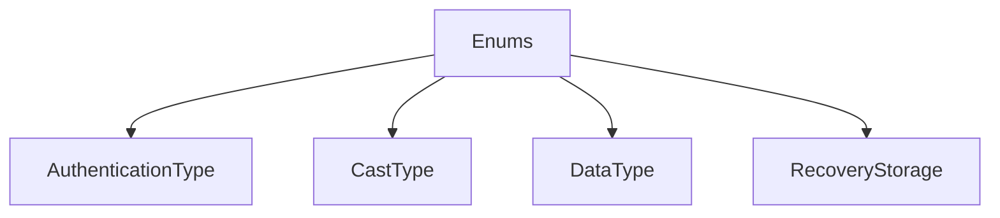

# Enums

## Contents

- [Overview](#overview)
- [Files](#files)
- [Types and Members](#types-and-members)
- [Serialization and Contracts](#serialization-and-contracts)
- [Package Dependencies](#package-dependencies)
- [Diagrams](#diagrams)
- [Examples](#examples)
- [See Also](#see-also)

## Overview

The **Enums** area groups 4 documented types, including `AuthenticationType`, `CastType`, `DataType`, `RecoveryStorage`. It provides the contracts and implementation used by this part of ThunderPropagator.BuildingBlocks.

## Files

| File | Primary type(s)/symbol(s) | LOC (approx.) | Responsibility |
|---|---|---:|---|
| `AuthenticationType.cs` | `AuthenticationType` | 9 | Defines AuthenticationType and its related behavior. |
| `CastType.cs` | `CastType` | 9 | Defines CastType and its related behavior. |
| `DataType.cs` | `DataType` | 51 | Defines DataType and its related behavior. |
| `RecoveryStorage.cs` | `RecoveryStorage` | 11 | Defines RecoveryStorage and its related behavior. |

## Types and Members

| Type | Kind | Summary | Inherits/Implements | Key Members |
|---|---|---|---|---|
| [`AuthenticationType`](#authenticationtype) | enum | Represents the AuthenticationType enum. | — | — |
| [`CastType`](#casttype) | enum | Represents the CastType enum. | — | — |
| [`DataType`](#datatype) | enum | Represents the DataType enum. | — | — |
| [`RecoveryStorage`](#recoverystorage) | enum | Represents the RecoveryStorage enum. | — | — |

### AuthenticationType

- **Kind:** enum
- **Namespace:** `ThunderPropagator.BuildingBlocks.Application.Enums`
- **Inherits/implements:** None declared
- **Attributes:** None detected
- **Key members:** Refer to the API surface in the source package
- **Summary:** Represents the AuthenticationType enum.
- **Thread safety:** Follow the lifetime and concurrency guarantees of the owning component; no additional guarantee is inferred.

**Usage recipe**

```csharp
// Resolve AuthenticationType from the configured service container or construct it with its declared dependencies.
```

[↑ Back to top](#contents)

### CastType

- **Kind:** enum
- **Namespace:** `ThunderPropagator.BuildingBlocks.Application.Enums`
- **Inherits/implements:** None declared
- **Attributes:** None detected
- **Key members:** Refer to the API surface in the source package
- **Summary:** Represents the CastType enum.
- **Thread safety:** Follow the lifetime and concurrency guarantees of the owning component; no additional guarantee is inferred.

**Usage recipe**

```csharp
// Resolve CastType from the configured service container or construct it with its declared dependencies.
```

[↑ Back to top](#contents)

### DataType

- **Kind:** enum
- **Namespace:** `ThunderPropagator.BuildingBlocks.Application.Enums`
- **Inherits/implements:** None declared
- **Attributes:** None detected
- **Key members:** Refer to the API surface in the source package
- **Summary:** Represents the DataType enum.
- **Thread safety:** Follow the lifetime and concurrency guarantees of the owning component; no additional guarantee is inferred.

**Usage recipe**

```csharp
// Resolve DataType from the configured service container or construct it with its declared dependencies.
```

[↑ Back to top](#contents)

### RecoveryStorage

- **Kind:** enum
- **Namespace:** `ThunderPropagator.BuildingBlocks.Application.Enums`
- **Inherits/implements:** None declared
- **Attributes:** None detected
- **Key members:** Refer to the API surface in the source package
- **Summary:** Represents the RecoveryStorage enum.
- **Thread safety:** Follow the lifetime and concurrency guarantees of the owning component; no additional guarantee is inferred.

**Usage recipe**

```csharp
// Resolve RecoveryStorage from the configured service container or construct it with its declared dependencies.
```

[↑ Back to top](#contents)

## Serialization and Contracts

Serialization behavior is part of the public wire or persistence contract in this area. Preserve field names, ordering rules, content negotiation, and backward-compatibility expectations when changing these types.

## Package Dependencies

| Package | Version | Description | Links |
|---|---|---|---|
| `Apache.NMS.ActiveMQ` | `2.2.0` | External dependency used by the repository. | [Registry](https://www.nuget.org/packages/Apache.NMS.ActiveMQ) |
| `Ardalis.GuardClauses` | `5.0.0` | External dependency used by the repository. | [Registry](https://www.nuget.org/packages/Ardalis.GuardClauses) |
| `CaseConverter` | `2.0.1` | External dependency used by the repository. | [Registry](https://www.nuget.org/packages/CaseConverter) |
| `JetBrains.Annotations` | `2026.2.0` | External dependency used by the repository. | [Registry](https://www.nuget.org/packages/JetBrains.Annotations) |
| `Microsoft.Diagnostics.Tracing.TraceEvent` | `3.2.5` | External dependency used by the repository. | [Registry](https://www.nuget.org/packages/Microsoft.Diagnostics.Tracing.TraceEvent) |
| `Microsoft.Extensions.DependencyInjection.Abstractions` | `10.*` | External dependency used by the repository. | [Registry](https://www.nuget.org/packages/Microsoft.Extensions.DependencyInjection.Abstractions) |
| `Microsoft.Extensions.Diagnostics.HealthChecks` | `10.*` | External dependency used by the repository. | [Registry](https://www.nuget.org/packages/Microsoft.Extensions.Diagnostics.HealthChecks) |
| `Newtonsoft.Json` | `13.0.4` | External dependency used by the repository. | [Registry](https://www.nuget.org/packages/Newtonsoft.Json) |
| `SharpZipLib` | `1.4.2` | External dependency used by the repository. | [Registry](https://www.nuget.org/packages/SharpZipLib) |
| `System.IdentityModel.Tokens.Jwt` | `8.19.2` | External dependency used by the repository. | [Registry](https://www.nuget.org/packages/System.IdentityModel.Tokens.Jwt) |

## Diagrams

### Component overview



The diagram shows the direct components documented by the **Enums** area.

## Examples

Start with `AuthenticationType` as the primary entry point for this folder, then follow its linked contracts and collaborators.

## See Also

- [Parent area](../README.md)
- [Attributes](../Attributes/README.md)
- [Certificate](../Certificate/README.md)
- [ChangeTrackingItems](../ChangeTrackingItems/README.md)
- [Ciphering](../Ciphering/README.md)
- [Collections](../Collections/README.md)
- [CorrelationId](../CorrelationId/README.md)
- [Helpers](../Helpers/README.md)
- [Identity](../Identity/README.md)
- [Objects](../Objects/README.md)
- [Serializations](../Serializations/README.md)

[↑ Back to top](#contents)
