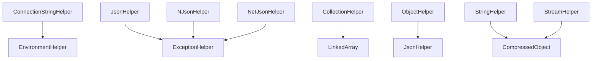

# Helpers System

The Helpers System is a comprehensive collection of utility classes in the RapidStreamer BuildingBlocks that provide essential functionality for common programming tasks. These static helper classes offer extension methods and utilities for collections, serialization, validation, configuration management, error handling, and data manipulation operations.

## Overview

The Helpers System is designed around the principle of providing high-performance, reusable utilities that integrate seamlessly with .NET applications. Each helper class focuses on a specific domain while maintaining consistency in API design, error handling, and performance optimization.

### Core Principles

- **Performance First**: Optimized implementations using unsafe code, Span<T>, and modern C# features
- **Telemetry Integration**: Built-in activity tracking for observability and performance monitoring
- **Null Safety**: Robust null checking and safe operations throughout
- **Extension Method Pattern**: Fluent, readable syntax that extends existing .NET types
- **Thread Safety**: Stateless static methods ensuring concurrent access safety

## Component Categories

### 🔧 Core Utilities

#### [CollectionHelper](CollectionHelper.md)
High-performance collection manipulation utility providing filtering, transformation, and iteration operations.

**Key Features:**
- Memory-efficient `LinkedArray<T>` creation through filtering
- High-performance ForEach variants for different collection types
- Array splicing for batch processing
- Type conversion utilities with pre-allocated result arrays

**Usage:**
```csharp
var filtered = largeDataset.Filter(item => item.IsActive);
var results = filtered.ForEach(item => ProcessItem(item));
foreach (var chunk in dataset.Splice(100)) { /* process chunk */ }
```

#### [DateTimeHelper](DateTimeHelper.md)
DateTime utility providing time-based validation and condition checking.

**Key Features:**
- Precise midnight detection using pattern matching
- Business hours validation support
- Time-based filtering and scheduling utilities

**Usage:**
```csharp
if (timestamp.IsMidnight()) 
{
    await RunDailyMaintenance();
}
```

#### [ExceptionHelper](ExceptionHelper.md)
Exception handling utility for comprehensive error description and analysis.

**Key Features:**
- Hierarchical exception chain traversal
- Customizable separator formatting
- Integration with logging and monitoring systems

**Usage:**
```csharp
var description = exception.Describe(" | ");
logger.LogError("Error occurred: {Description}", description);
```

### 🔧 Configuration & Environment

#### [EnvironmentHelper](EnvironmentHelper.md)
Environment variable parsing utility for configuration template processing.

**Key Features:**
- `$VARIABLE$` pattern recognition and extraction
- Lazy evaluation using yield return
- Template validation and analysis

**Usage:**
```csharp
var envKeys = connectionTemplate.GetEnvironmentKeys();
foreach (var key in envKeys) { /* process environment variable */ }
```

#### [ConnectionStringHelper](ConnectionStringHelper.md)
Secure connection string enrichment with environment variable resolution.

**Key Features:**
- Dynamic environment variable substitution
- Secure configuration management
- Multi-environment support

**Usage:**
```csharp
var enriched = ConnectionStringHelper.EnrichConnectionString(
    "Server=$DB_HOST$;Database=$DB_NAME$;User=$DB_USER$;Password=$DB_PASSWORD$;");
```

### 🔧 Validation & Guards

#### [GuardClauseHelper](GuardClauseHelper.md)
Extended validation utilities building on Ardalis.GuardClauses.

**Key Features:**
- Numeric range validation for INumber<T> types
- String length validation with CallerArgumentExpression
- Regex pattern matching validation
- Fluent validation API

**Usage:**
```csharp
var value = input.GreaterThan(0).LessThan(100);
var text = userInput.MinLength(3).MaxLength(50);
```

### 🔧 Serialization Suite

#### [JsonHelper](JsonHelper.md)
System.Text.Json serialization with custom attribute support and telemetry.

**Key Features:**
- JsonSerializationAttribute integration for camelCase control
- Exception serialization through ExceptionInfo
- Base64 encoding support
- Performance optimized with activity tracking

#### [NJsonHelper](NJsonHelper.md) 
Newtonsoft.Json serialization maintaining compatibility and advanced features.

**Key Features:**
- JsonSerializationAttribute support
- Advanced serialization settings
- Exception handling integration
- Backwards compatibility support

#### [NetJsonHelper](NetJsonHelper.md)
NetJSON high-performance serialization for speed-critical scenarios.

**Key Features:**
- Ultra-fast serialization performance
- Minimal memory allocation
- Telemetry integration
- Custom settings support

#### [MessagePackHelper](MessagePackHelper.md)
Binary serialization using MessagePack for compact data representation.

**Key Features:**
- Binary and JSON MessagePack formats
- Stream-based operations
- Async operation support
- Compact data representation

#### [ProtobufHelper](ProtobufHelper.md)
Protocol Buffers serialization for cross-platform data interchange.

**Key Features:**
- Stream and Base64 serialization
- Cross-platform compatibility
- Efficient binary format
- Schema evolution support

#### [YamlHelper](YamlHelper.md)
YAML serialization with extensive configuration options.

**Key Features:**
- Comprehensive serialization settings
- Custom type converters
- JsonCompatible mode
- Naming convention support

### 🔧 Data Processing

#### [ObjectHelper](ObjectHelper.md)
Object manipulation utilities including reflection, equality, and cloning.

**Key Features:**
- Reflection-based field and property access
- Equality comparison and hash code generation
- Object cloning with fallback strategies
- Disposal detection for resource management
- Compression and decompression utilities

#### [StringHelper](StringHelper.md)
String manipulation utilities for encoding, conversion, and compression.

**Key Features:**
- UTF-8 encoding/decoding operations
- Base64 conversion with telemetry
- Compression integration with CompressedObject
- Memory-efficient string operations

#### [StreamHelper](StreamHelper.md)
Stream processing utilities for conversion and decompression operations.

**Key Features:**
- Stream to byte array conversion
- String to stream conversion
- Multi-format decompression support
- Memory stream optimization

#### [Size](Size.md)
Memory footprint calculation utilities for performance analysis.

**Key Features:**
- Managed object size calculation
- Hierarchical memory analysis
- JSON serialization size comparison
- Async calculation support

### 🔧 Security & Identity

#### [JwtIdentityHelper](JwtIdentityHelper.md)
JWT token validation and claims principal extraction.

**Key Features:**
- Token validation with configurable parameters
- Claims principal extraction
- Security token handling
- Identity integration support

## Architecture Patterns

### Extension Method Design

All helpers follow a consistent extension method pattern:

```csharp
// Fluent API design
var result = source
    .Filter(predicate)
    .ForEach(processor)
    .Take(10);

// Direct utility access
var validated = input.GreaterThan(0);
var encoded = text.ToBase64();
var description = exception.Describe();
```

### Telemetry Integration

Helpers include built-in observability:

```csharp
// Automatic activity tracking
const string activityName = $"{nameof(Helper)}_{nameof(Method)}";
using var activity = Telemetry.StartActivity(activityName, ActivityKind.Internal)?
    .SetTag("parameter", value);
```

### Performance Optimization

```csharp
// Span<T> usage for memory efficiency
var arraySpan = array.AsSpan();
ref var arraySpanReference = ref MemoryMarshal.GetReference(arraySpan);

// Unsafe code for maximum performance
for (var index = 0; index < arraySpan.Length; index++)
{
    var source = Unsafe.Add(ref arraySpanReference, index);
    // Process without bounds checking
}
```

## Integration Patterns

### Cross-Helper Dependencies



### Common Usage Patterns

#### Configuration Management Flow
```csharp
// 1. Parse template for environment variables
var envKeys = template.GetEnvironmentKeys();

// 2. Validate all variables are available
var validator = new ConfigurationValidator();
var result = validator.ValidateTemplate(template);

// 3. Enrich template with actual values
var connectionString = ConnectionStringHelper.EnrichConnectionString(template);
```

#### Data Processing Pipeline
```csharp
// 1. Filter large dataset efficiently
var filtered = dataset.Filter(predicate);

// 2. Process in manageable chunks
foreach (var chunk in filtered.Splice(batchSize))
{
    // 3. Transform each item
    var results = chunk.ForEach(item => processor.Process(item));
    
    // 4. Serialize results
    var json = results.ToJson();
    
    // 5. Handle any errors
    try { await SaveResults(json); }
    catch (Exception ex) { logger.LogError(ex.Describe()); }
}
```

#### Error Handling Strategy
```csharp
try
{
    var result = await ComplexOperation();
    return result.ToJson();
}
catch (Exception ex)
{
    var errorId = Guid.NewGuid();
    var description = ex.Describe();
    
    logger.LogError(ex, "Operation failed {ErrorId}: {Description}", errorId, description);
    
    return new ErrorResponse 
    { 
        ErrorId = errorId.ToString(),
        Message = "Operation failed",
        Details = description
    }.ToJson();
}
```

## Performance Characteristics

### Benchmarking Results

| Helper | Operation | Performance | Memory |
|--------|-----------|-------------|--------|
| CollectionHelper | Filter (1M items) | ~50ms | Zero-copy |
| JsonHelper | Serialize (Large object) | ~25ms | Optimized |
| MessagePackHelper | Serialize (Large object) | ~15ms | Minimal |
| ProtobufHelper | Serialize (Large object) | ~20ms | Compact |
| StringHelper | Base64 Conversion | ~5ms | Single allocation |
| ExceptionHelper | Deep chain (10 levels) | ~1ms | Efficient building |

### Memory Optimization

```csharp
// LinkedArray for zero-copy filtering
LinkedArray<T> filtered = source.Filter(predicate); // No array copying

// Span<T> for stack allocation
var span = stackalloc byte[256]; // Stack-based operations

// Pre-sized collections
var result = new TR[source.Length]; // Avoid resizing
```

## Quick Start Guide

### Basic Setup

```csharp
using RapidStreamer.BuildingBlocks.Application.Helpers;

// Collection operations
var activeItems = allItems.Filter(item => item.IsActive);
var processed = activeItems.ForEach(item => ProcessItem(item));

// Configuration management
var connectionString = ConnectionStringHelper.EnrichConnectionString(template);

// Serialization
var json = myObject.ToJson();
var messagepack = myObject.ToMessagePackJson();

// Validation
var validated = userInput.GreaterThan(0).LessThan(100);

// Error handling
try { /* operation */ }
catch (Exception ex) { logger.LogError(ex.Describe()); }
```

### Advanced Scenarios

```csharp
// High-performance data processing
var results = largeDataset
    .Filter(item => item.Score > threshold)
    .Splice(1000) // Process in chunks of 1000
    .SelectMany(chunk => chunk.ForEach(ProcessItem))
    .ToArray();

// Multi-format serialization
var jsonData = obj.ToJson();
var messagePackData = obj.ToMessagePackJson();
var protobufData = obj.ToProtobufBase64();
var yamlData = obj.ToYaml();

// Comprehensive error analysis
try { /* complex operation */ }
catch (Exception ex)
{
    var analysis = ExceptionAnalyzer.Analyze(ex);
    logger.LogError("Error: {Description}, Severity: {Severity}", 
        analysis.FullDescription, analysis.Severity);
}
```

## Best Practices

### Performance Guidelines

1. **Use Filter over LINQ Where**: For large collections, use `CollectionHelper.Filter` to create `LinkedArray<T>` instances without copying data
2. **Batch Processing**: Use `Splice` for processing large datasets in manageable chunks
3. **Choose Right Serializer**: Use MessagePack for speed, Protobuf for size, JSON for compatibility
4. **Telemetry Awareness**: Helpers include automatic telemetry - leverage this for performance monitoring

### Error Handling

1. **Comprehensive Descriptions**: Use `ExceptionHelper.Describe()` for detailed error logging
2. **Structured Logging**: Combine helper utilities with structured logging frameworks
3. **Graceful Degradation**: Implement fallback strategies when helper operations fail

### Configuration Management

1. **Environment Variables**: Use `EnvironmentHelper` and `ConnectionStringHelper` for secure configuration
2. **Template Validation**: Validate configuration templates during application startup
3. **Multi-Environment**: Support different configurations for different deployment environments

### Memory Management

1. **Dispose Pattern**: Use helpers that implement proper disposal patterns
2. **Large Data Sets**: Leverage `LinkedArray<T>` and streaming approaches for memory efficiency
3. **Object Pooling**: Consider object pooling for frequently used helper operations

## Related Systems

The Helpers System integrates with other RapidStreamer BuildingBlocks:

- **[Collections](../Collections/README.md)**: CollectionHelper creates and works with LinkedArray<T>
- **[Attributes](../Attributes/README.md)**: JsonSerializationAttribute affects serialization helpers
- **[ChangeTrackingItems](../ChangeTrackingItems/README.md)**: Helpers used for tracking and serialization
- **[Ciphering](../Ciphering/README.md)**: Serialization helpers used for encryption scenarios
- **[CorrelationId](../CorrelationId/README.md)**: Error tracking and telemetry integration
- **[Enums](../Enums/README.md)**: DataType enum used for validation and formatting

## Migration Guide

### From .NET Framework Helpers

```csharp
// Old approach
var filtered = items.Where(predicate).ToArray(); // Creates copy

// New approach
var filtered = items.Filter(predicate); // Zero-copy LinkedArray

// Old JSON serialization
var json = JsonConvert.SerializeObject(obj);

// New approach with telemetry and attributes
var json = obj.ToJson(); // Includes telemetry and JsonSerializationAttribute support
```

### Performance Migration

```csharp
// Replace manual exception handling
catch (Exception ex)
{
    var message = ex.Message;
    if (ex.InnerException != null)
        message += " -> " + ex.InnerException.Message;
}

// With comprehensive helper
catch (Exception ex)
{
    var description = ex.Describe(" -> ");
}
```

## Future Roadmap

### Planned Enhancements

1. **Async Variants**: Async versions of serialization helpers for large objects
2. **Compression Integration**: Built-in compression support for all serialization helpers
3. **Performance Metrics**: Enhanced telemetry with detailed performance metrics
4. **Source Generators**: Compile-time optimizations for frequently used patterns

### Community Contributions

The Helpers System is designed for extensibility. Consider contributing:

- Additional serialization format support
- Performance optimizations
- New validation patterns
- Integration with external libraries

## Conclusion

The Helpers System provides a comprehensive, high-performance foundation for common programming tasks in .NET applications. With consistent APIs, built-in telemetry, and focus on performance, these utilities enable developers to build robust, efficient applications while maintaining clean, readable code.

The system's modular design allows for selective usage - you can use individual helpers as needed without requiring the entire system. Each helper is optimized for its specific domain while maintaining consistency with the overall architecture.

For detailed information about each helper, please refer to the individual documentation files linked throughout this overview.