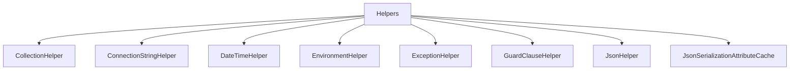

# Helpers

## Contents

- [Overview](#overview)
- [Files](#files)
- [Types and Members](#types-and-members)
- [Serialization and Contracts](#serialization-and-contracts)
- [Validation and Constraints](#validation-and-constraints)
- [Performance Notes](#performance-notes)
- [Package Dependencies](#package-dependencies)
- [Diagrams](#diagrams)
- [Examples](#examples)
- [See Also](#see-also)

## Overview

The **Helpers** area groups 13 documented types, including `CollectionHelper`, `ConnectionStringHelper`, `DateTimeHelper`, `EnvironmentHelper`, `ExceptionHelper`. It provides the contracts and implementation used by this part of ThunderPropagator.BuildingBlocks.

## Files

| File | Primary type(s)/symbol(s) | LOC (approx.) | Responsibility |
|---|---|---:|---|
| `CollectionHelper.cs` | `CollectionHelper` | 178 | Defines CollectionHelper and its related behavior. |
| `ConnectionStringHelper.cs` | `ConnectionStringHelper` | 21 | Defines ConnectionStringHelper and its related behavior. |
| `DateTimeHelper.cs` | `DateTimeHelper` | 16 | Defines DateTimeHelper and its related behavior. |
| `EnvironmentHelper.cs` | `EnvironmentHelper` | 18 | Defines EnvironmentHelper and its related behavior. |
| `ExceptionHelper.cs` | `ExceptionHelper` | 20 | Defines ExceptionHelper and its related behavior. |
| `ExceptionInfoNewtonsoftConverter.cs` | `ExceptionInfoNewtonsoftConverter` | 56 | Defines ExceptionInfoNewtonsoftConverter and its related behavior. |
| `GuardClauseHelper.cs` | `GuardClauseHelper` | 149 | Defines GuardClauseHelper and its related behavior. |
| `JsonHelper.cs` | `JsonHelper`, `SensitiveDataStringJsonConverter` | 213 | Defines JsonHelper, SensitiveDataStringJsonConverter and its related behavior. |
| `JsonSerializationAttributeCache.cs` | `JsonSerializationAttributeCache` | 17 | Defines JsonSerializationAttributeCache and its related behavior. |
| `JwtIdentityHelper.cs` | `JwtIdentityHelper` | 76 | Defines JwtIdentityHelper and its related behavior. |
| `NJsonHelper.cs` | `NJsonHelper`, `SensitiveDataContractResolver`, `SensitiveDataValueProvider` | 290 | Defines NJsonHelper, SensitiveDataContractResolver, SensitiveDataValueProvider and its related behavior. |
| `ObjectHelper.cs` | `ObjectHelper` | 191 | Defines ObjectHelper and its related behavior. |
| `Size.cs` | `ReferenceEqualityComparer` | 323 | Defines ReferenceEqualityComparer and its related behavior. |
| `StreamHelper.cs` | `StreamHelper` | 78 | Defines StreamHelper and its related behavior. |
| `StringHelper.cs` | `StringHelper` | 92 | Defines StringHelper and its related behavior. |

## Types and Members

| Type | Kind | Summary | Inherits/Implements | Key Members |
|---|---|---|---|---|
| [`CollectionHelper`](#collectionhelper) | class | Represents the CollectionHelper class. | — | — |
| [`ConnectionStringHelper`](#connectionstringhelper) | class | Represents the ConnectionStringHelper class. | — | `EnrichConnectionString(…)` |
| [`DateTimeHelper`](#datetimehelper) | class | Represents the DateTimeHelper class. | — | `IsMidnight(…)` |
| [`EnvironmentHelper`](#environmenthelper) | class | Represents the EnvironmentHelper class. | — | `GetEnvironmentKeys(…)` |
| [`ExceptionHelper`](#exceptionhelper) | class | Represents the ExceptionHelper class. | — | `Describe(…)` |
| [`GuardClauseHelper`](#guardclausehelper) | class | Represents the GuardClauseHelper class. | — | `MinLength(…)` |
| [`JsonHelper`](#jsonhelper) | class | Represents the JsonHelper class. | — | `Read(…)`, `Write(…)`, `BuildDefaultSerializerOptions(…)`, `JsonSerializerOptions(…)` |
| [`JsonSerializationAttributeCache`](#jsonserializationattributecache) | class | Represents the JsonSerializationAttributeCache class. | — | `Get(…)` |
| [`JwtIdentityHelper`](#jwtidentityhelper) | class | Represents the JwtIdentityHelper class. | — | `GetPrincipalFromToken(…)`, `IsTokenValid(…)` |
| [`NJsonHelper`](#njsonhelper) | class | Represents the NJsonHelper class. | — | — |
| [`ObjectHelper`](#objecthelper) | class | Represents the ObjectHelper class. | — | `GetFields(…)`, `GetProperties(…)`, `GetFields(…)`, `GetProperties(…)`, `EquatableEqual(…)`, `EquatableHashCode(…)` |
| [`StreamHelper`](#streamhelper) | class | Represents the StreamHelper class. | — | `ToByteArray(…)`, `ToStream(…)`, `DecompressStream(…)` |
| [`StringHelper`](#stringhelper) | class | Represents the StringHelper class. | — | `ToByteArray(…)`, `ToByteReadOnlyMemory(…)`, `FromByteArray(…)`, `ToBase64(…)`, `FromBase64(…)`, `DecompressString(…)` |

### CollectionHelper

- **Kind:** class
- **Namespace:** `ThunderPropagator.BuildingBlocks.Application.Helpers`
- **Inherits/implements:** None declared
- **Attributes:** None detected
- **Key members:** Refer to the API surface in the source package
- **Summary:** Represents the CollectionHelper class.
- **Thread safety:** Follow the lifetime and concurrency guarantees of the owning component; no additional guarantee is inferred.

**Usage recipe**

```csharp
// Resolve CollectionHelper from the configured service container or construct it with its declared dependencies.
```

[↑ Back to top](#contents)

### ConnectionStringHelper

- **Kind:** class
- **Namespace:** `ThunderPropagator.BuildingBlocks.Application.Helpers`
- **Inherits/implements:** None declared
- **Attributes:** None detected
- **Key members:** `EnrichConnectionString(…)`
- **Summary:** Represents the ConnectionStringHelper class.
- **Thread safety:** Follow the lifetime and concurrency guarantees of the owning component; no additional guarantee is inferred.

**Usage recipe**

```csharp
// Resolve ConnectionStringHelper from the configured service container or construct it with its declared dependencies.
```

[↑ Back to top](#contents)

### DateTimeHelper

- **Kind:** class
- **Namespace:** `ThunderPropagator.BuildingBlocks.Application.Helpers`
- **Inherits/implements:** None declared
- **Attributes:** None detected
- **Key members:** `IsMidnight(…)`
- **Summary:** Represents the DateTimeHelper class.
- **Thread safety:** Follow the lifetime and concurrency guarantees of the owning component; no additional guarantee is inferred.

**Usage recipe**

```csharp
// Resolve DateTimeHelper from the configured service container or construct it with its declared dependencies.
```

[↑ Back to top](#contents)

### EnvironmentHelper

- **Kind:** class
- **Namespace:** `ThunderPropagator.BuildingBlocks.Application.Helpers`
- **Inherits/implements:** None declared
- **Attributes:** None detected
- **Key members:** `GetEnvironmentKeys(…)`
- **Summary:** Represents the EnvironmentHelper class.
- **Thread safety:** Follow the lifetime and concurrency guarantees of the owning component; no additional guarantee is inferred.

**Usage recipe**

```csharp
// Resolve EnvironmentHelper from the configured service container or construct it with its declared dependencies.
```

[↑ Back to top](#contents)

### ExceptionHelper

- **Kind:** class
- **Namespace:** `ThunderPropagator.BuildingBlocks.Application.Helpers`
- **Inherits/implements:** None declared
- **Attributes:** None detected
- **Key members:** `Describe(…)`
- **Summary:** Represents the ExceptionHelper class.
- **Thread safety:** Follow the lifetime and concurrency guarantees of the owning component; no additional guarantee is inferred.

**Usage recipe**

```csharp
// Resolve ExceptionHelper from the configured service container or construct it with its declared dependencies.
```

[↑ Back to top](#contents)

### GuardClauseHelper

- **Kind:** class
- **Namespace:** `ThunderPropagator.BuildingBlocks.Application.Helpers`
- **Inherits/implements:** None declared
- **Attributes:** None detected
- **Key members:** `MinLength(…)`
- **Summary:** Represents the GuardClauseHelper class.
- **Thread safety:** Follow the lifetime and concurrency guarantees of the owning component; no additional guarantee is inferred.

**Usage recipe**

```csharp
// Resolve GuardClauseHelper from the configured service container or construct it with its declared dependencies.
```

[↑ Back to top](#contents)

### JsonHelper

- **Kind:** class
- **Namespace:** `ThunderPropagator.BuildingBlocks.Application.Helpers`
- **Inherits/implements:** None declared
- **Attributes:** None detected
- **Key members:** `Read(…)`, `Write(…)`, `BuildDefaultSerializerOptions(…)`, `JsonSerializerOptions(…)`
- **Summary:** Represents the JsonHelper class.
- **Thread safety:** Follow the lifetime and concurrency guarantees of the owning component; no additional guarantee is inferred.

**Usage recipe**

```csharp
// Resolve JsonHelper from the configured service container or construct it with its declared dependencies.
```

[↑ Back to top](#contents)

### JsonSerializationAttributeCache

- **Kind:** class
- **Namespace:** `ThunderPropagator.BuildingBlocks.Application.Helpers`
- **Inherits/implements:** None declared
- **Attributes:** None detected
- **Key members:** `Get(…)`
- **Summary:** Represents the JsonSerializationAttributeCache class.
- **Thread safety:** Follow the lifetime and concurrency guarantees of the owning component; no additional guarantee is inferred.

**Usage recipe**

```csharp
// Resolve JsonSerializationAttributeCache from the configured service container or construct it with its declared dependencies.
```

[↑ Back to top](#contents)

### JwtIdentityHelper

- **Kind:** class
- **Namespace:** `ThunderPropagator.BuildingBlocks.Application.Helpers`
- **Inherits/implements:** None declared
- **Attributes:** None detected
- **Key members:** `GetPrincipalFromToken(…)`, `IsTokenValid(…)`
- **Summary:** Represents the JwtIdentityHelper class.
- **Thread safety:** Follow the lifetime and concurrency guarantees of the owning component; no additional guarantee is inferred.

**Usage recipe**

```csharp
// Resolve JwtIdentityHelper from the configured service container or construct it with its declared dependencies.
```

[↑ Back to top](#contents)

### NJsonHelper

- **Kind:** class
- **Namespace:** `ThunderPropagator.BuildingBlocks.Application.Helpers`
- **Inherits/implements:** None declared
- **Attributes:** None detected
- **Key members:** Refer to the API surface in the source package
- **Summary:** Represents the NJsonHelper class.
- **Thread safety:** Follow the lifetime and concurrency guarantees of the owning component; no additional guarantee is inferred.

**Usage recipe**

```csharp
// Resolve NJsonHelper from the configured service container or construct it with its declared dependencies.
```

[↑ Back to top](#contents)

### ObjectHelper

- **Kind:** class
- **Namespace:** `ThunderPropagator.BuildingBlocks.Application.Helpers`
- **Inherits/implements:** None declared
- **Attributes:** None detected
- **Key members:** `GetFields(…)`, `GetProperties(…)`, `GetFields(…)`, `GetProperties(…)`, `EquatableEqual(…)`, `EquatableHashCode(…)`
- **Summary:** Represents the ObjectHelper class.
- **Thread safety:** Follow the lifetime and concurrency guarantees of the owning component; no additional guarantee is inferred.

**Usage recipe**

```csharp
// Resolve ObjectHelper from the configured service container or construct it with its declared dependencies.
```

[↑ Back to top](#contents)

### StreamHelper

- **Kind:** class
- **Namespace:** `ThunderPropagator.BuildingBlocks.Application.Helpers`
- **Inherits/implements:** None declared
- **Attributes:** None detected
- **Key members:** `ToByteArray(…)`, `ToStream(…)`, `DecompressStream(…)`
- **Summary:** Represents the StreamHelper class.
- **Thread safety:** Follow the lifetime and concurrency guarantees of the owning component; no additional guarantee is inferred.

**Usage recipe**

```csharp
// Resolve StreamHelper from the configured service container or construct it with its declared dependencies.
```

[↑ Back to top](#contents)

### StringHelper

- **Kind:** class
- **Namespace:** `ThunderPropagator.BuildingBlocks.Application.Helpers`
- **Inherits/implements:** None declared
- **Attributes:** None detected
- **Key members:** `ToByteArray(…)`, `ToByteReadOnlyMemory(…)`, `FromByteArray(…)`, `ToBase64(…)`, `FromBase64(…)`, `DecompressString(…)`
- **Summary:** Represents the StringHelper class.
- **Thread safety:** Follow the lifetime and concurrency guarantees of the owning component; no additional guarantee is inferred.

**Usage recipe**

```csharp
// Resolve StringHelper from the configured service container or construct it with its declared dependencies.
```

[↑ Back to top](#contents)

## Serialization and Contracts

Serialization behavior is part of the public wire or persistence contract in this area. Preserve field names, ordering rules, content negotiation, and backward-compatibility expectations when changing these types.

## Validation and Constraints

Inputs are validated at component boundaries. Callers should provide non-null required values and handle domain or argument exceptions without retrying invalid requests unchanged.

## Performance Notes

This area contains performance-sensitive constructs such as pooled buffers, spans, asynchronous value types, or concurrent collections. Avoid unnecessary allocations and blocking calls on streaming or message-processing paths.

## Package Dependencies

| Package | Version | Description | Links |
|---|---|---|---|
| `Apache.NMS.ActiveMQ` | `2.2.0` | External dependency used by the repository. | [Registry](https://www.nuget.org/packages/Apache.NMS.ActiveMQ) |
| `Ardalis.GuardClauses` | `5.0.0` | External dependency used by the repository. | [Registry](https://www.nuget.org/packages/Ardalis.GuardClauses) |
| `CaseConverter` | `2.0.1` | External dependency used by the repository. | [Registry](https://www.nuget.org/packages/CaseConverter) |
| `JetBrains.Annotations` | `2026.2.0` | External dependency used by the repository. | [Registry](https://www.nuget.org/packages/JetBrains.Annotations) |
| `Microsoft.Diagnostics.Tracing.TraceEvent` | `3.2.5` | External dependency used by the repository. | [Registry](https://www.nuget.org/packages/Microsoft.Diagnostics.Tracing.TraceEvent) |
| `Microsoft.Extensions.DependencyInjection.Abstractions` | `10.*` | External dependency used by the repository. | [Registry](https://www.nuget.org/packages/Microsoft.Extensions.DependencyInjection.Abstractions) |
| `Microsoft.Extensions.Diagnostics.HealthChecks` | `10.*` | External dependency used by the repository. | [Registry](https://www.nuget.org/packages/Microsoft.Extensions.Diagnostics.HealthChecks) |
| `Newtonsoft.Json` | `13.0.4` | External dependency used by the repository. | [Registry](https://www.nuget.org/packages/Newtonsoft.Json) |
| `SharpZipLib` | `1.4.2` | External dependency used by the repository. | [Registry](https://www.nuget.org/packages/SharpZipLib) |
| `System.IdentityModel.Tokens.Jwt` | `8.19.2` | External dependency used by the repository. | [Registry](https://www.nuget.org/packages/System.IdentityModel.Tokens.Jwt) |

## Diagrams

### Component overview



The diagram shows the direct components documented by the **Helpers** area.

## Examples

Start with `CollectionHelper` as the primary entry point for this folder, then follow its linked contracts and collaborators.

## See Also

- [Parent area](../README.md)
- [Attributes](../Attributes/README.md)
- [Certificate](../Certificate/README.md)
- [ChangeTrackingItems](../ChangeTrackingItems/README.md)
- [Ciphering](../Ciphering/README.md)
- [Collections](../Collections/README.md)
- [CorrelationId](../CorrelationId/README.md)
- [Enums](../Enums/README.md)
- [Identity](../Identity/README.md)
- [Objects](../Objects/README.md)
- [Serializations](../Serializations/README.md)

[↑ Back to top](#contents)
