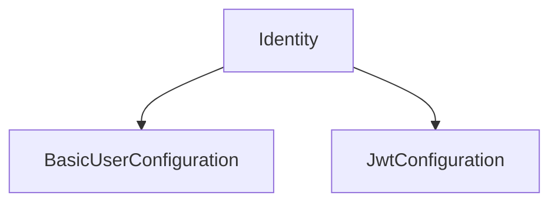

# Identity

## Contents

- [Overview](#overview)
- [Files](#files)
- [Types and Members](#types-and-members)
- [Serialization and Contracts](#serialization-and-contracts)
- [Validation and Constraints](#validation-and-constraints)
- [Package Dependencies](#package-dependencies)
- [Diagrams](#diagrams)
- [Examples](#examples)
- [See Also](#see-also)

## Overview

The **Identity** area groups 2 documented types, including `BasicUserConfiguration`, `JwtConfiguration`. It provides the contracts and implementation used by this part of ThunderPropagator.BuildingBlocks.

## Files

| File | Primary type(s)/symbol(s) | LOC (approx.) | Responsibility |
|---|---|---:|---|
| `BasicUserConfiguration.cs` | `BasicUserConfiguration` | 18 | Defines BasicUserConfiguration and its related behavior. |
| `JwtConfiguration.cs` | `JwtConfiguration` | 24 | Defines JwtConfiguration and its related behavior. |

## Types and Members

| Type | Kind | Summary | Inherits/Implements | Key Members |
|---|---|---|---|---|
| [`BasicUserConfiguration`](#basicuserconfiguration) | class | Represents the BasicUserConfiguration class. | `EquatableObject<BasicUserConfiguration>` | `GetHashCode(…)` |
| [`JwtConfiguration`](#jwtconfiguration) | class | Represents the JwtConfiguration class. | `EquatableObject<JwtConfiguration>` | — |

### BasicUserConfiguration

- **Kind:** class
- **Namespace:** `ThunderPropagator.BuildingBlocks.Application.Identity`
- **Inherits/implements:** `EquatableObject<BasicUserConfiguration>`
- **Attributes:** None detected
- **Key members:** `GetHashCode(…)`
- **Summary:** Represents the BasicUserConfiguration class.
- **Thread safety:** Follow the lifetime and concurrency guarantees of the owning component; no additional guarantee is inferred.

**Usage recipe**

```csharp
// Resolve BasicUserConfiguration from the configured service container or construct it with its declared dependencies.
```

[↑ Back to top](#contents)

### JwtConfiguration

- **Kind:** class
- **Namespace:** `ThunderPropagator.BuildingBlocks.Application.Identity`
- **Inherits/implements:** `EquatableObject<JwtConfiguration>`
- **Attributes:** None detected
- **Key members:** Refer to the API surface in the source package
- **Summary:** Represents the JwtConfiguration class.
- **Thread safety:** Follow the lifetime and concurrency guarantees of the owning component; no additional guarantee is inferred.

**Usage recipe**

```csharp
// Resolve JwtConfiguration from the configured service container or construct it with its declared dependencies.
```

[↑ Back to top](#contents)

## Serialization and Contracts

Serialization behavior is part of the public wire or persistence contract in this area. Preserve field names, ordering rules, content negotiation, and backward-compatibility expectations when changing these types.

## Validation and Constraints

Inputs are validated at component boundaries. Callers should provide non-null required values and handle domain or argument exceptions without retrying invalid requests unchanged.

## Package Dependencies

| Package | Version | Description | Links |
|---|---|---|---|
| `Apache.NMS.ActiveMQ` | `2.2.0` | External dependency used by the repository. | [Registry](https://www.nuget.org/packages/Apache.NMS.ActiveMQ) |
| `Ardalis.GuardClauses` | `5.0.0` | External dependency used by the repository. | [Registry](https://www.nuget.org/packages/Ardalis.GuardClauses) |
| `CaseConverter` | `2.0.1` | External dependency used by the repository. | [Registry](https://www.nuget.org/packages/CaseConverter) |
| `JetBrains.Annotations` | `2026.2.0` | External dependency used by the repository. | [Registry](https://www.nuget.org/packages/JetBrains.Annotations) |
| `Microsoft.Diagnostics.Tracing.TraceEvent` | `3.2.5` | External dependency used by the repository. | [Registry](https://www.nuget.org/packages/Microsoft.Diagnostics.Tracing.TraceEvent) |
| `Microsoft.Extensions.DependencyInjection.Abstractions` | `10.*` | External dependency used by the repository. | [Registry](https://www.nuget.org/packages/Microsoft.Extensions.DependencyInjection.Abstractions) |
| `Microsoft.Extensions.Diagnostics.HealthChecks` | `10.*` | External dependency used by the repository. | [Registry](https://www.nuget.org/packages/Microsoft.Extensions.Diagnostics.HealthChecks) |
| `Newtonsoft.Json` | `13.0.4` | External dependency used by the repository. | [Registry](https://www.nuget.org/packages/Newtonsoft.Json) |
| `SharpZipLib` | `1.4.2` | External dependency used by the repository. | [Registry](https://www.nuget.org/packages/SharpZipLib) |
| `System.IdentityModel.Tokens.Jwt` | `8.19.2` | External dependency used by the repository. | [Registry](https://www.nuget.org/packages/System.IdentityModel.Tokens.Jwt) |

## Diagrams

### Component overview



The diagram shows the direct components documented by the **Identity** area.

## Examples

Start with `BasicUserConfiguration` as the primary entry point for this folder, then follow its linked contracts and collaborators.

## See Also

- [Parent area](../README.md)
- [Attributes](../Attributes/README.md)
- [Certificate](../Certificate/README.md)
- [ChangeTrackingItems](../ChangeTrackingItems/README.md)
- [Ciphering](../Ciphering/README.md)
- [Collections](../Collections/README.md)
- [CorrelationId](../CorrelationId/README.md)
- [Enums](../Enums/README.md)
- [Helpers](../Helpers/README.md)
- [Objects](../Objects/README.md)
- [Serializations](../Serializations/README.md)

[↑ Back to top](#contents)
