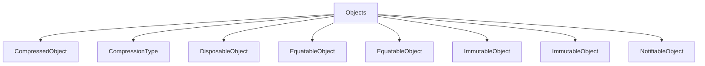

# Objects

## Contents

- [Overview](#overview)
- [Files](#files)
- [Types and Members](#types-and-members)
- [Validation and Constraints](#validation-and-constraints)
- [Performance Notes](#performance-notes)
- [Package Dependencies](#package-dependencies)
- [Diagrams](#diagrams)
- [Examples](#examples)
- [See Also](#see-also)

## Overview

The **Objects** area groups 9 documented types, including `CompressedObject`, `CompressionType`, `DisposableObject`, `EquatableObject`, `EquatableObject`. It provides the contracts and implementation used by this part of ThunderPropagator.BuildingBlocks.

## Files

| File | Primary type(s)/symbol(s) | LOC (approx.) | Responsibility |
|---|---|---:|---|
| `CompressedObject.cs` | `CompressedObject`, `CompressionType` | 28 | Defines CompressedObject, CompressionType and its related behavior. |
| `DisposableObject.cs` | `DisposableObject`, `EmptyDisposable`, `AnonymousDisposable`, `AnonymousDisposable` | 186 | Defines DisposableObject, EmptyDisposable, AnonymousDisposable and its related behavior. |
| `EquatableObject.cs` | `EquatableObject`, `EquatableObject` | 80 | Defines EquatableObject, EquatableObject and its related behavior. |
| `ImmutableObject.cs` | `ImmutableObject`, `ImmutableObject` | 48 | Defines ImmutableObject, ImmutableObject and its related behavior. |
| `NotifiableObject.cs` | `NotifiableObject`, `NotifiableChangeType` | 12 | Defines NotifiableObject, NotifiableChangeType and its related behavior. |

## Types and Members

| Type | Kind | Summary | Inherits/Implements | Key Members |
|---|---|---|---|---|
| [`CompressedObject`](#compressedobject) | struct | Represents the CompressedObject struct. | — | `Length`, `ToString(…)`, `CompressedObject(…)`, `string(…)`, `CompressedObject(…)` |
| [`CompressionType`](#compressiontype) | enum | Represents the CompressionType enum. | — | `Length`, `ToString(…)`, `CompressedObject(…)`, `string(…)`, `CompressedObject(…)` |
| [`DisposableObject`](#disposableobject) | class | Represents the DisposableObject class. | `EquatableObject,` | `IsDisposed`, `DisposeManagedResources(…)`, `IsDisposed`, `DisposeManagedResources(…)`, `IsDisposing`, `IsDisposed` |
| [`EquatableObject`](#equatableobject) | class | Represents the EquatableObject class. | `IEquatable<TEquatableObject>` | `GetAtomicValues(…)`, `Equals(…)`, `Equals(…)`, `GetHashCode(…)` |
| [`EquatableObject`](#equatableobject) | class | Represents the EquatableObject class. | `EquatableObject<EquatableObject>` | — |
| [`ImmutableObject`](#immutableobject) | class | Represents the ImmutableObject class. | `EquatableObject<TImmutableObject>` | `GetAtomicValues(…)`, `GetHashCode(…)` |
| [`ImmutableObject`](#immutableobject) | class | Represents the ImmutableObject class. | `EquatableObject<ImmutableObject>;` | — |
| [`NotifiableObject`](#notifiableobject) | class | Represents the NotifiableObject class. | — | — |
| [`NotifiableChangeType`](#notifiablechangetype) | enum | Represents the NotifiableChangeType enum. | — | — |

### CompressedObject

- **Kind:** struct
- **Namespace:** `ThunderPropagator.BuildingBlocks.Application.Objects`
- **Inherits/implements:** None declared
- **Attributes:** None detected
- **Key members:** `Length`, `ToString(…)`, `CompressedObject(…)`, `string(…)`, `CompressedObject(…)`
- **Summary:** Represents the CompressedObject struct.
- **Thread safety:** Follow the lifetime and concurrency guarantees of the owning component; no additional guarantee is inferred.

**Usage recipe**

```csharp
// Resolve CompressedObject from the configured service container or construct it with its declared dependencies.
```

[↑ Back to top](#contents)

### CompressionType

- **Kind:** enum
- **Namespace:** `ThunderPropagator.BuildingBlocks.Application.Objects`
- **Inherits/implements:** None declared
- **Attributes:** None detected
- **Key members:** `Length`, `ToString(…)`, `CompressedObject(…)`, `string(…)`, `CompressedObject(…)`
- **Summary:** Represents the CompressionType enum.
- **Thread safety:** Follow the lifetime and concurrency guarantees of the owning component; no additional guarantee is inferred.

**Usage recipe**

```csharp
// Resolve CompressionType from the configured service container or construct it with its declared dependencies.
```

[↑ Back to top](#contents)

### DisposableObject

- **Kind:** class
- **Namespace:** `ThunderPropagator.BuildingBlocks.Application.Objects`
- **Inherits/implements:** `EquatableObject,`
- **Attributes:** None detected
- **Key members:** `IsDisposed`, `DisposeManagedResources(…)`, `IsDisposed`, `DisposeManagedResources(…)`, `IsDisposing`, `IsDisposed`, `Dispose(…)`, `DisposeManagedResources(…)`
- **Summary:** Represents the DisposableObject class.
- **Thread safety:** Follow the lifetime and concurrency guarantees of the owning component; no additional guarantee is inferred.

**Usage recipe**

```csharp
// Resolve DisposableObject from the configured service container or construct it with its declared dependencies.
```

[↑ Back to top](#contents)

### EquatableObject

- **Kind:** class
- **Namespace:** `ThunderPropagator.BuildingBlocks.Application.Objects`
- **Inherits/implements:** `IEquatable<TEquatableObject>`
- **Attributes:** None detected
- **Key members:** `GetAtomicValues(…)`, `Equals(…)`, `Equals(…)`, `GetHashCode(…)`
- **Summary:** Represents the EquatableObject class.
- **Thread safety:** Follow the lifetime and concurrency guarantees of the owning component; no additional guarantee is inferred.

**Usage recipe**

```csharp
// Resolve EquatableObject from the configured service container or construct it with its declared dependencies.
```

[↑ Back to top](#contents)

### EquatableObject

- **Kind:** class
- **Namespace:** `ThunderPropagator.BuildingBlocks.Application.Objects`
- **Inherits/implements:** `EquatableObject<EquatableObject>`
- **Attributes:** None detected
- **Key members:** Refer to the API surface in the source package
- **Summary:** Represents the EquatableObject class.
- **Thread safety:** Follow the lifetime and concurrency guarantees of the owning component; no additional guarantee is inferred.

**Usage recipe**

```csharp
// Resolve EquatableObject from the configured service container or construct it with its declared dependencies.
```

[↑ Back to top](#contents)

### ImmutableObject

- **Kind:** class
- **Namespace:** `ThunderPropagator.BuildingBlocks.Application.Objects`
- **Inherits/implements:** `EquatableObject<TImmutableObject>`
- **Attributes:** None detected
- **Key members:** `GetAtomicValues(…)`, `GetHashCode(…)`
- **Summary:** Represents the ImmutableObject class.
- **Thread safety:** Follow the lifetime and concurrency guarantees of the owning component; no additional guarantee is inferred.

**Usage recipe**

```csharp
// Resolve ImmutableObject from the configured service container or construct it with its declared dependencies.
```

[↑ Back to top](#contents)

### ImmutableObject

- **Kind:** class
- **Namespace:** `ThunderPropagator.BuildingBlocks.Application.Objects`
- **Inherits/implements:** `EquatableObject<ImmutableObject>;`
- **Attributes:** None detected
- **Key members:** Refer to the API surface in the source package
- **Summary:** Represents the ImmutableObject class.
- **Thread safety:** Follow the lifetime and concurrency guarantees of the owning component; no additional guarantee is inferred.

**Usage recipe**

```csharp
// Resolve ImmutableObject from the configured service container or construct it with its declared dependencies.
```

[↑ Back to top](#contents)

### NotifiableObject

- **Kind:** class
- **Namespace:** `ThunderPropagator.BuildingBlocks.Application.Objects`
- **Inherits/implements:** None declared
- **Attributes:** None detected
- **Key members:** Refer to the API surface in the source package
- **Summary:** Represents the NotifiableObject class.
- **Thread safety:** Follow the lifetime and concurrency guarantees of the owning component; no additional guarantee is inferred.

**Usage recipe**

```csharp
// Resolve NotifiableObject from the configured service container or construct it with its declared dependencies.
```

[↑ Back to top](#contents)

### NotifiableChangeType

- **Kind:** enum
- **Namespace:** `ThunderPropagator.BuildingBlocks.Application.Objects`
- **Inherits/implements:** None declared
- **Attributes:** None detected
- **Key members:** Refer to the API surface in the source package
- **Summary:** Represents the NotifiableChangeType enum.
- **Thread safety:** Follow the lifetime and concurrency guarantees of the owning component; no additional guarantee is inferred.

**Usage recipe**

```csharp
// Resolve NotifiableChangeType from the configured service container or construct it with its declared dependencies.
```

[↑ Back to top](#contents)

## Validation and Constraints

Inputs are validated at component boundaries. Callers should provide non-null required values and handle domain or argument exceptions without retrying invalid requests unchanged.

## Performance Notes

This area contains performance-sensitive constructs such as pooled buffers, spans, asynchronous value types, or concurrent collections. Avoid unnecessary allocations and blocking calls on streaming or message-processing paths.

## Package Dependencies

| Package | Version | Description | Links |
|---|---|---|---|
| `Apache.NMS.ActiveMQ` | `2.2.0` | External dependency used by the repository. | [Registry](https://www.nuget.org/packages/Apache.NMS.ActiveMQ) |
| `Ardalis.GuardClauses` | `5.0.0` | External dependency used by the repository. | [Registry](https://www.nuget.org/packages/Ardalis.GuardClauses) |
| `CaseConverter` | `2.0.1` | External dependency used by the repository. | [Registry](https://www.nuget.org/packages/CaseConverter) |
| `JetBrains.Annotations` | `2026.2.0` | External dependency used by the repository. | [Registry](https://www.nuget.org/packages/JetBrains.Annotations) |
| `Microsoft.Diagnostics.Tracing.TraceEvent` | `3.2.5` | External dependency used by the repository. | [Registry](https://www.nuget.org/packages/Microsoft.Diagnostics.Tracing.TraceEvent) |
| `Microsoft.Extensions.DependencyInjection.Abstractions` | `10.*` | External dependency used by the repository. | [Registry](https://www.nuget.org/packages/Microsoft.Extensions.DependencyInjection.Abstractions) |
| `Microsoft.Extensions.Diagnostics.HealthChecks` | `10.*` | External dependency used by the repository. | [Registry](https://www.nuget.org/packages/Microsoft.Extensions.Diagnostics.HealthChecks) |
| `Newtonsoft.Json` | `13.0.4` | External dependency used by the repository. | [Registry](https://www.nuget.org/packages/Newtonsoft.Json) |
| `SharpZipLib` | `1.4.2` | External dependency used by the repository. | [Registry](https://www.nuget.org/packages/SharpZipLib) |
| `System.IdentityModel.Tokens.Jwt` | `8.19.2` | External dependency used by the repository. | [Registry](https://www.nuget.org/packages/System.IdentityModel.Tokens.Jwt) |

## Diagrams

### Component overview



The diagram shows the direct components documented by the **Objects** area.

## Examples

Start with `CompressedObject` as the primary entry point for this folder, then follow its linked contracts and collaborators.

## See Also

- [Parent area](../README.md)
- [Attributes](../Attributes/README.md)
- [Certificate](../Certificate/README.md)
- [ChangeTrackingItems](../ChangeTrackingItems/README.md)
- [Ciphering](../Ciphering/README.md)
- [Collections](../Collections/README.md)
- [CorrelationId](../CorrelationId/README.md)
- [Enums](../Enums/README.md)
- [Helpers](../Helpers/README.md)
- [Identity](../Identity/README.md)
- [Serializations](../Serializations/README.md)

[↑ Back to top](#contents)
