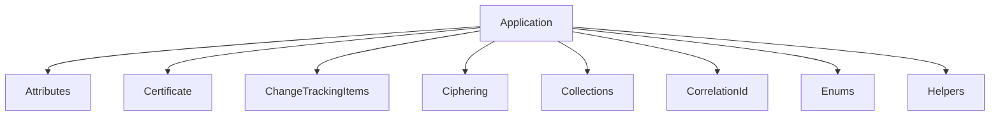

# Application

## Contents

- [Overview](#overview)
- [Files](#files)
- [Types and Members](#types-and-members)
- [Serialization and Contracts](#serialization-and-contracts)
- [Validation and Constraints](#validation-and-constraints)
- [Performance Notes](#performance-notes)
- [Package Dependencies](#package-dependencies)
- [Diagrams](#diagrams)
- [Examples](#examples)
- [See Also](#see-also)

## Overview

The **Application** area groups 11 documented types, including `BuildingBlocksExtensions`, `DispatcherTimer`, `FeederMessage`, `FeederMessageEnvelope`, `ICloneable`. It provides the contracts and implementation used by this part of ThunderPropagator.BuildingBlocks.

## Files

| File | Primary type(s)/symbol(s) | LOC (approx.) | Responsibility |
|---|---|---:|---|
| `AssemblyInfo.cs` | — | 6 | Contains the assembly info implementation or configuration. |
| `BuildingBlocksExtensions.cs` | `BuildingBlocksExtensions` | 67 | Defines BuildingBlocksExtensions and its related behavior. |
| `ConcurrentStringBuilder.cs` | `ConcurrentStringBuilder` | 789 | Defines ConcurrentStringBuilder and its related behavior. |
| `DispatcherTimer.cs` | `DispatcherTimer` | 159 | Defines DispatcherTimer and its related behavior. |
| `ExceptionInfo.cs` | `ExceptionInfo` | 55 | Defines ExceptionInfo and its related behavior. |
| `FeederMessage.cs` | `FeederMessage` | 171 | Defines FeederMessage and its related behavior. |
| `FeederMessageEnvelope.cs` | `FeederMessageEnvelope` | 31 | Defines FeederMessageEnvelope and its related behavior. |
| `FeederMessagePayload.cs` | `FeederMessagePayload` | 259 | Defines FeederMessagePayload and its related behavior. |
| `GlobalUsings.cs` | — | 1 | Contains the global usings implementation or configuration. |
| `ICloneable.cs` | `ICloneable` | 7 | Defines ICloneable and its related behavior. |
| `IConvertible.cs` | `IConvertible` | 7 | Defines IConvertible and its related behavior. |
| `InconvertibleException.cs` | `InconvertibleException` | 31 | Defines InconvertibleException and its related behavior. |
| `Result.cs` | `Result` | 51 | Defines Result and its related behavior. |
| `SensitiveDataEncryption.cs` | `SensitiveDataEncryption` | 132 | Defines SensitiveDataEncryption and its related behavior. |
| `ServiceConfiguration.cs` | `IServiceConfiguration`, `ServiceConfiguration`, `ServiceConfigurationJsonConverter` | 251 | Defines IServiceConfiguration, ServiceConfiguration, ServiceConfigurationJsonConverter and its related behavior. |
| `Telemetry.cs` | `Telemetry` | 229 | Defines Telemetry and its related behavior. |
| `ThunderPropagator.BuildingBlocks.Application.csproj` | — | 18 | Defines project build targets, dependencies, and package metadata. |

### Direct child areas

- [Attributes](./Attributes/README.md) `Types:3` `Files:3`
- [Certificate](./Certificate/README.md) `Types:1` `Files:1`
- [ChangeTrackingItems](./ChangeTrackingItems/README.md) `Types:2` `Files:5`
- [Ciphering](./Ciphering/README.md) `Types:2` `Files:3`
- [Collections](./Collections/README.md) `Types:6` `Files:3`
- [CorrelationId](./CorrelationId/README.md) `Types:3` `Files:3`
- [Enums](./Enums/README.md) `Types:4` `Files:4`
- [Helpers](./Helpers/README.md) `Types:13` `Files:15`
- [Identity](./Identity/README.md) `Types:2` `Files:2`
- [Objects](./Objects/README.md) `Types:9` `Files:5`
- [Serializations](./Serializations/README.md) `Types:5` `Files:5`

## Types and Members

| Type | Kind | Summary | Inherits/Implements | Key Members |
|---|---|---|---|---|
| [`BuildingBlocksExtensions`](#buildingblocksextensions) | class | Extension methods for registering ThunderPropagator BuildingBlocks services. | — | `AddBuildingBlocks(…)` |
| [`DispatcherTimer`](#dispatchertimer) | class | Represents the DispatcherTimer class. | — | `Run(…)` |
| [`FeederMessage`](#feedermessage) | class | Abstract base class for all strongly-typed DTO carrier messages. Each subclass property stores its value in a shared ConcurrentDictionary keyed by the property name via . This means the dictionary is tightly coupled to the object's typed surface; callers must never remove or clear entries through the interface, as doing so would silently wipe typed property values and leave the instance in a broken state. is exposed only for serializers and infrastructure code that need read or add access. returns to signal the append-only contract: Clear() , Remove(string) , and Remove(KeyValuePair) always throw . The only safe payload-clearing operations are (opt-in object-pool reset) and (called on disposal). | `DisposableObject,` | `Envelope`, `Payload`, `SetValue(…)` |
| [`FeederMessageEnvelope`](#feedermessageenvelope) | class | The protocol-level header of a . Contains infrastructure-managed routing and correlation fields and never any user-defined payload. | — | `CorrelationId`, `HashKey`, `CastType`, `IsDeleted` |
| [`ICloneable`](#icloneable) | interface | Represents the ICloneable interface. | — | — |
| [`IConvertible`](#iconvertible) | interface | Represents the IConvertible interface. | — | — |
| [`Result`](#result) | class | Represents the outcome of an operation that either succeeds with a value or fails with an expected error message, forcing callers to check before accessing . | — | `IsSuccess`, `Error`, `Value`, `Success(…)`, `Failure(…)` |
| [`SensitiveDataEncryption`](#sensitivedataencryption) | class | Central configuration point for at-rest encryption of properties marked with . Call once at application startup before any serialization occurs. All serialization paths in this library ( JSON converter and NJsonHelper ) automatically encrypt sensitive fields on write and decrypt on read while a key is active. Subsequent calls are silently ignored, matching the semantics of . | — | `IsConfigured`, `Configure(…)`, `Encrypt(…)`, `Decrypt(…)`, `RevertEncryption(…)` |
| [`IServiceConfiguration`](#iserviceconfiguration) | interface | Represents the IServiceConfiguration interface. | `IEnumerable<KeyValuePair<string, string>>;` | `WriteJson(…)`, `ReadJson(…)` |
| [`ServiceConfiguration`](#serviceconfiguration) | class | Represents the ServiceConfiguration class. | `IServiceConfiguration,` | `WriteJson(…)`, `ReadJson(…)` |
| [`Telemetry`](#telemetry) | class | Central telemetry facade for the ThunderPropagator.BuildingBlocks library. Wraps and so callers never reference the underlying instances directly. Naming conventions (OTel semantic conventions): Meter name: thunderpropagator.{subsystem} — e.g., thunderpropagator.buildingblocks . Metric name: thunderpropagator.{subsystem}.{noun}.{verb} — all lowercase, dot-separated. Unit strings: use OTel units — {message} , {request} , ms , By , 1 , etc. No snake_case or PascalCase in metric names. | — | `Version`, `SuccessfulTag`, `UnsuccessfulTag`, `Configure(…)`, `HasListeners(…)`, `StartActivity(…)` |

### BuildingBlocksExtensions

- **Kind:** class
- **Namespace:** `ThunderPropagator.BuildingBlocks.Application`
- **Inherits/implements:** None declared
- **Attributes:** None detected
- **Key members:** `AddBuildingBlocks(…)`
- **Summary:** Extension methods for registering ThunderPropagator BuildingBlocks services.
- **Thread safety:** Follow the lifetime and concurrency guarantees of the owning component; no additional guarantee is inferred.

**Usage recipe**

```csharp
// Resolve BuildingBlocksExtensions from the configured service container or construct it with its declared dependencies.
```

[↑ Back to top](#contents)

### DispatcherTimer

- **Kind:** class
- **Namespace:** `ThunderPropagator.BuildingBlocks.Application`
- **Inherits/implements:** None declared
- **Attributes:** None detected
- **Key members:** `Run(…)`
- **Summary:** Represents the DispatcherTimer class.
- **Thread safety:** Follow the lifetime and concurrency guarantees of the owning component; no additional guarantee is inferred.

**Usage recipe**

```csharp
// Resolve DispatcherTimer from the configured service container or construct it with its declared dependencies.
```

[↑ Back to top](#contents)

### FeederMessage

- **Kind:** class
- **Namespace:** `ThunderPropagator.BuildingBlocks.Application`
- **Inherits/implements:** `DisposableObject,`
- **Attributes:** None detected
- **Key members:** `Envelope`, `Payload`, `SetValue(…)`
- **Summary:** Abstract base class for all strongly-typed DTO carrier messages. Each subclass property stores its value in a shared ConcurrentDictionary keyed by the property name via . This means the dictionary is tightly coupled to the object's typed surface; callers must never remove or clear entries through the interface, as doing so would silently wipe typed property values and leave the instance in a broken state. is exposed only for serializers and infrastructure code that need read or add access. returns to signal the append-only contract: Clear() , Remove(string) , and Remove(KeyValuePair) always throw . The only safe payload-clearing operations are (opt-in object-pool reset) and (called on disposal).
- **Thread safety:** Follow the lifetime and concurrency guarantees of the owning component; no additional guarantee is inferred.

**Usage recipe**

```csharp
// Resolve FeederMessage from the configured service container or construct it with its declared dependencies.
```

[↑ Back to top](#contents)

### FeederMessageEnvelope

- **Kind:** class
- **Namespace:** `ThunderPropagator.BuildingBlocks.Application`
- **Inherits/implements:** None declared
- **Attributes:** None detected
- **Key members:** `CorrelationId`, `HashKey`, `CastType`, `IsDeleted`
- **Summary:** The protocol-level header of a . Contains infrastructure-managed routing and correlation fields and never any user-defined payload.
- **Thread safety:** Follow the lifetime and concurrency guarantees of the owning component; no additional guarantee is inferred.

**Usage recipe**

```csharp
// Resolve FeederMessageEnvelope from the configured service container or construct it with its declared dependencies.
```

[↑ Back to top](#contents)

### ICloneable

- **Kind:** interface
- **Namespace:** `ThunderPropagator.BuildingBlocks.Application`
- **Inherits/implements:** None declared
- **Attributes:** None detected
- **Key members:** Refer to the API surface in the source package
- **Summary:** Represents the ICloneable interface.
- **Thread safety:** Follow the lifetime and concurrency guarantees of the owning component; no additional guarantee is inferred.

**Usage recipe**

```csharp
// Resolve ICloneable from the configured service container or construct it with its declared dependencies.
```

[↑ Back to top](#contents)

### IConvertible

- **Kind:** interface
- **Namespace:** `ThunderPropagator.BuildingBlocks.Application`
- **Inherits/implements:** None declared
- **Attributes:** None detected
- **Key members:** Refer to the API surface in the source package
- **Summary:** Represents the IConvertible interface.
- **Thread safety:** Follow the lifetime and concurrency guarantees of the owning component; no additional guarantee is inferred.

**Usage recipe**

```csharp
// Resolve IConvertible from the configured service container or construct it with its declared dependencies.
```

[↑ Back to top](#contents)

### Result

- **Kind:** class
- **Namespace:** `ThunderPropagator.BuildingBlocks.Application`
- **Inherits/implements:** None declared
- **Attributes:** None detected
- **Key members:** `IsSuccess`, `Error`, `Value`, `Success(…)`, `Failure(…)`
- **Summary:** Represents the outcome of an operation that either succeeds with a value or fails with an expected error message, forcing callers to check before accessing .
- **Thread safety:** Follow the lifetime and concurrency guarantees of the owning component; no additional guarantee is inferred.

**Usage recipe**

```csharp
// Resolve Result from the configured service container or construct it with its declared dependencies.
```

[↑ Back to top](#contents)

### SensitiveDataEncryption

- **Kind:** class
- **Namespace:** `ThunderPropagator.BuildingBlocks.Application`
- **Inherits/implements:** None declared
- **Attributes:** None detected
- **Key members:** `IsConfigured`, `Configure(…)`, `Encrypt(…)`, `Decrypt(…)`, `RevertEncryption(…)`
- **Summary:** Central configuration point for at-rest encryption of properties marked with . Call once at application startup before any serialization occurs. All serialization paths in this library ( JSON converter and NJsonHelper ) automatically encrypt sensitive fields on write and decrypt on read while a key is active. Subsequent calls are silently ignored, matching the semantics of .
- **Thread safety:** Follow the lifetime and concurrency guarantees of the owning component; no additional guarantee is inferred.

**Usage recipe**

```csharp
// Resolve SensitiveDataEncryption from the configured service container or construct it with its declared dependencies.
```

[↑ Back to top](#contents)

### IServiceConfiguration

- **Kind:** interface
- **Namespace:** `ThunderPropagator.BuildingBlocks.Application`
- **Inherits/implements:** `IEnumerable<KeyValuePair<string, string>>;`
- **Attributes:** None detected
- **Key members:** `WriteJson(…)`, `ReadJson(…)`
- **Summary:** Represents the IServiceConfiguration interface.
- **Thread safety:** Follow the lifetime and concurrency guarantees of the owning component; no additional guarantee is inferred.

**Usage recipe**

```csharp
// Resolve IServiceConfiguration from the configured service container or construct it with its declared dependencies.
```

[↑ Back to top](#contents)

### ServiceConfiguration

- **Kind:** class
- **Namespace:** `ThunderPropagator.BuildingBlocks.Application`
- **Inherits/implements:** `IServiceConfiguration,`
- **Attributes:** None detected
- **Key members:** `WriteJson(…)`, `ReadJson(…)`
- **Summary:** Represents the ServiceConfiguration class.
- **Thread safety:** Follow the lifetime and concurrency guarantees of the owning component; no additional guarantee is inferred.

**Usage recipe**

```csharp
// Resolve ServiceConfiguration from the configured service container or construct it with its declared dependencies.
```

[↑ Back to top](#contents)

### Telemetry

- **Kind:** class
- **Namespace:** `ThunderPropagator.BuildingBlocks.Application`
- **Inherits/implements:** None declared
- **Attributes:** None detected
- **Key members:** `Version`, `SuccessfulTag`, `UnsuccessfulTag`, `Configure(…)`, `HasListeners(…)`, `StartActivity(…)`, `StartActivity(…)`
- **Summary:** Central telemetry facade for the ThunderPropagator.BuildingBlocks library. Wraps and so callers never reference the underlying instances directly. Naming conventions (OTel semantic conventions): Meter name: thunderpropagator.{subsystem} — e.g., thunderpropagator.buildingblocks . Metric name: thunderpropagator.{subsystem}.{noun}.{verb} — all lowercase, dot-separated. Unit strings: use OTel units — {message} , {request} , ms , By , 1 , etc. No snake_case or PascalCase in metric names.
- **Thread safety:** Follow the lifetime and concurrency guarantees of the owning component; no additional guarantee is inferred.

**Usage recipe**

```csharp
// Resolve Telemetry from the configured service container or construct it with its declared dependencies.
```

[↑ Back to top](#contents)

## Serialization and Contracts

Serialization behavior is part of the public wire or persistence contract in this area. Preserve field names, ordering rules, content negotiation, and backward-compatibility expectations when changing these types.

## Validation and Constraints

Inputs are validated at component boundaries. Callers should provide non-null required values and handle domain or argument exceptions without retrying invalid requests unchanged.

## Performance Notes

This area contains performance-sensitive constructs such as pooled buffers, spans, asynchronous value types, or concurrent collections. Avoid unnecessary allocations and blocking calls on streaming or message-processing paths.

## Package Dependencies

| Package | Version | Description | Links |
|---|---|---|---|
| `Apache.NMS.ActiveMQ` | `2.2.0` | External dependency used by the repository. | [Registry](https://www.nuget.org/packages/Apache.NMS.ActiveMQ) |
| `Ardalis.GuardClauses` | `5.0.0` | External dependency used by the repository. | [Registry](https://www.nuget.org/packages/Ardalis.GuardClauses) |
| `CaseConverter` | `2.0.1` | External dependency used by the repository. | [Registry](https://www.nuget.org/packages/CaseConverter) |
| `JetBrains.Annotations` | `2026.2.0` | External dependency used by the repository. | [Registry](https://www.nuget.org/packages/JetBrains.Annotations) |
| `Microsoft.Diagnostics.Tracing.TraceEvent` | `3.2.5` | External dependency used by the repository. | [Registry](https://www.nuget.org/packages/Microsoft.Diagnostics.Tracing.TraceEvent) |
| `Microsoft.Extensions.DependencyInjection.Abstractions` | `10.*` | External dependency used by the repository. | [Registry](https://www.nuget.org/packages/Microsoft.Extensions.DependencyInjection.Abstractions) |
| `Microsoft.Extensions.Diagnostics.HealthChecks` | `10.*` | External dependency used by the repository. | [Registry](https://www.nuget.org/packages/Microsoft.Extensions.Diagnostics.HealthChecks) |
| `Newtonsoft.Json` | `13.0.4` | External dependency used by the repository. | [Registry](https://www.nuget.org/packages/Newtonsoft.Json) |
| `SharpZipLib` | `1.4.2` | External dependency used by the repository. | [Registry](https://www.nuget.org/packages/SharpZipLib) |
| `System.IdentityModel.Tokens.Jwt` | `8.19.2` | External dependency used by the repository. | [Registry](https://www.nuget.org/packages/System.IdentityModel.Tokens.Jwt) |

## Diagrams

### Component overview



The diagram shows the direct components documented by the **Application** area.

## Examples

Start with `BuildingBlocksExtensions` as the primary entry point for this folder, then follow its linked contracts and collaborators.

## See Also

- [Documentation home](../README.md)
- [Infrastructure](../Infrastructure/README.md)

[↑ Back to top](#contents)
