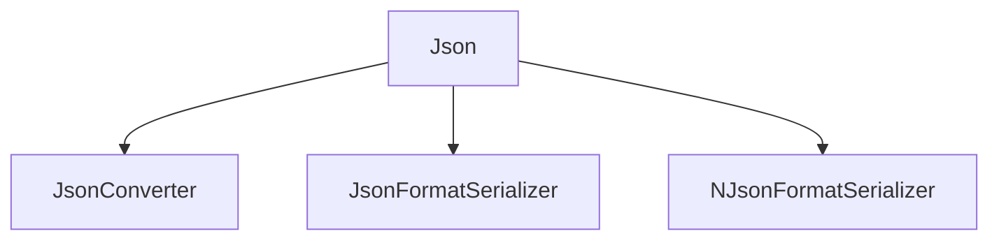

# Json

## Contents

- [Overview](#overview)
- [Files](#files)
- [Types and Members](#types-and-members)
- [Serialization and Contracts](#serialization-and-contracts)
- [Validation and Constraints](#validation-and-constraints)
- [Package Dependencies](#package-dependencies)
- [Diagrams](#diagrams)
- [Examples](#examples)
- [See Also](#see-also)

## Overview

The **Json** area groups 3 documented types, including `JsonConverter`, `JsonFormatSerializer`, `NJsonFormatSerializer`. It provides the contracts and implementation used by this part of ThunderPropagator.BuildingBlocks.

## Files

| File | Primary type(s)/symbol(s) | LOC (approx.) | Responsibility |
|---|---|---:|---|
| `JsonConverter.cs` | `JsonConverter` | 108 | Defines JsonConverter and its related behavior. |
| `JsonFormatSerializer.cs` | `JsonFormatSerializer` | 69 | Defines JsonFormatSerializer and its related behavior. |
| `NJsonFormatSerializer.cs` | `NJsonFormatSerializer` | 71 | Defines NJsonFormatSerializer and its related behavior. |

## Types and Members

| Type | Kind | Summary | Inherits/Implements | Key Members |
|---|---|---|---|---|
| [`JsonConverter`](#jsonconverter) | class | Represents the JsonConverter class. | `System.Text.Json.Serialization.JsonConverter<T>` | `Read(…)`, `ReadInternal(…)`, `ThrowException(…)`, `WriteValue(…)`, `WriteValue(…)`, `ReadValue(…)` |
| [`JsonFormatSerializer`](#jsonformatserializer) | class | and implementation backed by System.Text.Json . | `IFormatSerializer, IFormatDeserializer` | `SerializerType`, `MediaType` |
| [`NJsonFormatSerializer`](#njsonformatserializer) | class | and implementation backed by Newtonsoft.Json. | `IFormatSerializer, IFormatDeserializer` | `SerializerType`, `MediaType` |

### JsonConverter

- **Kind:** class
- **Namespace:** `ThunderPropagator.BuildingBlocks.Application.Serializations.Json`
- **Inherits/implements:** `System.Text.Json.Serialization.JsonConverter<T>`
- **Attributes:** None detected
- **Key members:** `Read(…)`, `ReadInternal(…)`, `ThrowException(…)`, `WriteValue(…)`, `WriteValue(…)`, `ReadValue(…)`
- **Summary:** Represents the JsonConverter class.
- **Thread safety:** Follow the lifetime and concurrency guarantees of the owning component; no additional guarantee is inferred.

**Usage recipe**

```csharp
// Resolve JsonConverter from the configured service container or construct it with its declared dependencies.
```

[↑ Back to top](#contents)

### JsonFormatSerializer

- **Kind:** class
- **Namespace:** `ThunderPropagator.BuildingBlocks.Application.Serializations.Json`
- **Inherits/implements:** `IFormatSerializer, IFormatDeserializer`
- **Attributes:** None detected
- **Key members:** `SerializerType`, `MediaType`
- **Summary:** and implementation backed by System.Text.Json .
- **Thread safety:** Follow the lifetime and concurrency guarantees of the owning component; no additional guarantee is inferred.

**Usage recipe**

```csharp
// Resolve JsonFormatSerializer from the configured service container or construct it with its declared dependencies.
```

[↑ Back to top](#contents)

### NJsonFormatSerializer

- **Kind:** class
- **Namespace:** `ThunderPropagator.BuildingBlocks.Application.Serializations.Json`
- **Inherits/implements:** `IFormatSerializer, IFormatDeserializer`
- **Attributes:** None detected
- **Key members:** `SerializerType`, `MediaType`
- **Summary:** and implementation backed by Newtonsoft.Json.
- **Thread safety:** Follow the lifetime and concurrency guarantees of the owning component; no additional guarantee is inferred.

**Usage recipe**

```csharp
// Resolve NJsonFormatSerializer from the configured service container or construct it with its declared dependencies.
```

[↑ Back to top](#contents)

## Serialization and Contracts

Serialization behavior is part of the public wire or persistence contract in this area. Preserve field names, ordering rules, content negotiation, and backward-compatibility expectations when changing these types.

## Validation and Constraints

Inputs are validated at component boundaries. Callers should provide non-null required values and handle domain or argument exceptions without retrying invalid requests unchanged.

## Package Dependencies

| Package | Version | Description | Links |
|---|---|---|---|
| `Apache.NMS.ActiveMQ` | `2.2.0` | External dependency used by the repository. | [Registry](https://www.nuget.org/packages/Apache.NMS.ActiveMQ) |
| `Ardalis.GuardClauses` | `5.0.0` | External dependency used by the repository. | [Registry](https://www.nuget.org/packages/Ardalis.GuardClauses) |
| `CaseConverter` | `2.0.1` | External dependency used by the repository. | [Registry](https://www.nuget.org/packages/CaseConverter) |
| `JetBrains.Annotations` | `2026.2.0` | External dependency used by the repository. | [Registry](https://www.nuget.org/packages/JetBrains.Annotations) |
| `Microsoft.Diagnostics.Tracing.TraceEvent` | `3.2.5` | External dependency used by the repository. | [Registry](https://www.nuget.org/packages/Microsoft.Diagnostics.Tracing.TraceEvent) |
| `Microsoft.Extensions.DependencyInjection.Abstractions` | `10.*` | External dependency used by the repository. | [Registry](https://www.nuget.org/packages/Microsoft.Extensions.DependencyInjection.Abstractions) |
| `Microsoft.Extensions.Diagnostics.HealthChecks` | `10.*` | External dependency used by the repository. | [Registry](https://www.nuget.org/packages/Microsoft.Extensions.Diagnostics.HealthChecks) |
| `Newtonsoft.Json` | `13.0.4` | External dependency used by the repository. | [Registry](https://www.nuget.org/packages/Newtonsoft.Json) |
| `SharpZipLib` | `1.4.2` | External dependency used by the repository. | [Registry](https://www.nuget.org/packages/SharpZipLib) |
| `System.IdentityModel.Tokens.Jwt` | `8.19.2` | External dependency used by the repository. | [Registry](https://www.nuget.org/packages/System.IdentityModel.Tokens.Jwt) |

## Diagrams

### Component overview



The diagram shows the direct components documented by the **Json** area.

## Examples

Start with `JsonConverter` as the primary entry point for this folder, then follow its linked contracts and collaborators.

## See Also

- [Parent area](../README.md)

[↑ Back to top](#contents)
