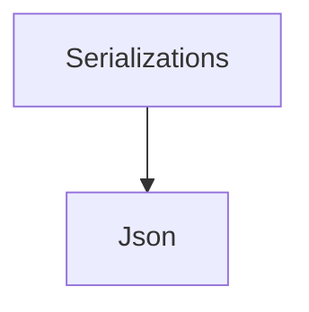

# Serializations

## Contents

- [Overview](#overview)
- [Files](#files)
- [Types and Members](#types-and-members)
- [Serialization and Contracts](#serialization-and-contracts)
- [Validation and Constraints](#validation-and-constraints)
- [Package Dependencies](#package-dependencies)
- [Diagrams](#diagrams)
- [Examples](#examples)
- [See Also](#see-also)

## Overview

The **Serializations** area groups 5 documented types, including `FormatSerializerRegistry`, `IFormatDeserializer`, `IFormatSerializer`, `IFormatSerializerRegistry`, `SerializerType`. It provides the contracts and implementation used by this part of ThunderPropagator.BuildingBlocks.

## Files

| File | Primary type(s)/symbol(s) | LOC (approx.) | Responsibility |
|---|---|---:|---|
| `FormatSerializerRegistry.cs` | `FormatSerializerRegistry` | 98 | Defines FormatSerializerRegistry and its related behavior. |
| `IFormatDeserializer.cs` | `IFormatDeserializer` | 31 | Defines IFormatDeserializer and its related behavior. |
| `IFormatSerializer.cs` | `IFormatSerializer` | 31 | Defines IFormatSerializer and its related behavior. |
| `IFormatSerializerRegistry.cs` | `IFormatSerializerRegistry` | 43 | Defines IFormatSerializerRegistry and its related behavior. |
| `SerializerType.cs` | `SerializerType` | 38 | Defines SerializerType and its related behavior. |

### Direct child areas

- [Json](./Json/README.md) `Types:3` `Files:3`

## Types and Members

| Type | Kind | Summary | Inherits/Implements | Key Members |
|---|---|---|---|---|
| [`FormatSerializerRegistry`](#formatserializerregistry) | class | Default registry that resolves and instances by or MIME type using frozen dictionaries for O(1) lookup. | `IFormatSerializerRegistry` | `GetSerializer(…)`, `GetSerializer(…)`, `GetDeserializer(…)`, `GetDeserializer(…)` |
| [`IFormatDeserializer`](#iformatdeserializer) | interface | Deserializes objects from string and byte representations for a specific format. | — | — |
| [`IFormatSerializer`](#iformatserializer) | interface | Serializes objects to string and byte representations for a specific format. | — | — |
| [`IFormatSerializerRegistry`](#iformatserializerregistry) | interface | Provides lookup of format serializers and deserializers by or MIME type. | — | — |
| [`SerializerType`](#serializertype) | record-struct | Identifies the serialization library to use. | — | `int(…)`, `SerializerType(…)`, `CompareTo(…)`, `CompareTo(…)`, `ToString(…)` |

### FormatSerializerRegistry

- **Kind:** class
- **Namespace:** `ThunderPropagator.BuildingBlocks.Application.Serializations`
- **Inherits/implements:** `IFormatSerializerRegistry`
- **Attributes:** None detected
- **Key members:** `GetSerializer(…)`, `GetSerializer(…)`, `GetDeserializer(…)`, `GetDeserializer(…)`
- **Summary:** Default registry that resolves and instances by or MIME type using frozen dictionaries for O(1) lookup.
- **Thread safety:** Follow the lifetime and concurrency guarantees of the owning component; no additional guarantee is inferred.

**Usage recipe**

```csharp
// Resolve FormatSerializerRegistry from the configured service container or construct it with its declared dependencies.
```

[↑ Back to top](#contents)

### IFormatDeserializer

- **Kind:** interface
- **Namespace:** `ThunderPropagator.BuildingBlocks.Application.Serializations`
- **Inherits/implements:** None declared
- **Attributes:** None detected
- **Key members:** Refer to the API surface in the source package
- **Summary:** Deserializes objects from string and byte representations for a specific format.
- **Thread safety:** Follow the lifetime and concurrency guarantees of the owning component; no additional guarantee is inferred.

**Usage recipe**

```csharp
// Resolve IFormatDeserializer from the configured service container or construct it with its declared dependencies.
```

[↑ Back to top](#contents)

### IFormatSerializer

- **Kind:** interface
- **Namespace:** `ThunderPropagator.BuildingBlocks.Application.Serializations`
- **Inherits/implements:** None declared
- **Attributes:** None detected
- **Key members:** Refer to the API surface in the source package
- **Summary:** Serializes objects to string and byte representations for a specific format.
- **Thread safety:** Follow the lifetime and concurrency guarantees of the owning component; no additional guarantee is inferred.

**Usage recipe**

```csharp
// Resolve IFormatSerializer from the configured service container or construct it with its declared dependencies.
```

[↑ Back to top](#contents)

### IFormatSerializerRegistry

- **Kind:** interface
- **Namespace:** `ThunderPropagator.BuildingBlocks.Application.Serializations`
- **Inherits/implements:** None declared
- **Attributes:** None detected
- **Key members:** Refer to the API surface in the source package
- **Summary:** Provides lookup of format serializers and deserializers by or MIME type.
- **Thread safety:** Follow the lifetime and concurrency guarantees of the owning component; no additional guarantee is inferred.

**Usage recipe**

```csharp
// Resolve IFormatSerializerRegistry from the configured service container or construct it with its declared dependencies.
```

[↑ Back to top](#contents)

### SerializerType

- **Kind:** record-struct
- **Namespace:** `ThunderPropagator.BuildingBlocks.Application.Serializations`
- **Inherits/implements:** None declared
- **Attributes:** None detected
- **Key members:** `int(…)`, `SerializerType(…)`, `CompareTo(…)`, `CompareTo(…)`, `ToString(…)`
- **Summary:** Identifies the serialization library to use.
- **Thread safety:** Follow the lifetime and concurrency guarantees of the owning component; no additional guarantee is inferred.

**Usage recipe**

```csharp
// Resolve SerializerType from the configured service container or construct it with its declared dependencies.
```

[↑ Back to top](#contents)

## Serialization and Contracts

Serialization behavior is part of the public wire or persistence contract in this area. Preserve field names, ordering rules, content negotiation, and backward-compatibility expectations when changing these types.

## Validation and Constraints

Inputs are validated at component boundaries. Callers should provide non-null required values and handle domain or argument exceptions without retrying invalid requests unchanged.

## Package Dependencies

| Package | Version | Description | Links |
|---|---|---|---|
| `Apache.NMS.ActiveMQ` | `2.2.0` | External dependency used by the repository. | [Registry](https://www.nuget.org/packages/Apache.NMS.ActiveMQ) |
| `Ardalis.GuardClauses` | `5.0.0` | External dependency used by the repository. | [Registry](https://www.nuget.org/packages/Ardalis.GuardClauses) |
| `CaseConverter` | `2.0.1` | External dependency used by the repository. | [Registry](https://www.nuget.org/packages/CaseConverter) |
| `JetBrains.Annotations` | `2026.2.0` | External dependency used by the repository. | [Registry](https://www.nuget.org/packages/JetBrains.Annotations) |
| `Microsoft.Diagnostics.Tracing.TraceEvent` | `3.2.5` | External dependency used by the repository. | [Registry](https://www.nuget.org/packages/Microsoft.Diagnostics.Tracing.TraceEvent) |
| `Microsoft.Extensions.DependencyInjection.Abstractions` | `10.*` | External dependency used by the repository. | [Registry](https://www.nuget.org/packages/Microsoft.Extensions.DependencyInjection.Abstractions) |
| `Microsoft.Extensions.Diagnostics.HealthChecks` | `10.*` | External dependency used by the repository. | [Registry](https://www.nuget.org/packages/Microsoft.Extensions.Diagnostics.HealthChecks) |
| `Newtonsoft.Json` | `13.0.4` | External dependency used by the repository. | [Registry](https://www.nuget.org/packages/Newtonsoft.Json) |
| `SharpZipLib` | `1.4.2` | External dependency used by the repository. | [Registry](https://www.nuget.org/packages/SharpZipLib) |
| `System.IdentityModel.Tokens.Jwt` | `8.19.2` | External dependency used by the repository. | [Registry](https://www.nuget.org/packages/System.IdentityModel.Tokens.Jwt) |

## Diagrams

### Component overview



The diagram shows the direct components documented by the **Serializations** area.

## Examples

Start with `FormatSerializerRegistry` as the primary entry point for this folder, then follow its linked contracts and collaborators.

## See Also

- [Parent area](../README.md)
- [Attributes](../Attributes/README.md)
- [Certificate](../Certificate/README.md)
- [ChangeTrackingItems](../ChangeTrackingItems/README.md)
- [Ciphering](../Ciphering/README.md)
- [Collections](../Collections/README.md)
- [CorrelationId](../CorrelationId/README.md)
- [Enums](../Enums/README.md)
- [Helpers](../Helpers/README.md)
- [Identity](../Identity/README.md)
- [Objects](../Objects/README.md)

[↑ Back to top](#contents)
