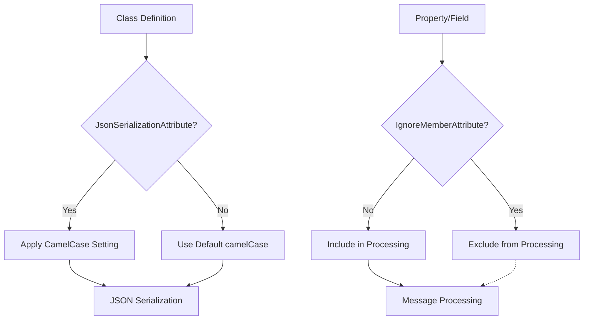
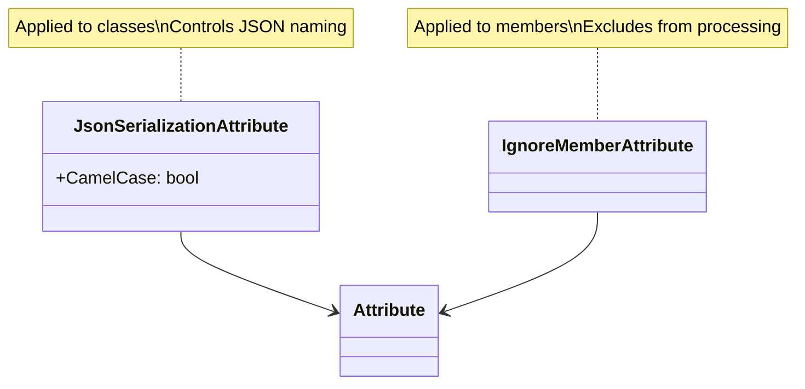

# Attributes

Custom attributes for controlling serialization behavior and metadata in RapidStreamer applications.

## Contents

- [Overview](#overview)
- [Files](#files)
- [Types & Members](#types--members)
- [Diagrams](#diagrams)
- [Examples](#examples)
- [See Also](#see-also)

## Overview

The Attributes namespace provides custom attributes that control how objects are serialized and processed within the RapidStreamer framework. These attributes allow developers to customize JSON serialization behavior and exclude specific members from processing.

Key attributes include:
- `JsonSerializationAttribute` - Controls JSON property naming conventions
- `IgnoreMemberAttribute` - Excludes properties or fields from serialization/processing

## Files

| File | Primary type(s) | LOC (approx) | Responsibility |
|------|-----------------|--------------|----------------|
| `JsonSerializationAttribute.cs` | `JsonSerializationAttribute` | 15 | Controls JSON serialization options for classes |
| `IgnoreMemberAttribute.cs` | `IgnoreMemberAttribute` | 10 | Marks members to be ignored during processing |

## Types & Members

| Type | Kind | Summary | Inherits/Implements | Key Members |
|------|------|---------|-------------------|-------------|
| `JsonSerializationAttribute` | Class | Controls JSON serialization behavior | `Attribute` | `CamelCase` |
| `IgnoreMemberAttribute` | Class | Marks members for exclusion | `Attribute` | - |

### JsonSerializationAttribute

**Kind:** Class  
**Namespace:** RapidStreamer.BuildingBlocks.Application.Attributes  
**Inherits:** Attribute  
**AttributeUsage:** AttributeTargets.Class

Controls JSON serialization options for classes, particularly property naming conventions.

**Key Properties:**
- `CamelCase: bool` - Whether to use camelCase for property names (default: true)

**Constructors:**
- `JsonSerializationAttribute()` - Default constructor with CamelCase = true

**Usage Recipe:**
```csharp
[JsonSerialization(CamelCase = false)]
public class MyClass
{
    public string FirstName { get; set; }
    public string LastName { get; set; }
}

// Without attribute: {"firstName": "John", "lastName": "Doe"}
// With CamelCase = false: {"FirstName": "John", "LastName": "Doe"}
```

### IgnoreMemberAttribute

**Kind:** Class  
**Namespace:** RapidStreamer.BuildingBlocks.Application.Attributes  
**Inherits:** Attribute  
**AttributeUsage:** AttributeTargets.Property | AttributeTargets.Field

Marks properties or fields to be ignored during serialization, processing, or other operations.

**Usage Recipe:**
```csharp
public class UserProfile : FeederMessage
{
    public string Username { get; set; }

    [IgnoreMember]
    public string PasswordHash { get; set; } // Won't be serialized

    [IgnoreMember]
    private int _accessCount; // Won't be processed
}
```

## Diagrams

### Attribute Usage Flow



### Attribute Relationships



## Examples

### Combined Attribute Usage
```csharp
using RapidStreamer.BuildingBlocks.Application.Attributes;

[JsonSerialization(CamelCase = false)]
public class Product : FeederMessage
{
    public string ProductId { get; set; }
    public string Name { get; set; }
    public decimal Price { get; set; }

    [IgnoreMember]
    public DateTime CreatedAt { get; set; } // Internal timestamp

    [IgnoreMember]
    private List<string> _tags; // Internal data
}

public class Order : FeederMessage
{
    public string OrderId { get; set; }
    public List<Product> Products { get; set; }

    [IgnoreMember]
    public string InternalNotes { get; set; } // Not for external consumption
}
```

### Serialization Behavior
```csharp
var product = new Product
{
    ProductId = "P001",
    Name = "Widget",
    Price = 29.99m,
    CreatedAt = DateTime.Now
};

// JSON output (PascalCase due to CamelCase = false):
// {"ProductId": "P001", "Name": "Widget", "Price": 29.99}
// Note: CreatedAt is excluded due to IgnoreMember
```

## See Also

- [FeederMessage](../README.md#feedermessage) - Base class that uses these attributes
- [Helpers](../Helpers/README.md) - Serialization helpers that respect these attributes
- [Serializations](../Serializations/README.md) - Serialization implementations

[↑ Back to top](#contents)</content>
<parameter name="filePath">C:\Users\Kiarash\RiderProjects\RapidStreamer.BuildingBlocks\docs\BuildingBlocks.Application\Attributes\README.md
