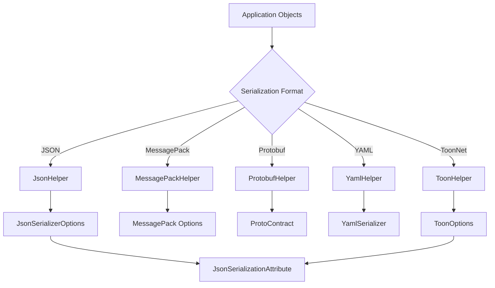
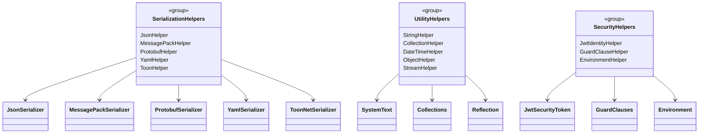
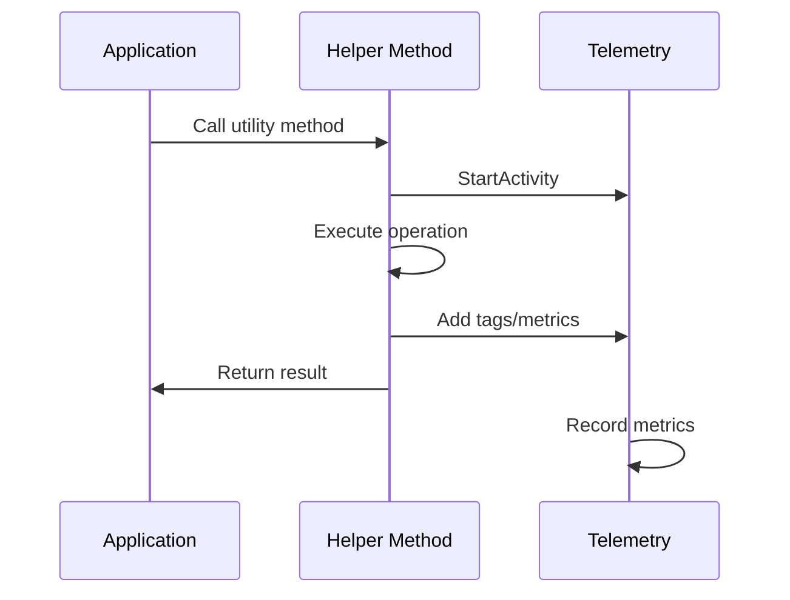

# Helpers

Comprehensive utility classes providing common operations for RapidStreamer applications, including serialization, string manipulation, collections, and cryptography.

## Contents

- [Overview](#overview)
- [Files](#files)
- [Types & Members](#types--members)
- [Diagrams](#diagrams)
- [Examples](#examples)
- [See Also](#see-also)

## Overview

The Helpers namespace contains essential utility classes that provide common functionality used throughout RapidStreamer applications. These helpers offer efficient implementations for serialization, string operations, collection processing, cryptography, and more.

Key categories include:
- **Serialization**: JSON, MessagePack, Protobuf, YAML, ToonNet format support
- **String Operations**: Encoding, compression, base64 conversion
- **Collections**: High-performance filtering, conversion, and manipulation
- **Cryptography**: AES/RSA encryption, password hashing, certificate handling
- **System Utilities**: Environment, date/time, connection strings

## Files

| File | Primary type(s) | LOC (approx) | Responsibility |
|------|-----------------|--------------|----------------|
| `JsonHelper.cs` | `JsonHelper` | 120 | JSON serialization with attribute support |
| `MessagePackHelper.cs` | `MessagePackHelper` | 80 | MessagePack binary serialization |
| `ProtobufHelper.cs` | `ProtobufHelper` | 70 | Protocol Buffers serialization |
| `YamlHelper.cs` | `YamlHelper` | 60 | YAML document serialization |
| `ToonHelper.cs` | `ToonHelper` | 105 | ToonNet format serialization |
| `StringHelper.cs` | `StringHelper` | 100 | String encoding, compression, base64 |
| `CollectionHelper.cs` | `CollectionHelper` | 150 | Collection filtering and conversion utilities |
| `DateTimeHelper.cs` | `DateTimeHelper` | 40 | Date/time operations and formatting |
| `EnvironmentHelper.cs` | `EnvironmentHelper` | 30 | Environment variable access utilities |
| `ConnectionStringHelper.cs` | `ConnectionStringHelper` | 50 | Database connection string parsing |
| `GuardClauseHelper.cs` | `GuardClauseHelper` | 60 | Input validation and guard clauses |
| `ExceptionHelper.cs` | `ExceptionHelper` | 40 | Exception handling utilities |
| `JwtIdentityHelper.cs` | `JwtIdentityHelper` | 80 | JWT token processing and identity |
| `ObjectHelper.cs` | `ObjectHelper` | 60 | Object manipulation and reflection |
| `StreamHelper.cs` | `StreamHelper` | 70 | Stream operations and utilities |
| `Size.cs` | `Size` | 30 | Size calculations and formatting |

## Types & Members

| Type | Kind | Summary | Inherits/Implements | Key Members |
|------|------|---------|-------------------|-------------|
| `JsonHelper` | Static Class | JSON serialization utilities | - | `ToJson()`, `FromJson()`, attribute-aware |
| `MessagePackHelper` | Static Class | MessagePack serialization | - | `ToMessagePack()`, `FromMessagePack()` |
| `ProtobufHelper` | Static Class | Protocol Buffers serialization | - | `ToProtobuf()`, `FromProtobuf()` |
| `YamlHelper` | Static Class | YAML serialization | - | `ToYaml()`, `FromYaml()` |
| `ToonHelper` | Static Class | ToonNet format serialization | - | `ToToon()`, `FromToon()` |
| `StringHelper` | Static Class | String manipulation utilities | - | `ToBase64()`, `FromBase64()`, compression |
| `CollectionHelper` | Static Class | Collection processing utilities | - | `Filter()`, `Convert()`, high-performance |
| `DateTimeHelper` | Static Class | Date/time utilities | - | Formatting, parsing, timezone handling |
| `EnvironmentHelper` | Static Class | Environment access utilities | - | Safe environment variable reading |
| `ConnectionStringHelper` | Static Class | Connection string parsing | - | Database URL parsing and validation |
| `GuardClauseHelper` | Static Class | Input validation | - | Guard clauses for method parameters |
| `JwtIdentityHelper` | Static Class | JWT token handling | - | Token validation, claims extraction |
| `ObjectHelper` | Static Class | Object utilities | - | Deep cloning, property access |
| `StreamHelper` | Static Class | Stream operations | - | Reading, writing, compression |

### JsonHelper

**Kind:** Static Class  
**Namespace:** RapidStreamer.BuildingBlocks.Application.Helpers

JSON serialization utilities with support for custom attributes and options.

**Key Methods:**
- `ToJson<T>(T instance, Func<JsonSerializerOptions, JsonSerializerOptions>? options)` - Serialize to JSON string
- `FromJson<T>(string json, Func<JsonSerializerOptions, JsonSerializerOptions>? options)` - Deserialize from JSON string
- `ToJsonBytes<T>(T instance)` - Serialize to UTF-8 bytes
- `FromJsonBytes<T>(byte[] bytes)` - Deserialize from UTF-8 bytes

**Features:**
- Respects `JsonSerializationAttribute` for naming conventions
- Handles `Exception` objects via `ExceptionInfo`
- Configurable serialization options

**Usage Recipe:**
```csharp
[JsonSerialization(CamelCase = false)]
public class Product
{
    public string ProductId { get; set; }
    public decimal Price { get; set; }
}

var product = new Product { ProductId = "P001", Price = 29.99m };
string json = product.ToJson(); // {"ProductId": "P001", "Price": 29.99}
Product? restored = json.FromJson<Product>();
```

### StringHelper

**Kind:** Static Class  
**Namespace:** RapidStreamer.BuildingBlocks.Application.Helpers

String manipulation utilities including encoding, compression, and base64 conversion.

**Key Methods:**
- `ToBase64(string str)` - Convert string to base64
- `FromBase64(string str)` - Convert base64 to string
- `ToByteArray(string str)` - Convert to UTF-8 bytes
- `FromByteArray(byte[] bytes)` - Convert UTF-8 bytes to string

**Usage Recipe:**
```csharp
string original = "Hello, World!";
string base64 = original.ToBase64(); // "SGVsbG8sIFdvcmxkIQ=="
string decoded = base64.FromBase64(); // "Hello, World!"

byte[] bytes = original.ToByteArray();
string back = bytes.FromByteArray(); // "Hello, World!"
```

### CollectionHelper

**Kind:** Static Class  
**Namespace:** RapidStreamer.BuildingBlocks.Application.Helpers

High-performance collection processing utilities with telemetry support.

**Key Methods:**
- `Filter<T>(IEnumerable<T> enumerable, Func<T, bool> func)` - High-performance filtering
- `Convert<T, TR>(T[] array, Func<T, TR> func)` - Array conversion with performance tracking

**Features:**
- Uses `LinkedArray<T>` for memory-efficient filtering
- Includes telemetry for performance monitoring
- Span-based operations for optimal performance

**Usage Recipe:**
```csharp
int[] numbers = { 1, 2, 3, 4, 5, 6, 7, 8, 9, 10 };
var evens = numbers.Filter(n => n % 2 == 0); // [2, 4, 6, 8, 10]

string[] strings = { "a", "bb", "ccc" };
int[] lengths = strings.Convert(s => s.Length); // [1, 2, 3]
```

## Diagrams

### Serialization Helper Relationships



### Helper Categories



### Performance Monitoring Flow



## Examples

### Multi-Format Serialization
```csharp
public class User
{
    public string Id { get; set; }
    public string Name { get; set; }
    public DateTime CreatedAt { get; set; }
}

var user = new User { Id = "123", Name = "John", CreatedAt = DateTime.Now };

// JSON serialization
string json = user.ToJson();
User? fromJson = json.FromJson<User>();

// MessagePack for binary efficiency
byte[] msgpack = user.ToMessagePack();
User? fromMsgpack = msgpack.FromMessagePack<User>();

// YAML for human readability
string yaml = user.ToYaml();
User? fromYaml = yaml.FromYaml<User>();
```

### Collection Processing Pipeline
```csharp
// High-performance filtering and transformation
var data = Enumerable.Range(1, 1000000).ToArray();

// Filter even numbers (memory efficient)
var evens = data.Filter(n => n % 2 == 0);

// Convert to strings with length info
var results = evens.Convert(n => new { Number = n, Digits = n.ToString().Length });

// Process in batches for memory management
foreach (var batch in results.Chunk(1000))
{
    // Process batch
    Console.WriteLine($"Processed {batch.Length} items");
}
```

### Secure String Handling
```csharp
// Environment variable access with validation
string apiKey = EnvironmentHelper.GetRequiredEnvironmentVariable("API_KEY");
string dbUrl = EnvironmentHelper.GetEnvironmentVariable("DATABASE_URL", "postgresql://localhost:5432/default");

// Connection string parsing
var connectionInfo = ConnectionStringHelper.Parse(dbUrl);
Console.WriteLine($"Host: {connectionInfo.Host}, Port: {connectionInfo.Port}");

// JWT token validation
string token = "...jwt token...";
var claims = JwtIdentityHelper.ValidateAndExtractClaims(token, "your-secret-key");
string userId = claims.FindFirst("sub")?.Value;
```

## See Also

- [Attributes](../Attributes/README.md) - Attributes that influence helper behavior
- [Collections](../Collections/README.md) - Specialized collection types used by helpers
- [Ciphering](../Ciphering/README.md) - Cryptographic helpers
- [Serializations](../Serializations/README.md) - Serialization abstractions

[↑ Back to top](#contents)</content>
<parameter name="filePath">C:\Users\Kiarash\RiderProjects\RapidStreamer.BuildingBlocks\docs\BuildingBlocks.Application\Helpers\README.md
