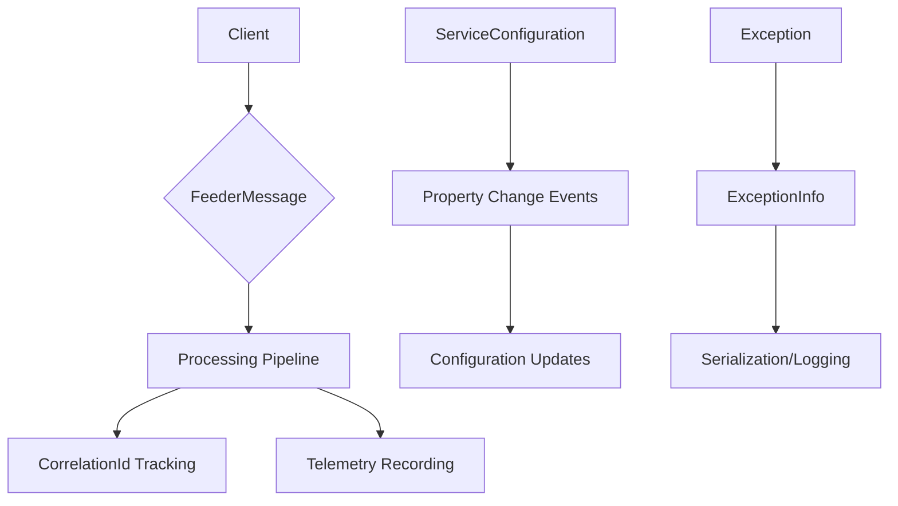
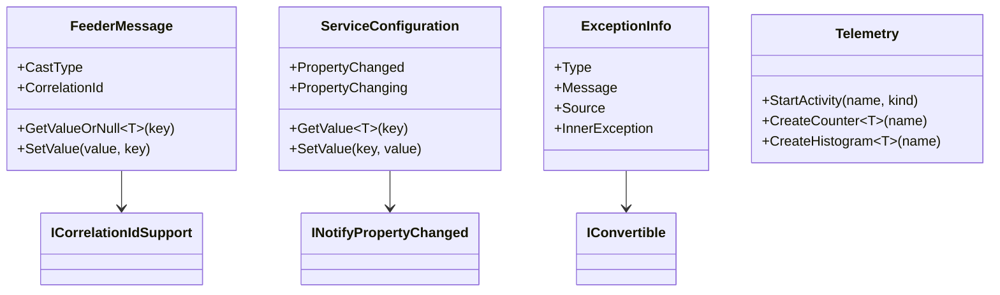

# BuildingBlocks.Application

Core application-level components providing essential functionality for building robust applications.

## Contents

- [Overview](#overview)
- [Files](#files)
- [Types & Members](#types--members)
- [Diagrams](#diagrams)
- [Examples](#examples)
- [See Also](#see-also)

## Overview

The BuildingBlocks.Application namespace contains the foundational components for RapidStreamer applications. This includes core abstractions like `FeederMessage`, configuration management with `ServiceConfiguration`, telemetry support, and essential utilities for application development.

Key features include:
- Message-based communication with `FeederMessage` abstract class
- Configuration management with observable properties
- Telemetry and metrics collection
- Exception information serialization
- Correlation ID support for distributed tracing

## Files

| File | Primary type(s) | LOC (approx) | Responsibility |
|------|-----------------|--------------|----------------|
| `ExceptionInfo.cs` | `ExceptionInfo` | 45 | Exception serialization and information capture |
| `FeederMessage.cs` | `FeederMessage` | 120 | Abstract message class with dictionary-like behavior |
| `ServiceConfiguration.cs` | `IServiceConfiguration`, `ServiceConfiguration` | 200 | Configuration management with change notifications |
| `Telemetry.cs` | `Telemetry` | 60 | Telemetry and metrics collection utilities |
| `AssemblyInfo.cs` | Assembly attributes | 15 | Assembly metadata |
| `GlobalUsings.cs` | Global using directives | 20 | Common namespace imports |
| `ConcurrentStringBuilder.cs` | `ConcurrentStringBuilder` | 80 | Thread-safe string building |
| `DispatcherTimer.cs` | `DispatcherTimer` | 40 | Timer implementation for UI threading |
| `ICloneable.cs` | `ICloneable<T>` | 15 | Generic cloning interface |
| `IConvertible.cs` | `IConvertible<T>` | 15 | Generic conversion interface |
| `InconvertibleException.cs` | `InconvertibleException` | 20 | Exception for conversion failures |

## Types & Members

| Type | Kind | Summary | Inherits/Implements | Key Members |
|------|------|---------|-------------------|-------------|
| `ExceptionInfo` | Class | Serializable exception information | - | `Type`, `Message`, `Source`, `InnerException` |
| `FeederMessage` | Abstract Class | Message with dictionary behavior | `DisposableObject`, `IDictionary<string, object?>`, `ICorrelationIdSupport` | `this[string]`, `CastType`, `CorrelationId` |
| `IServiceConfiguration` | Interface | Configuration contract | `IEnumerable<KeyValuePair<string, string>>` | - |
| `ServiceConfiguration` | Abstract Class | Observable configuration | `IServiceConfiguration`, `INotifyPropertyChanged` | Properties via indexer, events |
| `Telemetry` | Static Class | Telemetry utilities | - | `StartActivity()`, `CreateCounter()`, metrics |

### ExceptionInfo

**Kind:** Class  
**Namespace:** RapidStreamer.BuildingBlocks.Application

Serializable representation of exception information for logging and transmission.

**Key Properties:**
- `Type: string` - Full type name of the exception
- `Message: string` - Exception message
- `Source: string?` - Source of the exception
- `InnerException: ExceptionInfo?` - Nested exception information

**Constructors:**
- `ExceptionInfo(Exception exception)` - Creates from exception instance

**Usage Recipe:**
```csharp
try
{
    // Some operation
}
catch (Exception ex)
{
    var info = new ExceptionInfo(ex);
    // Serialize or log the info
}
```

### FeederMessage

**Kind:** Abstract Class  
**Namespace:** RapidStreamer.BuildingBlocks.Application  
**Inherits:** DisposableObject  
**Implements:** IDictionary<string, object?>, ICorrelationIdSupport, ICloneable

Abstract base class for messages that behave like dictionaries with additional messaging features.

**Key Properties:**
- `this[string]: object?` - Dictionary-like access
- `CastType: CastType` - Message casting mode
- `CorrelationId: string?` - Request correlation identifier

**Key Methods:**
- `GetValueOrNull<T>(string key)` - Type-safe value retrieval
- `SetValue(object value, string key)` - Type-safe value setting
- `Clone()` - Create a copy of the message

**Usage Recipe:**
```csharp
public class MyMessage : FeederMessage
{
    public string Title
    {
        get => GetValueOrDefault<string>("Title");
        set => SetValue(value, "Title");
    }
}

var message = new MyMessage { Title = "Hello", CorrelationId = "123" };
```

### ServiceConfiguration

**Kind:** Abstract Class  
**Namespace:** RapidStreamer.BuildingBlocks.Application  
**Implements:** IServiceConfiguration, INotifyPropertyChanged, INotifyPropertyChanging, IEquatable<ServiceConfiguration>

Observable configuration class with JSON serialization support.

**Key Properties:**
- Properties accessed via indexer and reflection

**Key Methods:**
- `GetValue<T>(string key)` - Retrieve configuration value
- `SetValue(string key, object? value)` - Set configuration value

**Events:**
- `PropertyChanged` - Fired when properties change
- `PropertyChanging` - Fired before properties change

**Usage Recipe:**
```csharp
public class AppConfig : ServiceConfiguration
{
    public string DatabaseUrl
    {
        get => GetValue<string>("DatabaseUrl");
        set => SetValue("DatabaseUrl", value);
    }
}

var config = new AppConfig();
config.PropertyChanged += (s, e) => Console.WriteLine($"Changed: {e.PropertyName}");
config.DatabaseUrl = "postgresql://...";
```

### Telemetry

**Kind:** Static Class  
**Namespace:** RapidStreamer.BuildingBlocks.Application

Centralized telemetry and metrics collection utilities.

**Key Methods:**
- `StartActivity(string name, ActivityKind kind)` - Start a tracing activity
- `CreateCounter<T>(string name, string? unit, string? description)` - Create a counter metric
- `CreateHistogram<T>(string name, string? unit, string? description)` - Create a histogram metric

**Usage Recipe:**
```csharp
using var activity = Telemetry.StartActivity("ProcessOrder", ActivityKind.Internal);
var counter = Telemetry.CreateCounter<int>("orders_processed", "orders", "Number of orders processed");
// ... processing logic ...
counter.Add(1);
```

## Diagrams

### Message Flow Architecture



### Component Relationships



## Examples

### Basic Message Creation
```csharp
public class OrderMessage : FeederMessage
{
    public string OrderId
    {
        get => GetValueOrDefault<string>("OrderId");
        set => SetValue(value, "OrderId");
    }

    public decimal Amount
    {
        get => GetValueOrDefault<decimal>("Amount");
        set => SetValue(value, "Amount");
    }
}

var message = new OrderMessage
{
    OrderId = "ORD-001",
    Amount = 99.99m,
    CorrelationId = Guid.NewGuid().ToString()
};
```

### Configuration with Change Tracking
```csharp
public class DatabaseConfig : ServiceConfiguration
{
    public string ConnectionString
    {
        get => GetValue<string>("ConnectionString");
        set => SetValue("ConnectionString", value);
    }

    public int MaxPoolSize
    {
        get => GetValue<int>("MaxPoolSize");
        set => SetValue("MaxPoolSize", value);
    }
}

var config = new DatabaseConfig();
config.PropertyChanged += (s, e) =>
{
    Console.WriteLine($"Config changed: {e.PropertyName}");
    // Trigger configuration reload
};

config.ConnectionString = "Server=localhost;Database=mydb";
config.MaxPoolSize = 100;
```

### Exception Handling with Telemetry
```csharp
try
{
    using var activity = Telemetry.StartActivity("ProcessPayment", ActivityKind.Internal);
    // ... payment processing ...
    activity?.AddTag("payment.amount", 99.99);
    activity?.AddTag(Telemetry.SuccessfulTag.Key, Telemetry.SuccessfulTag.Value);
}
catch (Exception ex)
{
    var exceptionInfo = new ExceptionInfo(ex);
    // Log or transmit exception info
    throw;
}
```

## See Also

- [Attributes](./Attributes/README.md) - Custom attributes for serialization and metadata
- [Helpers](./Helpers/README.md) - Utility classes for common operations
- [Collections](./Collections/README.md) - Specialized collection types
- [Ciphering](./Ciphering/README.md) - Cryptographic operations
- [BuildingBlocks.Infrastructure](../BuildingBlocks.Infrastructure/README.md) - Infrastructure components

[↑ Back to top](#contents)</content>
<parameter name="filePath">C:\Users\Kiarash\RiderProjects\RapidStreamer.BuildingBlocks\docs\BuildingBlocks.Application\README.md
