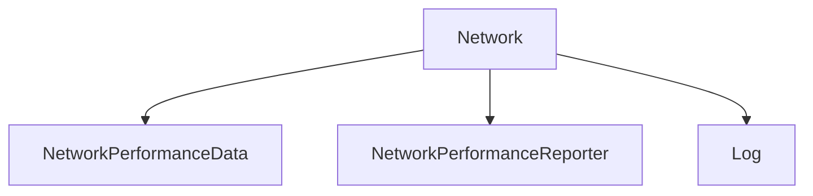

# Network

## Contents

- [Overview](#overview)
- [Files](#files)
- [Types and Members](#types-and-members)
- [Validation and Constraints](#validation-and-constraints)
- [Package Dependencies](#package-dependencies)
- [Diagrams](#diagrams)
- [Examples](#examples)
- [See Also](#see-also)

## Overview

The **Network** area groups 3 documented types, including `NetworkPerformanceData`, `NetworkPerformanceReporter`, `Log`. It provides the contracts and implementation used by this part of ThunderPropagator.BuildingBlocks.

## Files

| File | Primary type(s)/symbol(s) | LOC (approx.) | Responsibility |
|---|---|---:|---|
| `NetworkPerformanceData.cs` | `NetworkPerformanceData` | 21 | Defines NetworkPerformanceData and its related behavior. |
| `NetworkPerformanceReporter.cs` | `NetworkPerformanceReporter`, `Log` | 211 | Defines NetworkPerformanceReporter, Log and its related behavior. |

## Types and Members

| Type | Kind | Summary | Inherits/Implements | Key Members |
|---|---|---|---|---|
| [`NetworkPerformanceData`](#networkperformancedata) | class | Represents the NetworkPerformanceData class. | — | `TcpBytesReceived`, `TcpBytesSent`, `TcpBytesTotal`, `UdpBytesReceived`, `UdpBytesSent`, `UdpBytesTotal` |
| [`NetworkPerformanceReporter`](#networkperformancereporter) | class | Represents the NetworkPerformanceReporter class. | `DisposableObject` | `CreateAsync(…)`, `Create(…)`, `GetNetworkPerformanceData(…)` |
| [`Log`](#log) | class | Source-generated high-performance logging methods for . | — | `EtwSessionFailed(…)` |

### NetworkPerformanceData

- **Kind:** class
- **Namespace:** `ThunderPropagator.BuildingBlocks.Infrastructure.System.Network`
- **Inherits/implements:** None declared
- **Attributes:** None detected
- **Key members:** `TcpBytesReceived`, `TcpBytesSent`, `TcpBytesTotal`, `UdpBytesReceived`, `UdpBytesSent`, `UdpBytesTotal`, `BytesReceived`, `BytesSent`
- **Summary:** Represents the NetworkPerformanceData class.
- **Thread safety:** Follow the lifetime and concurrency guarantees of the owning component; no additional guarantee is inferred.

**Usage recipe**

```csharp
// Resolve NetworkPerformanceData from the configured service container or construct it with its declared dependencies.
```

[↑ Back to top](#contents)

### NetworkPerformanceReporter

- **Kind:** class
- **Namespace:** `ThunderPropagator.BuildingBlocks.Infrastructure.System.Network`
- **Inherits/implements:** `DisposableObject`
- **Attributes:** None detected
- **Key members:** `CreateAsync(…)`, `Create(…)`, `GetNetworkPerformanceData(…)`
- **Summary:** Represents the NetworkPerformanceReporter class.
- **Thread safety:** Follow the lifetime and concurrency guarantees of the owning component; no additional guarantee is inferred.

**Usage recipe**

```csharp
// Resolve NetworkPerformanceReporter from the configured service container or construct it with its declared dependencies.
```

[↑ Back to top](#contents)

### Log

- **Kind:** class
- **Namespace:** `ThunderPropagator.BuildingBlocks.Infrastructure.System.Network`
- **Inherits/implements:** None declared
- **Attributes:** None detected
- **Key members:** `EtwSessionFailed(…)`
- **Summary:** Source-generated high-performance logging methods for .
- **Thread safety:** Follow the lifetime and concurrency guarantees of the owning component; no additional guarantee is inferred.

**Usage recipe**

```csharp
// Resolve Log from the configured service container or construct it with its declared dependencies.
```

[↑ Back to top](#contents)

## Validation and Constraints

Inputs are validated at component boundaries. Callers should provide non-null required values and handle domain or argument exceptions without retrying invalid requests unchanged.

## Package Dependencies

| Package | Version | Description | Links |
|---|---|---|---|
| `Apache.NMS.ActiveMQ` | `2.2.0` | External dependency used by the repository. | [Registry](https://www.nuget.org/packages/Apache.NMS.ActiveMQ) |
| `Ardalis.GuardClauses` | `5.0.0` | External dependency used by the repository. | [Registry](https://www.nuget.org/packages/Ardalis.GuardClauses) |
| `CaseConverter` | `2.0.1` | External dependency used by the repository. | [Registry](https://www.nuget.org/packages/CaseConverter) |
| `JetBrains.Annotations` | `2026.2.0` | External dependency used by the repository. | [Registry](https://www.nuget.org/packages/JetBrains.Annotations) |
| `Microsoft.Diagnostics.Tracing.TraceEvent` | `3.2.5` | External dependency used by the repository. | [Registry](https://www.nuget.org/packages/Microsoft.Diagnostics.Tracing.TraceEvent) |
| `Microsoft.Extensions.DependencyInjection.Abstractions` | `10.*` | External dependency used by the repository. | [Registry](https://www.nuget.org/packages/Microsoft.Extensions.DependencyInjection.Abstractions) |
| `Microsoft.Extensions.Diagnostics.HealthChecks` | `10.*` | External dependency used by the repository. | [Registry](https://www.nuget.org/packages/Microsoft.Extensions.Diagnostics.HealthChecks) |
| `Newtonsoft.Json` | `13.0.4` | External dependency used by the repository. | [Registry](https://www.nuget.org/packages/Newtonsoft.Json) |
| `SharpZipLib` | `1.4.2` | External dependency used by the repository. | [Registry](https://www.nuget.org/packages/SharpZipLib) |
| `System.IdentityModel.Tokens.Jwt` | `8.19.2` | External dependency used by the repository. | [Registry](https://www.nuget.org/packages/System.IdentityModel.Tokens.Jwt) |

## Diagrams

### Component overview



The diagram shows the direct components documented by the **Network** area.

## Examples

Start with `NetworkPerformanceData` as the primary entry point for this folder, then follow its linked contracts and collaborators.

## See Also

- [Parent area](../README.md)

[↑ Back to top](#contents)
