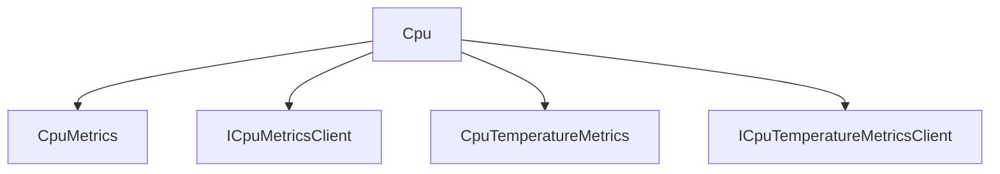

# Cpu

## Contents

- [Overview](#overview)
- [Files](#files)
- [Types and Members](#types-and-members)
- [Package Dependencies](#package-dependencies)
- [Diagrams](#diagrams)
- [Examples](#examples)
- [See Also](#see-also)

## Overview

The **Cpu** area groups 4 documented types, including `CpuMetrics`, `ICpuMetricsClient`, `CpuTemperatureMetrics`, `ICpuTemperatureMetricsClient`. It provides the contracts and implementation used by this part of ThunderPropagator.BuildingBlocks.

## Files

| File | Primary type(s)/symbol(s) | LOC (approx.) | Responsibility |
|---|---|---:|---|
| `CpuMetrics.cs` | `CpuMetrics` | 9 | Defines CpuMetrics and its related behavior. |
| `CpuMetricsClient.cs` | `ICpuMetricsClient`, `CpuMetricsClient` | 174 | Defines ICpuMetricsClient, CpuMetricsClient and its related behavior. |
| `CpuTemperatureMetrics.cs` | `CpuTemperatureMetrics` | 37 | Defines CpuTemperatureMetrics and its related behavior. |
| `CpuTemperatureMetricsClient.cs` | `ICpuTemperatureMetricsClient`, `CpuTemperatureMetricsClient`, `ICpuTemperatureProvider`, `WindowsCpuTemperatureProvider`, `LinuxCpuTemperatureProvider`, `MacOsCpuTemperatureProvider`, `UnsupportedCpuTemperatureProvider` | 395 | Defines ICpuTemperatureMetricsClient, CpuTemperatureMetricsClient, ICpuTemperatureProvider and its related behavior. |

## Types and Members

| Type | Kind | Summary | Inherits/Implements | Key Members |
|---|---|---|---|---|
| [`CpuMetrics`](#cpumetrics) | record | Represents the CpuMetrics record. | — | — |
| [`ICpuMetricsClient`](#icpumetricsclient) | interface | Represents the ICpuMetricsClient interface. | `IMetricsClient<CpuMetrics>` | `GetMetricsAsync(…)`, `GetMetricsAsync(…)` |
| [`CpuTemperatureMetrics`](#cputemperaturemetrics) | record | Represents CPU temperature metrics. | `IMetrics` | `PackageTemperatureCelsius`, `CoreTemperatures`, `MaxTemperatureCelsius`, `AverageTemperatureCelsius`, `TemperatureSensorsAvailable`, `ErrorMessage` |
| [`ICpuTemperatureMetricsClient`](#icputemperaturemetricsclient) | interface | Represents the ICpuTemperatureMetricsClient interface. | `IMetricsClient<CpuTemperatureMetrics>;` | `GetMetricsAsync(…)`, `CreatePlatformProvider(…)`, `GetCpuTemperatureMetricsAsync(…)` |

### CpuMetrics

- **Kind:** record
- **Namespace:** `ThunderPropagator.BuildingBlocks.Infrastructure.SystemResourceMonitor.Metrics.Cpu`
- **Inherits/implements:** None declared
- **Attributes:** None detected
- **Key members:** Refer to the API surface in the source package
- **Summary:** Represents the CpuMetrics record.
- **Thread safety:** Follow the lifetime and concurrency guarantees of the owning component; no additional guarantee is inferred.

**Usage recipe**

```csharp
// Resolve CpuMetrics from the configured service container or construct it with its declared dependencies.
```

[↑ Back to top](#contents)

### ICpuMetricsClient

- **Kind:** interface
- **Namespace:** `ThunderPropagator.BuildingBlocks.Infrastructure.SystemResourceMonitor.Metrics.Cpu`
- **Inherits/implements:** `IMetricsClient<CpuMetrics>`
- **Attributes:** None detected
- **Key members:** `GetMetricsAsync(…)`, `GetMetricsAsync(…)`
- **Summary:** Represents the ICpuMetricsClient interface.
- **Thread safety:** Follow the lifetime and concurrency guarantees of the owning component; no additional guarantee is inferred.

**Usage recipe**

```csharp
// Resolve ICpuMetricsClient from the configured service container or construct it with its declared dependencies.
```

[↑ Back to top](#contents)

### CpuTemperatureMetrics

- **Kind:** record
- **Namespace:** `ThunderPropagator.BuildingBlocks.Infrastructure.SystemResourceMonitor.Metrics.Cpu`
- **Inherits/implements:** `IMetrics`
- **Attributes:** None detected
- **Key members:** `PackageTemperatureCelsius`, `CoreTemperatures`, `MaxTemperatureCelsius`, `AverageTemperatureCelsius`, `TemperatureSensorsAvailable`, `ErrorMessage`
- **Summary:** Represents CPU temperature metrics.
- **Thread safety:** Follow the lifetime and concurrency guarantees of the owning component; no additional guarantee is inferred.

**Usage recipe**

```csharp
// Resolve CpuTemperatureMetrics from the configured service container or construct it with its declared dependencies.
```

[↑ Back to top](#contents)

### ICpuTemperatureMetricsClient

- **Kind:** interface
- **Namespace:** `ThunderPropagator.BuildingBlocks.Infrastructure.SystemResourceMonitor.Metrics.Cpu`
- **Inherits/implements:** `IMetricsClient<CpuTemperatureMetrics>;`
- **Attributes:** None detected
- **Key members:** `GetMetricsAsync(…)`, `CreatePlatformProvider(…)`, `GetCpuTemperatureMetricsAsync(…)`
- **Summary:** Represents the ICpuTemperatureMetricsClient interface.
- **Thread safety:** Follow the lifetime and concurrency guarantees of the owning component; no additional guarantee is inferred.

**Usage recipe**

```csharp
// Resolve ICpuTemperatureMetricsClient from the configured service container or construct it with its declared dependencies.
```

[↑ Back to top](#contents)

## Package Dependencies

| Package | Version | Description | Links |
|---|---|---|---|
| `Apache.NMS.ActiveMQ` | `2.2.0` | External dependency used by the repository. | [Registry](https://www.nuget.org/packages/Apache.NMS.ActiveMQ) |
| `Ardalis.GuardClauses` | `5.0.0` | External dependency used by the repository. | [Registry](https://www.nuget.org/packages/Ardalis.GuardClauses) |
| `CaseConverter` | `2.0.1` | External dependency used by the repository. | [Registry](https://www.nuget.org/packages/CaseConverter) |
| `JetBrains.Annotations` | `2026.2.0` | External dependency used by the repository. | [Registry](https://www.nuget.org/packages/JetBrains.Annotations) |
| `Microsoft.Diagnostics.Tracing.TraceEvent` | `3.2.5` | External dependency used by the repository. | [Registry](https://www.nuget.org/packages/Microsoft.Diagnostics.Tracing.TraceEvent) |
| `Microsoft.Extensions.DependencyInjection.Abstractions` | `10.*` | External dependency used by the repository. | [Registry](https://www.nuget.org/packages/Microsoft.Extensions.DependencyInjection.Abstractions) |
| `Microsoft.Extensions.Diagnostics.HealthChecks` | `10.*` | External dependency used by the repository. | [Registry](https://www.nuget.org/packages/Microsoft.Extensions.Diagnostics.HealthChecks) |
| `Newtonsoft.Json` | `13.0.4` | External dependency used by the repository. | [Registry](https://www.nuget.org/packages/Newtonsoft.Json) |
| `SharpZipLib` | `1.4.2` | External dependency used by the repository. | [Registry](https://www.nuget.org/packages/SharpZipLib) |
| `System.IdentityModel.Tokens.Jwt` | `8.19.2` | External dependency used by the repository. | [Registry](https://www.nuget.org/packages/System.IdentityModel.Tokens.Jwt) |

## Diagrams

### Component overview



The diagram shows the direct components documented by the **Cpu** area.

## Examples

Start with `CpuMetrics` as the primary entry point for this folder, then follow its linked contracts and collaborators.

## See Also

- [Parent area](../README.md)
- [Battery](../Battery/README.md)
- [Disk](../Disk/README.md)
- [Gpu](../Gpu/README.md)
- [Memory](../Memory/README.md)
- [SystemDrives](../SystemDrives/README.md)

[↑ Back to top](#contents)
