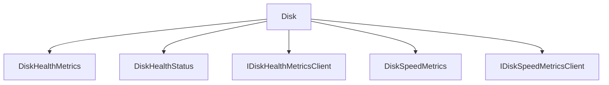

# Disk

## Contents

- [Overview](#overview)
- [Files](#files)
- [Types and Members](#types-and-members)
- [Validation and Constraints](#validation-and-constraints)
- [Package Dependencies](#package-dependencies)
- [Diagrams](#diagrams)
- [Examples](#examples)
- [See Also](#see-also)

## Overview

The **Disk** area groups 5 documented types, including `DiskHealthMetrics`, `DiskHealthStatus`, `IDiskHealthMetricsClient`, `DiskSpeedMetrics`, `IDiskSpeedMetricsClient`. It provides the contracts and implementation used by this part of ThunderPropagator.BuildingBlocks.

## Files

| File | Primary type(s)/symbol(s) | LOC (approx.) | Responsibility |
|---|---|---:|---|
| `DiskHealthMetrics.cs` | `DiskHealthMetrics`, `DiskHealthStatus` | 56 | Defines DiskHealthMetrics, DiskHealthStatus and its related behavior. |
| `DiskHealthMetricsClient.cs` | `IDiskHealthMetricsClient`, `DiskHealthMetricsClient`, `IDiskHealthProvider`, `WindowsDiskHealthProvider`, `LinuxDiskHealthProvider`, `MacOsDiskHealthProvider`, `UnsupportedDiskHealthProvider` | 255 | Defines IDiskHealthMetricsClient, DiskHealthMetricsClient, IDiskHealthProvider and its related behavior. |
| `DiskSpeedMetrics.cs` | `DiskSpeedMetrics` | 62 | Defines DiskSpeedMetrics and its related behavior. |
| `DiskSpeedMetricsClient.cs` | `IDiskSpeedMetricsClient`, `DiskSpeedMetricsClient`, `IDiskSpeedProvider`, `WindowsDiskSpeedProvider`, `LinuxDiskSpeedProvider`, `MacOsDiskSpeedProvider`, `UnsupportedDiskSpeedProvider` | 223 | Defines IDiskSpeedMetricsClient, DiskSpeedMetricsClient, IDiskSpeedProvider and its related behavior. |

## Types and Members

| Type | Kind | Summary | Inherits/Implements | Key Members |
|---|---|---|---|---|
| [`DiskHealthMetrics`](#diskhealthmetrics) | record | Represents disk health and SMART status metrics. | `IMetrics` | `DriveId`, `Status`, `WearLevelPercent`, `TemperatureCelsius`, `ReallocatedSectorsCount`, `PowerOnHours` |
| [`DiskHealthStatus`](#diskhealthstatus) | enum | Represents the DiskHealthStatus enum. | — | — |
| [`IDiskHealthMetricsClient`](#idiskhealthmetricsclient) | interface | Represents the IDiskHealthMetricsClient interface. | `IMetricsClient<DiskHealthMetrics[]>;` | `GetMetricsAsync(…)`, `GetDiskHealthMetricsAsync(…)` |
| [`DiskSpeedMetrics`](#diskspeedmetrics) | record | Represents disk performance metrics (throughput, IOPS, latency). | `IMetrics` | `DriveId`, `ReadThroughputMBps`, `WriteThroughputMBps`, `ReadIOPS`, `WriteIOPS`, `AverageReadLatencyMs` |
| [`IDiskSpeedMetricsClient`](#idiskspeedmetricsclient) | interface | Represents the IDiskSpeedMetricsClient interface. | `IMetricsClient<DiskSpeedMetrics[]>;` | `GetMetricsAsync(…)`, `GetDiskSpeedMetricsAsync(…)` |

### DiskHealthMetrics

- **Kind:** record
- **Namespace:** `ThunderPropagator.BuildingBlocks.Infrastructure.SystemResourceMonitor.Metrics.Disk`
- **Inherits/implements:** `IMetrics`
- **Attributes:** None detected
- **Key members:** `DriveId`, `Status`, `WearLevelPercent`, `TemperatureCelsius`, `ReallocatedSectorsCount`, `PowerOnHours`, `SmartAvailable`, `ErrorMessage`
- **Summary:** Represents disk health and SMART status metrics.
- **Thread safety:** Follow the lifetime and concurrency guarantees of the owning component; no additional guarantee is inferred.

**Usage recipe**

```csharp
// Resolve DiskHealthMetrics from the configured service container or construct it with its declared dependencies.
```

[↑ Back to top](#contents)

### DiskHealthStatus

- **Kind:** enum
- **Namespace:** `ThunderPropagator.BuildingBlocks.Infrastructure.SystemResourceMonitor.Metrics.Disk`
- **Inherits/implements:** None declared
- **Attributes:** None detected
- **Key members:** Refer to the API surface in the source package
- **Summary:** Represents the DiskHealthStatus enum.
- **Thread safety:** Follow the lifetime and concurrency guarantees of the owning component; no additional guarantee is inferred.

**Usage recipe**

```csharp
// Resolve DiskHealthStatus from the configured service container or construct it with its declared dependencies.
```

[↑ Back to top](#contents)

### IDiskHealthMetricsClient

- **Kind:** interface
- **Namespace:** `ThunderPropagator.BuildingBlocks.Infrastructure.SystemResourceMonitor.Metrics.Disk`
- **Inherits/implements:** `IMetricsClient<DiskHealthMetrics[]>;`
- **Attributes:** None detected
- **Key members:** `GetMetricsAsync(…)`, `GetDiskHealthMetricsAsync(…)`
- **Summary:** Represents the IDiskHealthMetricsClient interface.
- **Thread safety:** Follow the lifetime and concurrency guarantees of the owning component; no additional guarantee is inferred.

**Usage recipe**

```csharp
// Resolve IDiskHealthMetricsClient from the configured service container or construct it with its declared dependencies.
```

[↑ Back to top](#contents)

### DiskSpeedMetrics

- **Kind:** record
- **Namespace:** `ThunderPropagator.BuildingBlocks.Infrastructure.SystemResourceMonitor.Metrics.Disk`
- **Inherits/implements:** `IMetrics`
- **Attributes:** None detected
- **Key members:** `DriveId`, `ReadThroughputMBps`, `WriteThroughputMBps`, `ReadIOPS`, `WriteIOPS`, `AverageReadLatencyMs`, `AverageWriteLatencyMs`, `QueueDepth`
- **Summary:** Represents disk performance metrics (throughput, IOPS, latency).
- **Thread safety:** Follow the lifetime and concurrency guarantees of the owning component; no additional guarantee is inferred.

**Usage recipe**

```csharp
// Resolve DiskSpeedMetrics from the configured service container or construct it with its declared dependencies.
```

[↑ Back to top](#contents)

### IDiskSpeedMetricsClient

- **Kind:** interface
- **Namespace:** `ThunderPropagator.BuildingBlocks.Infrastructure.SystemResourceMonitor.Metrics.Disk`
- **Inherits/implements:** `IMetricsClient<DiskSpeedMetrics[]>;`
- **Attributes:** None detected
- **Key members:** `GetMetricsAsync(…)`, `GetDiskSpeedMetricsAsync(…)`
- **Summary:** Represents the IDiskSpeedMetricsClient interface.
- **Thread safety:** Follow the lifetime and concurrency guarantees of the owning component; no additional guarantee is inferred.

**Usage recipe**

```csharp
// Resolve IDiskSpeedMetricsClient from the configured service container or construct it with its declared dependencies.
```

[↑ Back to top](#contents)

## Validation and Constraints

Inputs are validated at component boundaries. Callers should provide non-null required values and handle domain or argument exceptions without retrying invalid requests unchanged.

## Package Dependencies

| Package | Version | Description | Links |
|---|---|---|---|
| `Apache.NMS.ActiveMQ` | `2.2.0` | External dependency used by the repository. | [Registry](https://www.nuget.org/packages/Apache.NMS.ActiveMQ) |
| `Ardalis.GuardClauses` | `5.0.0` | External dependency used by the repository. | [Registry](https://www.nuget.org/packages/Ardalis.GuardClauses) |
| `CaseConverter` | `2.0.1` | External dependency used by the repository. | [Registry](https://www.nuget.org/packages/CaseConverter) |
| `JetBrains.Annotations` | `2026.2.0` | External dependency used by the repository. | [Registry](https://www.nuget.org/packages/JetBrains.Annotations) |
| `Microsoft.Diagnostics.Tracing.TraceEvent` | `3.2.5` | External dependency used by the repository. | [Registry](https://www.nuget.org/packages/Microsoft.Diagnostics.Tracing.TraceEvent) |
| `Microsoft.Extensions.DependencyInjection.Abstractions` | `10.*` | External dependency used by the repository. | [Registry](https://www.nuget.org/packages/Microsoft.Extensions.DependencyInjection.Abstractions) |
| `Microsoft.Extensions.Diagnostics.HealthChecks` | `10.*` | External dependency used by the repository. | [Registry](https://www.nuget.org/packages/Microsoft.Extensions.Diagnostics.HealthChecks) |
| `Newtonsoft.Json` | `13.0.4` | External dependency used by the repository. | [Registry](https://www.nuget.org/packages/Newtonsoft.Json) |
| `SharpZipLib` | `1.4.2` | External dependency used by the repository. | [Registry](https://www.nuget.org/packages/SharpZipLib) |
| `System.IdentityModel.Tokens.Jwt` | `8.19.2` | External dependency used by the repository. | [Registry](https://www.nuget.org/packages/System.IdentityModel.Tokens.Jwt) |

## Diagrams

### Component overview



The diagram shows the direct components documented by the **Disk** area.

## Examples

Start with `DiskHealthMetrics` as the primary entry point for this folder, then follow its linked contracts and collaborators.

## See Also

- [Parent area](../README.md)
- [Battery](../Battery/README.md)
- [Cpu](../Cpu/README.md)
- [Gpu](../Gpu/README.md)
- [Memory](../Memory/README.md)
- [SystemDrives](../SystemDrives/README.md)

[↑ Back to top](#contents)
