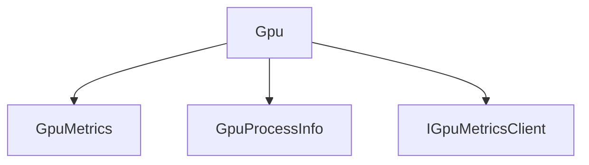

# Gpu

## Contents

- [Overview](#overview)
- [Files](#files)
- [Types and Members](#types-and-members)
- [Serialization and Contracts](#serialization-and-contracts)
- [Package Dependencies](#package-dependencies)
- [Diagrams](#diagrams)
- [Examples](#examples)
- [See Also](#see-also)

## Overview

The **Gpu** area groups 3 documented types, including `GpuMetrics`, `GpuProcessInfo`, `IGpuMetricsClient`. It provides the contracts and implementation used by this part of ThunderPropagator.BuildingBlocks.

## Files

| File | Primary type(s)/symbol(s) | LOC (approx.) | Responsibility |
|---|---|---:|---|
| `GpuMetrics.cs` | `GpuMetrics`, `GpuProcessInfo` | 93 | Defines GpuMetrics, GpuProcessInfo and its related behavior. |
| `GpuMetricsClient.cs` | `IGpuMetricsClient`, `GpuMetricsClient`, `IGpuMetricsProvider`, `WindowsGpuMetricsProvider`, `LinuxGpuMetricsProvider`, `MacOsGpuMetricsProvider`, `UnsupportedGpuMetricsProvider` | 426 | Defines IGpuMetricsClient, GpuMetricsClient, IGpuMetricsProvider and its related behavior. |

## Types and Members

| Type | Kind | Summary | Inherits/Implements | Key Members |
|---|---|---|---|---|
| [`GpuMetrics`](#gpumetrics) | record | Represents GPU temperature and utilization metrics. | `IMetrics` | `GpuIndex`, `GpuName`, `TemperatureCelsius`, `UtilizationPercent`, `MemoryUtilizationPercent`, `TotalMemoryMB` |
| [`GpuProcessInfo`](#gpuprocessinfo) | record | Represents a process using GPU resources. | — | `ProcessId`, `ProcessName`, `UsedMemoryMB`, `UtilizationPercent` |
| [`IGpuMetricsClient`](#igpumetricsclient) | interface | Represents the IGpuMetricsClient interface. | `IMetricsClient<GpuMetrics[]>` | `GetMetricsAsync(…)`, `GetMetricsAsync(…)`, `GetGpuMetricsAsync(…)` |

### GpuMetrics

- **Kind:** record
- **Namespace:** `ThunderPropagator.BuildingBlocks.Infrastructure.SystemResourceMonitor.Metrics.Gpu`
- **Inherits/implements:** `IMetrics`
- **Attributes:** None detected
- **Key members:** `GpuIndex`, `GpuName`, `TemperatureCelsius`, `UtilizationPercent`, `MemoryUtilizationPercent`, `TotalMemoryMB`, `UsedMemoryMB`, `PowerUsageWatts`
- **Summary:** Represents GPU temperature and utilization metrics.
- **Thread safety:** Follow the lifetime and concurrency guarantees of the owning component; no additional guarantee is inferred.

**Usage recipe**

```csharp
// Resolve GpuMetrics from the configured service container or construct it with its declared dependencies.
```

[↑ Back to top](#contents)

### GpuProcessInfo

- **Kind:** record
- **Namespace:** `ThunderPropagator.BuildingBlocks.Infrastructure.SystemResourceMonitor.Metrics.Gpu`
- **Inherits/implements:** None declared
- **Attributes:** None detected
- **Key members:** `ProcessId`, `ProcessName`, `UsedMemoryMB`, `UtilizationPercent`
- **Summary:** Represents a process using GPU resources.
- **Thread safety:** Follow the lifetime and concurrency guarantees of the owning component; no additional guarantee is inferred.

**Usage recipe**

```csharp
// Resolve GpuProcessInfo from the configured service container or construct it with its declared dependencies.
```

[↑ Back to top](#contents)

### IGpuMetricsClient

- **Kind:** interface
- **Namespace:** `ThunderPropagator.BuildingBlocks.Infrastructure.SystemResourceMonitor.Metrics.Gpu`
- **Inherits/implements:** `IMetricsClient<GpuMetrics[]>`
- **Attributes:** None detected
- **Key members:** `GetMetricsAsync(…)`, `GetMetricsAsync(…)`, `GetGpuMetricsAsync(…)`
- **Summary:** Represents the IGpuMetricsClient interface.
- **Thread safety:** Follow the lifetime and concurrency guarantees of the owning component; no additional guarantee is inferred.

**Usage recipe**

```csharp
// Resolve IGpuMetricsClient from the configured service container or construct it with its declared dependencies.
```

[↑ Back to top](#contents)

## Serialization and Contracts

Serialization behavior is part of the public wire or persistence contract in this area. Preserve field names, ordering rules, content negotiation, and backward-compatibility expectations when changing these types.

## Package Dependencies

| Package | Version | Description | Links |
|---|---|---|---|
| `Apache.NMS.ActiveMQ` | `2.2.0` | External dependency used by the repository. | [Registry](https://www.nuget.org/packages/Apache.NMS.ActiveMQ) |
| `Ardalis.GuardClauses` | `5.0.0` | External dependency used by the repository. | [Registry](https://www.nuget.org/packages/Ardalis.GuardClauses) |
| `CaseConverter` | `2.0.1` | External dependency used by the repository. | [Registry](https://www.nuget.org/packages/CaseConverter) |
| `JetBrains.Annotations` | `2026.2.0` | External dependency used by the repository. | [Registry](https://www.nuget.org/packages/JetBrains.Annotations) |
| `Microsoft.Diagnostics.Tracing.TraceEvent` | `3.2.5` | External dependency used by the repository. | [Registry](https://www.nuget.org/packages/Microsoft.Diagnostics.Tracing.TraceEvent) |
| `Microsoft.Extensions.DependencyInjection.Abstractions` | `10.*` | External dependency used by the repository. | [Registry](https://www.nuget.org/packages/Microsoft.Extensions.DependencyInjection.Abstractions) |
| `Microsoft.Extensions.Diagnostics.HealthChecks` | `10.*` | External dependency used by the repository. | [Registry](https://www.nuget.org/packages/Microsoft.Extensions.Diagnostics.HealthChecks) |
| `Newtonsoft.Json` | `13.0.4` | External dependency used by the repository. | [Registry](https://www.nuget.org/packages/Newtonsoft.Json) |
| `SharpZipLib` | `1.4.2` | External dependency used by the repository. | [Registry](https://www.nuget.org/packages/SharpZipLib) |
| `System.IdentityModel.Tokens.Jwt` | `8.19.2` | External dependency used by the repository. | [Registry](https://www.nuget.org/packages/System.IdentityModel.Tokens.Jwt) |

## Diagrams

### Component overview



The diagram shows the direct components documented by the **Gpu** area.

## Examples

Start with `GpuMetrics` as the primary entry point for this folder, then follow its linked contracts and collaborators.

## See Also

- [Parent area](../README.md)
- [Battery](../Battery/README.md)
- [Cpu](../Cpu/README.md)
- [Disk](../Disk/README.md)
- [Memory](../Memory/README.md)
- [SystemDrives](../SystemDrives/README.md)

[↑ Back to top](#contents)
