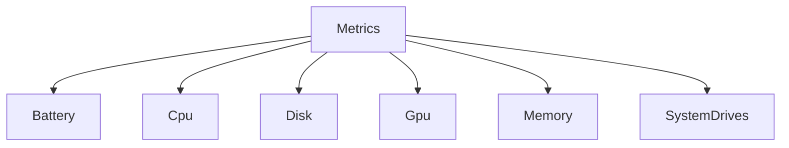

# Metrics

## Contents

- [Overview](#overview)
- [Files](#files)
- [Types and Members](#types-and-members)
- [Package Dependencies](#package-dependencies)
- [Diagrams](#diagrams)
- [Examples](#examples)
- [See Also](#see-also)

## Overview

The **Metrics** area groups 2 documented types, including `IMetrics`, `IMetricsClient`. It provides the contracts and implementation used by this part of ThunderPropagator.BuildingBlocks.

## Files

| File | Primary type(s)/symbol(s) | LOC (approx.) | Responsibility |
|---|---|---:|---|
| `IMetrics.cs` | `IMetrics` | 3 | Defines IMetrics and its related behavior. |
| `IMetricsClient.cs` | `IMetricsClient` | 7 | Defines IMetricsClient and its related behavior. |

### Direct child areas

- [Battery](./Battery/README.md) `Types:3` `Files:2`
- [Cpu](./Cpu/README.md) `Types:4` `Files:4`
- [Disk](./Disk/README.md) `Types:5` `Files:4`
- [Gpu](./Gpu/README.md) `Types:3` `Files:2`
- [Memory](./Memory/README.md) `Types:1` `Files:2`
- [SystemDrives](./SystemDrives/README.md) `Types:2` `Files:2`

## Types and Members

| Type | Kind | Summary | Inherits/Implements | Key Members |
|---|---|---|---|---|
| [`IMetrics`](#imetrics) | interface | Represents the IMetrics interface. | — | — |
| [`IMetricsClient`](#imetricsclient) | interface | Represents the IMetricsClient interface. | — | `GetMetricsAsync(…)` |

### IMetrics

- **Kind:** interface
- **Namespace:** `ThunderPropagator.BuildingBlocks.Infrastructure.SystemResourceMonitor.Metrics`
- **Inherits/implements:** None declared
- **Attributes:** None detected
- **Key members:** Refer to the API surface in the source package
- **Summary:** Represents the IMetrics interface.
- **Thread safety:** Follow the lifetime and concurrency guarantees of the owning component; no additional guarantee is inferred.

**Usage recipe**

```csharp
// Resolve IMetrics from the configured service container or construct it with its declared dependencies.
```

[↑ Back to top](#contents)

### IMetricsClient

- **Kind:** interface
- **Namespace:** `ThunderPropagator.BuildingBlocks.Infrastructure.SystemResourceMonitor.Metrics`
- **Inherits/implements:** None declared
- **Attributes:** None detected
- **Key members:** `GetMetricsAsync(…)`
- **Summary:** Represents the IMetricsClient interface.
- **Thread safety:** Follow the lifetime and concurrency guarantees of the owning component; no additional guarantee is inferred.

**Usage recipe**

```csharp
// Resolve IMetricsClient from the configured service container or construct it with its declared dependencies.
```

[↑ Back to top](#contents)

## Package Dependencies

| Package | Version | Description | Links |
|---|---|---|---|
| `Apache.NMS.ActiveMQ` | `2.2.0` | External dependency used by the repository. | [Registry](https://www.nuget.org/packages/Apache.NMS.ActiveMQ) |
| `Ardalis.GuardClauses` | `5.0.0` | External dependency used by the repository. | [Registry](https://www.nuget.org/packages/Ardalis.GuardClauses) |
| `CaseConverter` | `2.0.1` | External dependency used by the repository. | [Registry](https://www.nuget.org/packages/CaseConverter) |
| `JetBrains.Annotations` | `2026.2.0` | External dependency used by the repository. | [Registry](https://www.nuget.org/packages/JetBrains.Annotations) |
| `Microsoft.Diagnostics.Tracing.TraceEvent` | `3.2.5` | External dependency used by the repository. | [Registry](https://www.nuget.org/packages/Microsoft.Diagnostics.Tracing.TraceEvent) |
| `Microsoft.Extensions.DependencyInjection.Abstractions` | `10.*` | External dependency used by the repository. | [Registry](https://www.nuget.org/packages/Microsoft.Extensions.DependencyInjection.Abstractions) |
| `Microsoft.Extensions.Diagnostics.HealthChecks` | `10.*` | External dependency used by the repository. | [Registry](https://www.nuget.org/packages/Microsoft.Extensions.Diagnostics.HealthChecks) |
| `Newtonsoft.Json` | `13.0.4` | External dependency used by the repository. | [Registry](https://www.nuget.org/packages/Newtonsoft.Json) |
| `SharpZipLib` | `1.4.2` | External dependency used by the repository. | [Registry](https://www.nuget.org/packages/SharpZipLib) |
| `System.IdentityModel.Tokens.Jwt` | `8.19.2` | External dependency used by the repository. | [Registry](https://www.nuget.org/packages/System.IdentityModel.Tokens.Jwt) |

## Diagrams

### Component overview



The diagram shows the direct components documented by the **Metrics** area.

## Examples

Start with `IMetrics` as the primary entry point for this folder, then follow its linked contracts and collaborators.

## See Also

- [Parent area](../README.md)

[↑ Back to top](#contents)
