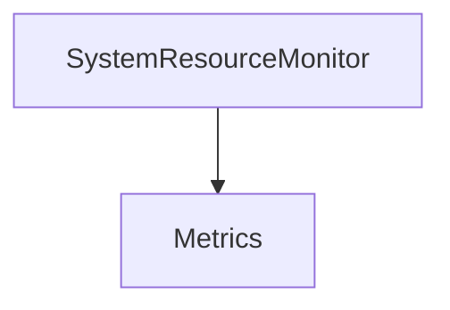

# SystemResourceMonitor

## Contents

- [Overview](#overview)
- [Files](#files)
- [Types and Members](#types-and-members)
- [Validation and Constraints](#validation-and-constraints)
- [Package Dependencies](#package-dependencies)
- [Diagrams](#diagrams)
- [Examples](#examples)
- [See Also](#see-also)

## Overview

The **SystemResourceMonitor** area groups 4 documented types, including `ISystemResourceMonitor`, `SystemResourceMonitorExtensions`, `SystemResourceMonitorMetrics`, `SystemResourceMonitorOptions`. It provides the contracts and implementation used by this part of ThunderPropagator.BuildingBlocks.

## Files

| File | Primary type(s)/symbol(s) | LOC (approx.) | Responsibility |
|---|---|---:|---|
| `ISystemResourceMonitor.cs` | `ISystemResourceMonitor`, `SystemResourceMonitorImpl` | 114 | Defines ISystemResourceMonitor, SystemResourceMonitorImpl and its related behavior. |
| `SystemResourceMonitorExtensions.cs` | `SystemResourceMonitorExtensions` | 68 | Defines SystemResourceMonitorExtensions and its related behavior. |
| `SystemResourceMonitorMetrics.cs` | `SystemResourceMonitorMetrics` | 55 | Defines SystemResourceMonitorMetrics and its related behavior. |
| `SystemResourceMonitorOptions.cs` | `SystemResourceMonitorOptions` | 80 | Defines SystemResourceMonitorOptions and its related behavior. |

### Direct child areas

- [Metrics](./Metrics/README.md) `Types:2` `Files:2`

## Types and Members

| Type | Kind | Summary | Inherits/Implements | Key Members |
|---|---|---|---|---|
| [`ISystemResourceMonitor`](#isystemresourcemonitor) | interface | Interface for system resource monitoring with comprehensive hardware health and performance metrics. | `IMetricsClient<SystemResourceMonitorMetrics>` | `SystemResourceMonitorImpl(…)`, `GetMetricsAsync(…)`, `GetMetricsAsync(…)` |
| [`SystemResourceMonitorExtensions`](#systemresourcemonitorextensions) | class | Extension methods for registering system resource monitoring services. | — | `AddSystemResourceMonitor(…)` |
| [`SystemResourceMonitorMetrics`](#systemresourcemonitormetrics) | record | Comprehensive system resource monitoring metrics including hardware health and performance data. | `IMetrics` | `Cpu`, `CpuTemperature`, `Memory`, `Drives`, `DiskHealth`, `DiskSpeed` |
| [`SystemResourceMonitorOptions`](#systemresourcemonitoroptions) | class | Configuration options for the system resource monitor. | — | `EnableCpuMetrics`, `EnableCpuTemperature`, `EnableMemoryMetrics`, `EnableDiskSpaceMetrics`, `EnableDiskHealthMetrics`, `EnableDiskSpeedMetrics` |

### ISystemResourceMonitor

- **Kind:** interface
- **Namespace:** `ThunderPropagator.BuildingBlocks.Infrastructure.SystemResourceMonitor`
- **Inherits/implements:** `IMetricsClient<SystemResourceMonitorMetrics>`
- **Attributes:** None detected
- **Key members:** `SystemResourceMonitorImpl(…)`, `GetMetricsAsync(…)`, `GetMetricsAsync(…)`
- **Summary:** Interface for system resource monitoring with comprehensive hardware health and performance metrics.
- **Thread safety:** Follow the lifetime and concurrency guarantees of the owning component; no additional guarantee is inferred.

**Usage recipe**

```csharp
// Resolve ISystemResourceMonitor from the configured service container or construct it with its declared dependencies.
```

[↑ Back to top](#contents)

### SystemResourceMonitorExtensions

- **Kind:** class
- **Namespace:** `ThunderPropagator.BuildingBlocks.Infrastructure.SystemResourceMonitor`
- **Inherits/implements:** None declared
- **Attributes:** None detected
- **Key members:** `AddSystemResourceMonitor(…)`
- **Summary:** Extension methods for registering system resource monitoring services.
- **Thread safety:** Follow the lifetime and concurrency guarantees of the owning component; no additional guarantee is inferred.

**Usage recipe**

```csharp
// Resolve SystemResourceMonitorExtensions from the configured service container or construct it with its declared dependencies.
```

[↑ Back to top](#contents)

### SystemResourceMonitorMetrics

- **Kind:** record
- **Namespace:** `ThunderPropagator.BuildingBlocks.Infrastructure.SystemResourceMonitor`
- **Inherits/implements:** `IMetrics`
- **Attributes:** None detected
- **Key members:** `Cpu`, `CpuTemperature`, `Memory`, `Drives`, `DiskHealth`, `DiskSpeed`, `Gpus`, `Battery`
- **Summary:** Comprehensive system resource monitoring metrics including hardware health and performance data.
- **Thread safety:** Follow the lifetime and concurrency guarantees of the owning component; no additional guarantee is inferred.

**Usage recipe**

```csharp
// Resolve SystemResourceMonitorMetrics from the configured service container or construct it with its declared dependencies.
```

[↑ Back to top](#contents)

### SystemResourceMonitorOptions

- **Kind:** class
- **Namespace:** `ThunderPropagator.BuildingBlocks.Infrastructure.SystemResourceMonitor`
- **Inherits/implements:** None declared
- **Attributes:** None detected
- **Key members:** `EnableCpuMetrics`, `EnableCpuTemperature`, `EnableMemoryMetrics`, `EnableDiskSpaceMetrics`, `EnableDiskHealthMetrics`, `EnableDiskSpeedMetrics`, `EnableGpuMetrics`, `EnableBatteryMetrics`
- **Summary:** Configuration options for the system resource monitor.
- **Thread safety:** Follow the lifetime and concurrency guarantees of the owning component; no additional guarantee is inferred.

**Usage recipe**

```csharp
// Resolve SystemResourceMonitorOptions from the configured service container or construct it with its declared dependencies.
```

[↑ Back to top](#contents)

## Validation and Constraints

Inputs are validated at component boundaries. Callers should provide non-null required values and handle domain or argument exceptions without retrying invalid requests unchanged.

## Package Dependencies

| Package | Version | Description | Links |
|---|---|---|---|
| `Apache.NMS.ActiveMQ` | `2.2.0` | External dependency used by the repository. | [Registry](https://www.nuget.org/packages/Apache.NMS.ActiveMQ) |
| `Ardalis.GuardClauses` | `5.0.0` | External dependency used by the repository. | [Registry](https://www.nuget.org/packages/Ardalis.GuardClauses) |
| `CaseConverter` | `2.0.1` | External dependency used by the repository. | [Registry](https://www.nuget.org/packages/CaseConverter) |
| `JetBrains.Annotations` | `2026.2.0` | External dependency used by the repository. | [Registry](https://www.nuget.org/packages/JetBrains.Annotations) |
| `Microsoft.Diagnostics.Tracing.TraceEvent` | `3.2.5` | External dependency used by the repository. | [Registry](https://www.nuget.org/packages/Microsoft.Diagnostics.Tracing.TraceEvent) |
| `Microsoft.Extensions.DependencyInjection.Abstractions` | `10.*` | External dependency used by the repository. | [Registry](https://www.nuget.org/packages/Microsoft.Extensions.DependencyInjection.Abstractions) |
| `Microsoft.Extensions.Diagnostics.HealthChecks` | `10.*` | External dependency used by the repository. | [Registry](https://www.nuget.org/packages/Microsoft.Extensions.Diagnostics.HealthChecks) |
| `Newtonsoft.Json` | `13.0.4` | External dependency used by the repository. | [Registry](https://www.nuget.org/packages/Newtonsoft.Json) |
| `SharpZipLib` | `1.4.2` | External dependency used by the repository. | [Registry](https://www.nuget.org/packages/SharpZipLib) |
| `System.IdentityModel.Tokens.Jwt` | `8.19.2` | External dependency used by the repository. | [Registry](https://www.nuget.org/packages/System.IdentityModel.Tokens.Jwt) |

## Diagrams

### Component overview



The diagram shows the direct components documented by the **SystemResourceMonitor** area.

## Examples

Start with `ISystemResourceMonitor` as the primary entry point for this folder, then follow its linked contracts and collaborators.

## See Also

- [Parent area](../README.md)
- [HealthChecks](../HealthChecks/README.md)
- [System](../System/README.md)

[↑ Back to top](#contents)
